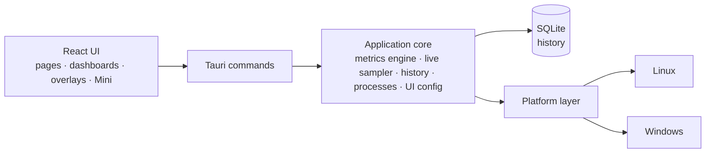

<p align="center">
  <a href="README.md">English</a> ·
  <a href="README.fr.md">Français</a> ·
  <a href="README.es.md">Español</a> ·
  <a href="README.pt-BR.md">Português (Brasil)</a> ·
  <b>Deutsch</b> ·
  <a href="README.it.md">Italiano</a> ·
  <a href="README.zh-CN.md">简体中文</a> ·
  <a href="README.ja.md">日本語</a> ·
  <a href="README.ko.md">한국어</a> ·
  <a href="README.ru.md">Русский</a>
</p>

<p align="center"><sub>Übersetzung von <a href="README.md">README.md</a>, das maßgeblich bleibt. Die ausführliche Dokumentation ist auf Englisch.</sub></p>

<p align="center">
  
</p>

<p align="center">
  <strong>Ein plattformübergreifender Systemmonitor für Windows und Fedora Linux — Live-Metriken,<br>
  lokaler Verlauf, selbst zusammengestellte Dashboards und Desktop-Overlays.</strong>
</p>

<p align="center">
  <a href="https://github.com/lolmath06/PULSE/actions/workflows/ci.yml"></a>
  
  
  
  
  <a href="LICENSE"></a>
</p>

<p align="center">
  <a href="#gallery">Galerie</a> ·
  <a href="#build-from-source">Aus dem Quellcode bauen</a> ·
  <a href="docs/README.md">Dokumentation</a> ·
  <a href="#platforms-and-status">Status</a> ·
  <a href="CHANGELOG.md">Änderungsprotokoll</a>
</p>

<p align="center">
  
</p>

## Was PULSE ist

PULSE zeigt, was dein Rechner gerade tut — Prozessor, Grafik, Arbeitsspeicher,
Datenträger, Netzwerk und Prozesse — und lässt dich entscheiden, **wie** es
angezeigt wird: in der Übersicht, auf Dashboards aus Widgets, in einem kleinen
Mini-Fenster oder als Overlays, die auf dem Desktop über anderen Fenstern liegen.

Es läuft nativ unter **Windows 10/11** und **Fedora Linux** hinter einem
gemeinsamen Metrik-Vertrag: Ein Widget, das an „GPU-Temperatur“ oder „logischer
Prozessor 3“ gebunden ist, bedeutet auf beiden dasselbe. Es liest alles mit den
Rechten des Benutzers, speichert seinen Verlauf in einer lokalen Datei und sagt,
wenn ein Rechner einen Wert nicht liefern kann, _warum_ — statt einen zu erfinden.

## Highlights

|                        |                                                                                                                                                                                                  |
| ---------------------- | ------------------------------------------------------------------------------------------------------------------------------------------------------------------------------------------------ |
| **Live-Überwachung**   | CPU-Auslastung und -Topologie, Auslastung und Takt pro logischem Prozessor, Arbeitsspeicher, GPU-Last / VRAM / Takt / Temperaturen / Lüfter, Datenträger-E/A und NVMe-Zustand, Netzwerk und WLAN |
| **Lokaler Verlauf**    | Alle 5 s in eine lokale SQLite-Datei geschrieben; Zeiträume von 15 Minuten bis 7 Tage, Min. / Max. / Mittelwert bleiben beim Verdichten älterer Daten erhalten                                   |
| **Dashboards**         | Mehrere Dashboards mit verschiebbaren, skalierbaren Widgets; acht Vorlagen; Linien-, Flächen-, Sparkline-, Wert-, Balken- und Messuhr-Darstellung; Import und Export                             |
| **Overlays & Mini**    | Zwölf Overlay-Pakete — Anzeigen, Balken, Leisten, Eck-HUDs — gesperrt klickdurchlässig; ein Tray-Symbol, ein konfigurierbares globales Tastenkürzel und ein kompaktes Mini-Fenster               |
| **Modi**               | Gaming, Entwicklung, Persönlich und Mini: jeweils mit eigenem Stil, Live-Leiste, Start-Dashboard und Overlay-Paketen                                                                             |
| **Darstellungsstudio** | Acht eingebaute Stile (Clean, Glass, Technical, Neon, Gaming, Stealth, Compact, Transparent HUD), Feinabstimmung und eigene gespeicherte Stile                                                   |
| **Prozesse**           | Anwendungen und Prozesse mit CPU, Speicher und E/A; ein Inspektor mit Paket- oder Signaturherkunft, SHA-256 auf Anfrage und ausdrücklichen Steuerungen                                           |
| **Sprachen**           | Sechzehn Oberflächensprachen; folgt standardmäßig der Systemsprache, oder wähle eine im Willkommensdialog oder unter Darstellung — Zahlen und Datumsangaben folgen ihr ebenfalls                 |

<a id="gallery"></a>

## Galerie

<table>
  <tr>
    <td width="50%"><br><sub><b>Übersicht</b> — eine Live-Leiste mit dem Wesentlichen, die vier Modi und Systemdetails.</sub></td>
    <td width="50%"><br><sub><b>Dashboards</b> — die Vorlage <i>Fancy showcase</i> in ihrem eigenen Glass-Stil.</sub></td>
  </tr>
  <tr>
    <td><br><sub><b>Vorlagen</b> — acht fertige Ausgangspunkte; alles bleibt bearbeitbar.</sub></td>
    <td><br><sub><b>Verlauf</b> — Details pro logischem Prozessor über 24 Stunden aufgezeichneter CPU-Last.</sub></td>
  </tr>
  <tr>
    <td><br><sub><b>Prozesse</b> — der Inspektor: Identität, Ressourcen, ausführbare Datei und Herkunft.</sub></td>
    <td><br><sub><b>Darstellung</b> — acht Stile, Feinabstimmung und eine Live-Vorschau.</sub></td>
  </tr>
  <tr>
    <td><br><sub><b>Overlays</b> — zwölf Pakete, von der dreizeiligen Anzeige bis zu Leisten in voller Höhe.</sub></td>
    <td><br><sub><b>Modi</b> — Entwicklung im Technical-Stil: eine dichte Leiste, eine Vorlage, seine Pakete.</sub></td>
  </tr>
</table>

<p align="center">
  <br>
  <sub><b>Mini</b> — ein kleines, gewöhnliches Fenster mit eigenen Layouts (hier: Vitals).</sub>
</p>

<sub>Jedes Bild ist eine Aufnahme der echten PULSE-Oberfläche. Damit sie reproduzierbar und frei
von persönlichen Daten bleiben, stammen die Antworten des Backends von einem deterministischen,
fiktiven Rechner — siehe [`scripts/showcase/`](scripts/showcase/README.md). Die Aufnahmen zeigen die
englische Oberfläche.</sub>

## Warum PULSE

Die meisten Monitore entscheiden für dich, was wichtig ist. PULSE geht vom
Gegenteil aus — **du stellst es zusammen** — und ist streng bei dem, was es zeigt:

- **Ehrliche Verfügbarkeit.** Jede Metrik trägt einen Status: verfügbar, auf dieser
  Plattform nicht unterstützt, auf diesem Rechner nicht erkannt, durch
  Berechtigungen blockiert, vorübergehend nicht verfügbar oder ein Anbieterfehler —
  jeweils mit Begründung. Ein fehlender Sensor wird als fehlend angezeigt, nie als `0`.
- **Unterscheidungen, die andere Werkzeuge verwischen.** Ein physischer Kern ist
  kein logischer Prozessor; dedizierter VRAM ist kein gemeinsam genutzter
  Arbeitsspeicher; ein Datenträger ist kein Volume; ein thermisches Limit ist keine
  Temperatur; ein lokaler Verwerfungszähler ist kein Paketverlust im Internet.
- **Stabile Identitäten.** GPUs, Datenträger und Netzwerkschnittstellen werden über
  das identifiziert, was einen Neustart übersteht (eine NVML-UUID, die WWID eines
  Laufwerks, eine permanente MAC), nie über `nvme0n1`, einen Adapterindex oder eine
  zufällige Adresse — so zeigen gespeicherte Dashboards weiter auf die richtige
  Hardware, und Exporte enthalten keine rohen Hardwarekennungen.
- **Modi und Dashboards sind getrennt.** Ein Modus beschreibt, _wie_ sich PULSE
  verhält; ein Dashboard beschreibt, _was_ es zeigt. Jedes Dashboard, jeder Stil,
  jeder Modus.

## Was es überwacht

Was ein Rechner melden kann, hängt von Hardware, Treibern und Plattform ab; PULSE
liest, was tatsächlich vorhanden ist.

| Bereich         | Metriken                                                                                                                                                                                         |
| --------------- | ------------------------------------------------------------------------------------------------------------------------------------------------------------------------------------------------ |
| **CPU**         | Gesamtauslastung; Auslastung und aktueller / maximaler Takt pro logischem Prozessor; physische Kerne, logische Prozessoren und Packages; Package-Temperatur, wo ein Sensor existiert             |
| **Speicher**    | Gesamt, belegt, verfügbar, Auslastung                                                                                                                                                            |
| **GPU**         | Jeder Adapter, benannt und identifiziert; Auslastung, VRAM, Kern- und Speichertakt, Kern- / Hotspot- / Speichertemperatur und Lüfterdrehzahl, wo NVML oder der `amdgpu`-Treiber sie bereitstellt |
| **Datenträger** | Geräte und Volumes; Kapazität und Belegung; Lese- / Schreibdurchsatz, IOPS und Latenz; NVMe-Zustand (Temperatur, Verschleiß, Reserve, Betriebsstunden, unsichere Abschaltungen, Fehler)          |
| **Netzwerk**    | Schnittstellen und Verbindungsstatus; Download / Upload, Pakete, Fehler und Verwerfungen; Verbindungsgeschwindigkeiten; WLAN-Signal und Verbindungsraten                                         |
| **Prozesse**    | Anzahl der Prozesse, laufenden Prozesse und Threads; CPU, Speicher, Threads und Datenträger-E/A pro Prozess und pro Anwendung                                                                    |

Herstellerbibliotheken für GPUs werden zur Laufzeit geladen: Ein fehlender Treiber
kostet diese Metriken, nie die Fähigkeit zu starten. Details:
[Metrik-Dokumentation](docs/metrics/README.md).

## Lokal zuerst und sicher by Design

- **Der Verlauf bleibt auf deinem Rechner** — eine lokale SQLite-Datei, Rohwerte für
  24 Stunden und minütliche Min.- / Max.- / Mittelwert- / Anzahl-Aggregate für 7
  Tage. ([Aufbewahrung](docs/history/retention.md))
- **Keine Telemetrie.** PULSE sendet nichts an irgendeinen Server. Die einzigen
  ausgehenden Aktionen sind die, die du anklickst — _Online suchen_ nach einem
  Prozessnamen oder einem Hash, _Hash auf VirusTotal prüfen_ — und die deinen Browser
  auf dieser Seite öffnen (es wird nie eine Datei hochgeladen).
- **Keine Befehlszeilen, keine Argumente, keine Umgebungsvariablen** werden für
  Prozesse erfasst.
- **Prozesssteuerungen sind ausdrücklich.** Anhalten / Fortsetzen, Prozess oder
  Baum beenden, Priorität und Affinität laufen nur, wenn du sie wählst; zerstörerische
  Aktionen fragen vorher nach. Jede zielt auf eine genaue Prozessinstanz — PID plus
  Start-Token, unmittelbar vor der Aktion erneut geprüft — sodass eine
  wiederverwendete PID nie versehentlich getroffen wird.
- **Keine Rechteerhöhung.** PULSE läuft mit den Rechten des Benutzers und erhöht sie
  nie; was mehr braucht, wird als Berechtigung verweigert gemeldet, mit Grund.
- **Nur lesender Hardwarezugriff.** Es werden nie Lüfter-, Limit- oder
  Energieeinstellungen geschrieben; nichts wird in Spiele injiziert — Overlays sind
  eigene Fenster.

Siehe [SECURITY.md](SECURITY.md) und die [Prozesssteuerungen](docs/processes/controls.md).

<a id="platforms-and-status"></a>

## Plattformen und Status

|                        | Windows 10 / 11                                                     | Fedora Linux                                                       |
| ---------------------- | ------------------------------------------------------------------- | ------------------------------------------------------------------ |
| Unterstützung          | Vollwertig                                                          | Vollwertig                                                         |
| Native Datenquellen    | Win32 / NT APIs, DXGI + D3DKMT, SetupAPI, IP Helper, NVML           | `/proc`, `/sys`, `hwmon`, DRM, `rtnetlink` + `nl80211`, NVML       |
| Overlays               | Native geschichtete Fenster im Vordergrund                          | GNOME-Shell-Brücke unter Wayland; normale Wayland- und X11-Fenster |
| Automatisierte Prüfung | Native CI: Build, Tests, Clippy, MSRV 1.77.2, NSIS / MSI / portabel | CI: Lint, Typecheck, Tests, App-Build, Clippy, MSRV 1.77.2         |
| Physische Prüfung      | Letzte Hürde vor der Veröffentlichung, ausstehend                   | Durchgeführt (Fedora 39, GNOME 45 unter Wayland)                   |

PULSE ist in Version **0.1.0-dev** und für seine erste Veröffentlichung
funktionskomplett. Native Windows-Builds werden in jedem CI-Lauf kompiliert, getestet
und paketiert; die letzte Hürde vor einer öffentlichen Veröffentlichung ist die
[physische Windows-Checkliste](docs/release/windows-physical-validation.md).
Es gibt noch keine veröffentlichte Version — siehe den [Veröffentlichungsprozess](docs/release/release-process.md).
macOS ist kein Ziel.

<a id="build-from-source"></a>

## Aus dem Quellcode bauen

**Voraussetzungen:** Node.js 20.19+ mit pnpm (`corepack enable pnpm`) und Rust
1.77.2+ über [rustup](https://rustup.rs) ([Hinweise zur MSRV](docs/development/msrv.md)).

<details>
<summary>Systempakete für <b>Fedora Linux</b></summary>

```bash
sudo dnf install -y \
  webkit2gtk4.1-devel \
  openssl-devel \
  curl wget file \
  libappindicator-gtk3-devel \
  librsvg2-devel \
  gcc gcc-c++ make
```

</details>

<details>
<summary>Voraussetzungen unter <b>Windows</b></summary>

- **Microsoft C++ Build Tools** mit der Workload „Desktopentwicklung mit C++“
- **WebView2 Runtime** (unter Windows 11 und aktuellem Windows 10 vorinstalliert)

</details>

```bash
git clone https://github.com/lolmath06/PULSE.git
cd PULSE
pnpm install
pnpm app:dev      # run PULSE in development
pnpm app:build    # build the desktop application and its bundles
```

Jeder erfolgreiche CI-Lauf erzeugt außerdem einen unsignierten Windows-Build
(NSIS-Installer, MSI, portable ausführbare Datei und Prüfsummen) zum Testen — siehe
[Windows-CI und Artefakte](docs/release/windows-ci.md).

## Architektur



Die Oberfläche liest nie `/proc`, `/sys`, DXGI oder NVML — alles Systemnahe
überquert die Befehlsgrenze als typisierte Daten, und nur die Plattformschicht weiß,
auf welchem Betriebssystem sie läuft. Mehr dazu im
[Architekturüberblick](docs/architecture/overview.md).

| Schicht           | Technologie                                             |
| ----------------- | ------------------------------------------------------- |
| Desktop-Hülle     | [Tauri 2](https://tauri.app)                            |
| Backend           | Rust (Edition 2021, MSRV 1.77.2)                        |
| Speicherung       | SQLite über `rusqlite` (gebündelt)                      |
| Oberfläche        | React 19, TypeScript, React Router, D3 shape, i18next   |
| Build & Werkzeuge | Vite, pnpm                                              |
| Tests & Qualität  | Vitest, `cargo test`, ESLint, Prettier, rustfmt, Clippy |

<details>
<summary><b>Aufbau des Repositorys</b></summary>

```text
PULSE/
├── src/                 # React frontend
│   ├── app/             # router, routes, app constants
│   ├── components/      # Dashboard, Overlay, Mini, History, ProcessInspector…
│   ├── config/          # the shared UI configuration store
│   ├── dashboard/       # widget model, grid layout, library, bindings, templates
│   ├── design/          # styles, tokens, appearance
│   ├── i18n/            # languages, locale resolution, translation catalogs
│   ├── live/            # this window's side of the live widget feed
│   ├── modes/           # Gaming, Development, Personal, Mini
│   ├── overlay/         # overlay model, desktop commands
│   ├── presets/         # dashboard templates and overlay packs
│   ├── services/        # the invoke() boundary
│   ├── types/           # shared types, mirrors of Rust payloads
│   └── visualization/   # chart engine: renderers, config, Customize
├── src-tauri/           # Rust backend
│   └── src/
│       ├── commands/    # Tauri command surface
│       ├── desktop.rs   # overlay windows, Mini, tray, global shortcut
│       ├── history/     # scheduler, SQLite store, queries, retention
│       ├── live/        # one shared 1 s sampler, in-memory rings
│       ├── metrics/     # metrics engine, model, well-known declarations
│       ├── overlay/     # capabilities, geometry, specs, settings, GNOME bridge
│       ├── platform/    # the platform seam: linux/ and windows/
│       ├── processes/   # snapshots, inspector, controls, provenance
│       └── ui_config/   # the shared UI configuration file (atomic, versioned)
├── integrations/        # the GNOME Shell overlay bridge extension
├── tools/windows-check/ # type-checks the Windows code from Linux
├── scripts/showcase/    # regenerates the README media
└── docs/
```

</details>

## Entwicklung

| Befehl                              | Was er tut                                     |
| ----------------------------------- | ---------------------------------------------- |
| `pnpm app:dev`                      | PULSE in der Entwicklung starten               |
| `pnpm app:build`                    | Die Desktop-Anwendung bauen                    |
| `pnpm dev`                          | Nur der Vite-Entwicklungsserver (ohne Backend) |
| `pnpm build`                        | Typen prüfen und die Oberfläche bauen          |
| `pnpm typecheck`                    | TypeScript, ohne Ausgabe                       |
| `pnpm lint` / `pnpm lint:fix`       | ESLint                                         |
| `pnpm format` / `pnpm format:check` | Prettier                                       |
| `pnpm test` / `pnpm test:watch`     | Vitest                                         |
| `pnpm rust:fmt`                     | `cargo fmt --check`                            |
| `pnpm rust:lint`                    | Clippy, Warnungen als Fehler                   |
| `pnpm rust:test`                    | `cargo test`                                   |
| `pnpm rust:windows`                 | Den Windows-Code unter Linux typprüfen         |
| `pnpm check:all`                    | Alles, was die CI ausführt                     |

`pnpm dev` startet die Oberfläche ohne das Rust-Backend; die Statusleiste meldet dann,
dass das Backend nicht verfügbar ist — außerhalb von Tauri ist das zu erwarten. Siehe
[Erste Schritte](docs/development/getting-started.md) und [Tests](docs/development/testing.md).

Eine systemnahe Funktion gilt erst als fertig, wenn ihr Verhalten unter Windows und
unter Fedora Linux entworfen und — wo immer es sich tatsächlich testen lässt —
geprüft wurde.

## Dokumentation

Beginne bei [`docs/README.md`](docs/README.md) (auf Englisch).

- **PULSE verwenden** — [Benutzerhandbuch](docs/user-guide/README.md) ·
  [Modi](docs/modes/overview.md) · [Overlays](docs/overlay/user-guide.md) ·
  [Darstellung](docs/design-system/customization.md) ·
  [Dashboard-Vorlagen](docs/presets/dashboard-templates.md) ·
  [Overlay-Pakete](docs/presets/overlay-packs.md)
- **Metriken** — [Engine](docs/metrics/README.md) · [Modell](docs/metrics/model.md) ·
  [Kennungen](docs/metrics/identifiers.md) · [CPU & Speicher](docs/metrics/cpu-memory.md) ·
  [CPU für Fortgeschrittene](docs/metrics/cpu-advanced.md) · [GPU](docs/metrics/gpu.md) ·
  [Temperaturen](docs/metrics/thermals.md) · [Datenträger](docs/metrics/storage.md) ·
  [Netzwerk](docs/metrics/network.md) · [Prozesse](docs/metrics/processes.md)
- **Prozesse** — [Inspektor](docs/processes/inspector.md) ·
  [Herkunft](docs/processes/provenance.md) · [Steuerungen](docs/processes/controls.md)
- **Verlauf & Visualisierung** — [Verlauf](docs/history/architecture.md) ·
  [Speicherung](docs/history/storage.md) · [Aufbewahrung](docs/history/retention.md) ·
  [Visualisierung](docs/visualization/architecture.md) ·
  [Darstellungen](docs/visualization/renderers.md)
- **Dashboards & Overlays** — [Dashboard](docs/dashboard/architecture.md) ·
  [Widgets](docs/dashboard/widgets.md) · [Layout](docs/dashboard/layout.md) ·
  [Overlay-Architektur](docs/overlay/architecture.md) ·
  [Backends](docs/overlay/backends.md) · [GNOME-Brücke](docs/overlay/gnome-bridge.md)
- **Design** — [Designsystem](docs/design-system/overview.md)
- **Plattformen** — [Fedora Linux](docs/platforms/fedora.md) · [Windows](docs/platforms/windows.md)
- **Veröffentlichung** — [CI](docs/release/ci.md) · [Windows-CI und Artefakte](docs/release/windows-ci.md) ·
  [physische Windows-Prüfung](docs/release/windows-physical-validation.md) ·
  [Veröffentlichungsprozess](docs/release/release-process.md)

## Mitwirken

Siehe [CONTRIBUTING.md](CONTRIBUTING.md). Führe `pnpm check:all` aus, bevor du einen
Pull Request öffnest, und behalte die plattformübergreifende Regel oben im Blick.

## Sicherheit

Bitte melde Sicherheitslücken vertraulich — siehe [SECURITY.md](SECURITY.md).

## Lizenz

**PULSE ist proprietäre Software.**
Copyright © 2026 Matheo Dolmen. Alle Rechte vorbehalten.

Der auf GitHub veröffentlichte Quellcode darf gelesen, geprüft und diskutiert
werden; durch die Veröffentlichung wird keine Lizenz zur Wiederverwendung oder
Weiterverbreitung erteilt. Wesentliche Kopien, Weiterverbreitung,
Veröffentlichung geänderter Versionen oder kommerzielle Nutzung erfordern eine
vorherige schriftliche Genehmigung.

Siehe **[LICENSE](LICENSE)**. Komponenten Dritter bleiben ihren eigenen
Lizenzen unterstellt.
