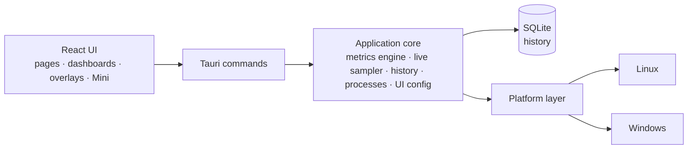

<p align="center">
  <a href="README.md">English</a> ·
  <a href="README.fr.md">Français</a> ·
  <b>Español</b> ·
  <a href="README.pt-BR.md">Português (Brasil)</a> ·
  <a href="README.de.md">Deutsch</a> ·
  <a href="README.it.md">Italiano</a> ·
  <a href="README.zh-CN.md">简体中文</a> ·
  <a href="README.ja.md">日本語</a> ·
  <a href="README.ko.md">한국어</a> ·
  <a href="README.ru.md">Русский</a>
</p>

<p align="center"><sub>Traducción de <a href="README.md">README.md</a>, que sigue siendo la referencia. La documentación detallada está en inglés.</sub></p>

<p align="center">
  
</p>

<p align="center">
  <strong>Un monitor del sistema multiplataforma para Windows y Fedora Linux — métricas en vivo,<br>
  historial local, paneles que tú compones y overlays en el escritorio.</strong>
</p>

<p align="center">
  <a href="https://github.com/lolmath06/PULSE/actions/workflows/ci.yml"></a>
  
  
  
  
  <a href="LICENSE"></a>
</p>

<p align="center">
  <a href="#gallery">Galería</a> ·
  <a href="#build-from-source">Compilar desde el código fuente</a> ·
  <a href="docs/README.md">Documentación</a> ·
  <a href="#platforms-and-status">Estado</a> ·
  <a href="CHANGELOG.md">Registro de cambios</a>
</p>

<p align="center">
  
</p>

## Qué es PULSE

PULSE muestra lo que hace tu máquina — procesador, gráfica, memoria, almacenamiento,
red y procesos — y te deja decidir **cómo** se muestra: en la vista general, en
paneles que construyes con widgets, en una pequeña ventana Mini o como overlays
situados en el escritorio por encima de otras ventanas.

Funciona de forma nativa en **Windows 10/11** y **Fedora Linux** con un mismo
contrato de métricas, así que un widget vinculado a «temperatura de la GPU» o a
«procesador lógico 3» significa lo mismo en ambos. Lo lee todo con los permisos del
propio usuario, guarda su historial en un archivo local y, cuando una máquina no
puede dar un valor, dice _por qué_ en lugar de inventarlo.

## Lo más destacado

|                            |                                                                                                                                                                                                  |
| -------------------------- | ------------------------------------------------------------------------------------------------------------------------------------------------------------------------------------------------ |
| **Monitorización en vivo** | Uso y topología de la CPU, uso y frecuencias por procesador lógico, memoria, carga / VRAM / frecuencias / temperaturas / ventilador de la GPU, E/S de almacenamiento y salud NVMe, red y Wi-Fi   |
| **Historial local**        | Se registra cada 5 s en un archivo SQLite local; rangos de 15 minutos a 7 días, con mín. / máx. / media conservados al compactar los datos antiguos                                              |
| **Paneles**                | Varios paneles de widgets que se mueven y redimensionan; ocho plantillas; representaciones de línea, área, sparkline, valor, barra e indicador; importación y exportación                        |
| **Overlays y Mini**        | Doce paquetes de overlays — lecturas, barras, rieles, HUD de esquina — que dejan pasar los clics al bloquearse; un icono en la bandeja, un atajo global configurable y una ventana Mini compacta |
| **Modos**                  | Juego, Desarrollo, Personal y Mini: cada uno con su estilo, su franja en vivo, su panel inicial y sus paquetes de overlays                                                                       |
| **Estudio de apariencia**  | Ocho estilos integrados (Clean, Glass, Technical, Neon, Gaming, Stealth, Compact, Transparent HUD), ajuste detallado y estilos guardados propios                                                 |
| **Procesos**               | Aplicaciones y procesos con CPU, memoria y E/S; un inspector con procedencia del paquete o de la firma, SHA-256 bajo demanda y controles explícitos                                              |
| **Idiomas**                | Dieciséis idiomas de interfaz; sigue el idioma del sistema por defecto, o elige uno en la bienvenida o en Apariencia — los números y las fechas también lo siguen                                |

<a id="gallery"></a>

## Galería

<table>
  <tr>
    <td width="50%"><br><sub><b>Vista general</b> — una franja en vivo con lo esencial, los cuatro modos y los detalles del sistema.</sub></td>
    <td width="50%"><br><sub><b>Paneles</b> — la plantilla <i>Fancy showcase</i>, con su propio estilo Glass.</sub></td>
  </tr>
  <tr>
    <td><br><sub><b>Plantillas</b> — ocho puntos de partida compuestos; todo sigue siendo editable.</sub></td>
    <td><br><sub><b>Historial</b> — el detalle por procesador lógico sobre 24 horas de carga de CPU registrada.</sub></td>
  </tr>
  <tr>
    <td><br><sub><b>Procesos</b> — el inspector: identidad, recursos, ejecutable y procedencia.</sub></td>
    <td><br><sub><b>Apariencia</b> — ocho estilos, ajuste detallado y vista previa en vivo.</sub></td>
  </tr>
  <tr>
    <td><br><sub><b>Overlays</b> — doce paquetes, desde una lectura de tres líneas hasta rieles de altura completa.</sub></td>
    <td><br><sub><b>Modos</b> — Desarrollo, en su estilo Technical: una franja densa, una plantilla, sus paquetes.</sub></td>
  </tr>
</table>

<p align="center">
  <br>
  <sub><b>Mini</b> — una ventana pequeña y normal con sus propias disposiciones (aquí: Vitals).</sub>
</p>

<sub>Cada imagen es una captura de la interfaz real de PULSE. Para que sean reproducibles y no
contengan datos personales de nadie, las respuestas del backend provienen de una máquina ficticia
determinista — consulta [`scripts/showcase/`](scripts/showcase/README.md). Las capturas muestran la
interfaz en inglés.</sub>

## Por qué PULSE

La mayoría de los monitores deciden por ti qué es lo importante. PULSE parte de la
premisa contraria — **lo compones tú** — y es estricto con lo que muestra:

- **Disponibilidad honesta.** Cada métrica tiene un estado: disponible, no
  compatible en esta plataforma, no detectada en esta máquina, bloqueada por
  permisos, temporalmente no disponible o error del proveedor — cada uno con su
  motivo. Un sensor ausente se muestra ausente, nunca como `0`.
- **Distinciones que otras herramientas difuminan.** Un núcleo físico no es un
  procesador lógico; la VRAM dedicada no es memoria del sistema compartida; un
  dispositivo de almacenamiento no es un volumen; un límite térmico no es una
  temperatura; un contador local de descartes no es pérdida de paquetes en Internet.
- **Identidades estables.** Las GPU, los discos y las interfaces de red se
  identifican por lo que sobrevive a los reinicios (un UUID de NVML, el WWID de una
  unidad, una MAC permanente), nunca por `nvme0n1`, un índice de adaptador o una
  dirección aleatoria — así los paneles guardados siguen apuntando al hardware
  correcto y las exportaciones no contienen identificadores de hardware en bruto.
- **Modos y paneles son independientes.** Un modo describe _cómo_ se comporta
  PULSE; un panel describe _qué_ muestra. Cualquier panel, cualquier estilo,
  cualquier modo.

## Qué supervisa

Lo que puede reportar cada máquina depende de su hardware, sus controladores y su
plataforma; PULSE lee lo que realmente hay.

| Área               | Métricas                                                                                                                                                                                                 |
| ------------------ | -------------------------------------------------------------------------------------------------------------------------------------------------------------------------------------------------------- |
| **CPU**            | Uso total; uso y frecuencia actual / máxima por procesador lógico; núcleos físicos, procesadores lógicos y encapsulados; temperatura del encapsulado si existe un sensor                                 |
| **Memoria**        | Total, usada, disponible, uso                                                                                                                                                                            |
| **GPU**            | Cada adaptador, con nombre e identificado; uso, VRAM, frecuencias de núcleo y memoria, temperaturas de núcleo / hotspot / memoria y RPM del ventilador cuando NVML o el controlador `amdgpu` las exponen |
| **Almacenamiento** | Dispositivos y volúmenes; capacidad y uso; rendimiento, IOPS y latencia de lectura / escritura; salud NVMe (temperatura, desgaste, reserva, horas de encendido, apagados inseguros, errores)             |
| **Red**            | Interfaces y estado del enlace; descarga / subida, paquetes, errores y descartes; velocidades de enlace; señal Wi-Fi y tasas de enlace                                                                   |
| **Procesos**       | Número de procesos, en ejecución e hilos; CPU, memoria, hilos y E/S de disco por proceso y por aplicación                                                                                                |

Las bibliotecas de GPU de los fabricantes se cargan en tiempo de ejecución: si falta
un controlador se pierden esas métricas, nunca la capacidad de arrancar. Detalles:
[documentación de métricas](docs/metrics/README.md).

## Local primero y seguro por diseño

- **El historial se queda en tu máquina** — un archivo SQLite local, muestras
  brutas de 24 horas y agregados por minuto de mín. / máx. / media / recuento de 7
  días. ([retención](docs/history/retention.md))
- **Sin telemetría.** PULSE no envía nada a ningún servidor. Las únicas acciones
  salientes son las que tú pulsas — _Buscar en línea_ un nombre de proceso o un hash,
  _Comprobar el hash en VirusTotal_ — que abren tu navegador en esa página (nunca se
  sube un archivo).
- **No se recogen líneas de comandos, argumentos ni variables de entorno** de los
  procesos.
- **Los controles de procesos son explícitos.** Suspender / reanudar, terminar un
  proceso o un árbol, prioridad y afinidad solo se ejecutan cuando tú los eliges;
  los destructivos preguntan antes. Cada uno apunta a una instancia exacta de
  proceso — PID más token de inicio, revalidado justo antes de actuar — así un PID
  reciclado nunca se ve afectado por error.
- **Sin elevación.** PULSE se ejecuta con los derechos del propio usuario y nunca
  los eleva; lo que necesita más se informa como permiso denegado, con el motivo.
- **Acceso al hardware de solo lectura.** Nunca se escribe ningún ajuste de
  ventiladores, límites o energía; nada se inyecta en los juegos — los overlays son
  ventanas independientes.

Consulta [SECURITY.md](SECURITY.md) y los [controles de procesos](docs/processes/controls.md).

<a id="platforms-and-status"></a>

## Plataformas y estado

|                          | Windows 10 / 11                                                             | Fedora Linux                                                             |
| ------------------------ | --------------------------------------------------------------------------- | ------------------------------------------------------------------------ |
| Nivel de soporte         | De primera clase                                                            | De primera clase                                                         |
| Fuentes de datos nativas | Win32 / NT APIs, DXGI + D3DKMT, SetupAPI, IP Helper, NVML                   | `/proc`, `/sys`, `hwmon`, DRM, `rtnetlink` + `nl80211`, NVML             |
| Overlays                 | Ventanas nativas superpuestas siempre visibles                              | Puente de GNOME Shell en Wayland; ventanas Wayland y X11 estándar        |
| Validación automatizada  | CI nativa: compilación, pruebas, Clippy, MSRV 1.77.2, NSIS / MSI / portable | CI: lint, typecheck, pruebas, compilación de la app, Clippy, MSRV 1.77.2 |
| Validación física        | Último paso antes de publicar, pendiente                                    | Realizada (Fedora 39, GNOME 45 en Wayland)                               |

PULSE está en la versión **0.1.0-dev** y tiene todas las funciones de su primera
versión. Las compilaciones nativas de Windows se compilan, prueban y empaquetan en
CI en cada ejecución; el último paso antes de una publicación es la
[lista de verificación física en Windows](docs/release/windows-physical-validation.md).
Todavía no hay ninguna versión publicada — consulta el [proceso de publicación](docs/release/release-process.md).
macOS no es un objetivo.

<a id="build-from-source"></a>

## Compilar desde el código fuente

**Requisitos:** Node.js 20.19+ con pnpm (`corepack enable pnpm`), y Rust 1.77.2+
mediante [rustup](https://rustup.rs) ([notas sobre la MSRV](docs/development/msrv.md)).

<details>
<summary>Paquetes del sistema para <b>Fedora Linux</b></summary>

```bash
sudo dnf install -y \
  webkit2gtk4.1-devel \
  openssl-devel \
  curl wget file \
  libappindicator-gtk3-devel \
  librsvg2-devel \
  gcc gcc-c++ make
```

</details>

<details>
<summary>Requisitos de <b>Windows</b></summary>

- **Microsoft C++ Build Tools** con la carga de trabajo «Desarrollo para el escritorio con C++»
- **WebView2 Runtime** (preinstalado en Windows 11 y en Windows 10 actualizado)

</details>

```bash
git clone https://github.com/lolmath06/PULSE.git
cd PULSE
pnpm install
pnpm app:dev      # run PULSE in development
pnpm app:build    # build the desktop application and its bundles
```

Cada ejecución correcta de la CI también genera una compilación de Windows sin
firmar (instalador NSIS, MSI, ejecutable portable y sumas de comprobación) para
pruebas — consulta [CI de Windows y artefactos](docs/release/windows-ci.md).

## Arquitectura



La interfaz nunca lee `/proc`, `/sys`, DXGI ni NVML — todo lo relacionado con el
sistema cruza la frontera de comandos como datos tipados, y solo la capa de
plataforma sabe en qué sistema operativo se ejecuta. Más información en la
[visión general de la arquitectura](docs/architecture/overview.md).

| Capa                       | Tecnología                                              |
| -------------------------- | ------------------------------------------------------- |
| Aplicación de escritorio   | [Tauri 2](https://tauri.app)                            |
| Backend                    | Rust (edición 2021, MSRV 1.77.2)                        |
| Almacenamiento             | SQLite mediante `rusqlite` (incluido)                   |
| Interfaz                   | React 19, TypeScript, React Router, D3 shape, i18next   |
| Compilación y herramientas | Vite, pnpm                                              |
| Pruebas y calidad          | Vitest, `cargo test`, ESLint, Prettier, rustfmt, Clippy |

<details>
<summary><b>Estructura del repositorio</b></summary>

```text
PULSE/
├── src/                 # React frontend
│   ├── app/             # router, routes, app constants
│   ├── components/      # Dashboard, Overlay, Mini, History, ProcessInspector…
│   ├── config/          # the shared UI configuration store
│   ├── dashboard/       # widget model, grid layout, library, bindings, templates
│   ├── design/          # styles, tokens, appearance
│   ├── i18n/            # languages, locale resolution, translation catalogs
│   ├── live/            # this window's side of the live widget feed
│   ├── modes/           # Gaming, Development, Personal, Mini
│   ├── overlay/         # overlay model, desktop commands
│   ├── presets/         # dashboard templates and overlay packs
│   ├── services/        # the invoke() boundary
│   ├── types/           # shared types, mirrors of Rust payloads
│   └── visualization/   # chart engine: renderers, config, Customize
├── src-tauri/           # Rust backend
│   └── src/
│       ├── commands/    # Tauri command surface
│       ├── desktop.rs   # overlay windows, Mini, tray, global shortcut
│       ├── history/     # scheduler, SQLite store, queries, retention
│       ├── live/        # one shared 1 s sampler, in-memory rings
│       ├── metrics/     # metrics engine, model, well-known declarations
│       ├── overlay/     # capabilities, geometry, specs, settings, GNOME bridge
│       ├── platform/    # the platform seam: linux/ and windows/
│       ├── processes/   # snapshots, inspector, controls, provenance
│       └── ui_config/   # the shared UI configuration file (atomic, versioned)
├── integrations/        # the GNOME Shell overlay bridge extension
├── tools/windows-check/ # type-checks the Windows code from Linux
├── scripts/showcase/    # regenerates the README media
└── docs/
```

</details>

## Desarrollo

| Comando                             | Qué hace                                              |
| ----------------------------------- | ----------------------------------------------------- |
| `pnpm app:dev`                      | Ejecutar PULSE en desarrollo                          |
| `pnpm app:build`                    | Compilar la aplicación de escritorio                  |
| `pnpm dev`                          | Solo el servidor de desarrollo de Vite (sin backend)  |
| `pnpm build`                        | Comprobar tipos y compilar la interfaz                |
| `pnpm typecheck`                    | TypeScript, sin generar archivos                      |
| `pnpm lint` / `pnpm lint:fix`       | ESLint                                                |
| `pnpm format` / `pnpm format:check` | Prettier                                              |
| `pnpm test` / `pnpm test:watch`     | Vitest                                                |
| `pnpm rust:fmt`                     | `cargo fmt --check`                                   |
| `pnpm rust:lint`                    | Clippy, con advertencias como errores                 |
| `pnpm rust:test`                    | `cargo test`                                          |
| `pnpm rust:windows`                 | Comprobar los tipos del código de Windows desde Linux |
| `pnpm check:all`                    | Todo lo que ejecuta la CI                             |

`pnpm dev` ejecuta la interfaz sin el backend de Rust; la barra de estado indica
entonces que el backend no está disponible, algo esperado fuera de Tauri. Consulta
[primeros pasos](docs/development/getting-started.md) y [pruebas](docs/development/testing.md).

Una función relacionada con el sistema no se considera terminada hasta que su
comportamiento en Windows y en Fedora Linux se ha diseñado y, siempre que se pueda
probar de verdad, validado.

## Documentación

Empieza por [`docs/README.md`](docs/README.md) (en inglés).

- **Usar PULSE** — [guía del usuario](docs/user-guide/README.md) ·
  [modos](docs/modes/overview.md) · [overlays](docs/overlay/user-guide.md) ·
  [apariencia](docs/design-system/customization.md) ·
  [plantillas de panel](docs/presets/dashboard-templates.md) ·
  [paquetes de overlays](docs/presets/overlay-packs.md)
- **Métricas** — [motor](docs/metrics/README.md) · [modelo](docs/metrics/model.md) ·
  [identificadores](docs/metrics/identifiers.md) · [CPU y memoria](docs/metrics/cpu-memory.md) ·
  [CPU avanzada](docs/metrics/cpu-advanced.md) · [GPU](docs/metrics/gpu.md) ·
  [temperaturas](docs/metrics/thermals.md) · [almacenamiento](docs/metrics/storage.md) ·
  [red](docs/metrics/network.md) · [procesos](docs/metrics/processes.md)
- **Procesos** — [inspector](docs/processes/inspector.md) ·
  [procedencia](docs/processes/provenance.md) · [controles](docs/processes/controls.md)
- **Historial y visualización** — [historial](docs/history/architecture.md) ·
  [almacenamiento](docs/history/storage.md) · [retención](docs/history/retention.md) ·
  [visualización](docs/visualization/architecture.md) ·
  [representaciones](docs/visualization/renderers.md)
- **Paneles y overlays** — [panel](docs/dashboard/architecture.md) ·
  [widgets](docs/dashboard/widgets.md) · [disposición](docs/dashboard/layout.md) ·
  [arquitectura de overlays](docs/overlay/architecture.md) ·
  [backends](docs/overlay/backends.md) · [puente de GNOME](docs/overlay/gnome-bridge.md)
- **Diseño** — [sistema de diseño](docs/design-system/overview.md)
- **Plataformas** — [Fedora Linux](docs/platforms/fedora.md) · [Windows](docs/platforms/windows.md)
- **Publicación** — [CI](docs/release/ci.md) · [CI de Windows y artefactos](docs/release/windows-ci.md) ·
  [validación física en Windows](docs/release/windows-physical-validation.md) ·
  [proceso de publicación](docs/release/release-process.md)

## Contribuir

Consulta [CONTRIBUTING.md](CONTRIBUTING.md). Ejecuta `pnpm check:all` antes de abrir
una pull request y ten presente la regla multiplataforma de arriba.

## Seguridad

Informa de las vulnerabilidades en privado — consulta [SECURITY.md](SECURITY.md).

## Licencia

**PULSE es software propietario.**
Copyright © 2026 Matheo Dolmen. Todos los derechos reservados.

El código fuente publicado en GitHub puede leerse, auditarse y discutirse;
su publicación no concede una licencia para reutilizarlo o redistribuirlo.
La copia sustancial, redistribución, publicación de versiones modificadas o
explotación comercial requiere autorización previa por escrito.

Consulte **[LICENSE](LICENSE)**. Los componentes de terceros conservan sus
propias licencias.
