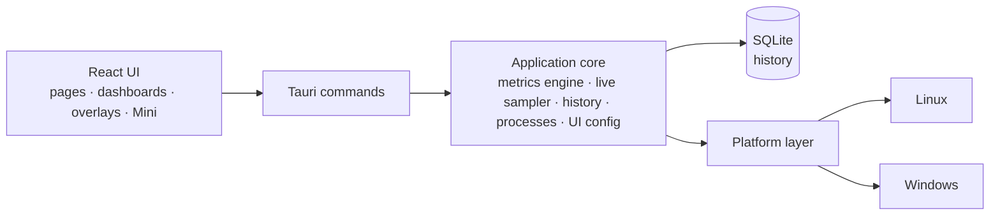

<p align="center">
  <a href="README.md">English</a> ·
  <b>Français</b> ·
  <a href="README.es.md">Español</a> ·
  <a href="README.pt-BR.md">Português (Brasil)</a> ·
  <a href="README.de.md">Deutsch</a> ·
  <a href="README.it.md">Italiano</a> ·
  <a href="README.zh-CN.md">简体中文</a> ·
  <a href="README.ja.md">日本語</a> ·
  <a href="README.ko.md">한국어</a> ·
  <a href="README.ru.md">Русский</a>
</p>

<p align="center"><sub>Traduction de <a href="README.md">README.md</a>, qui reste la référence. La documentation détaillée est en anglais.</sub></p>

<p align="center">
  
</p>

<p align="center">
  <strong>Un moniteur système multiplateforme pour Windows et Fedora Linux — métriques en direct,<br>
  historique local, tableaux de bord que vous composez et overlays sur le bureau.</strong>
</p>

<p align="center">
  <a href="https://github.com/lolmath06/PULSE/actions/workflows/ci.yml"></a>
  
  
  
  
  <a href="LICENSE"></a>
</p>

<p align="center">
  <a href="#gallery">Galerie</a> ·
  <a href="#build-from-source">Compiler depuis les sources</a> ·
  <a href="docs/README.md">Documentation</a> ·
  <a href="#platforms-and-status">État</a> ·
  <a href="CHANGELOG.md">Journal des modifications</a>
</p>

<p align="center">
  
</p>

## Ce qu'est PULSE

PULSE montre ce que fait votre machine — processeur, carte graphique, mémoire,
stockage, réseau et processus — et vous laisse décider **comment** c'est affiché :
dans la vue d'ensemble, sur des tableaux de bord composés de widgets, dans une
petite fenêtre Mini, ou en overlays posés sur le bureau au-dessus des autres
fenêtres.

Il fonctionne nativement sous **Windows 10/11** et **Fedora Linux** derrière un
même contrat de métriques : un widget lié à « température GPU » ou à « processeur
logique 3 » veut dire la même chose sur les deux. Il lit tout avec les droits de
l'utilisateur, conserve son historique dans un fichier local et, quand une machine
ne peut pas fournir une valeur, il dit _pourquoi_ au lieu d'en inventer une.

## Points forts

|                            |                                                                                                                                                                                                             |
| -------------------------- | ----------------------------------------------------------------------------------------------------------------------------------------------------------------------------------------------------------- |
| **Surveillance en direct** | Utilisation et topologie du CPU, utilisation et fréquences par processeur logique, mémoire, charge / VRAM / fréquences / températures / ventilateur du GPU, E/S de stockage et santé NVMe, réseau et Wi-Fi  |
| **Historique local**       | Enregistré toutes les 5 s dans un fichier SQLite local ; plages de 15 minutes à 7 jours, min / max / moyenne conservés quand les données anciennes sont compactées                                          |
| **Tableaux de bord**       | Plusieurs tableaux de widgets déplaçables et redimensionnables ; huit modèles ; rendus courbe, aire, sparkline, valeur, barre et jauge ; import et export                                                   |
| **Overlays et Mini**       | Douze packs d'overlays — relevés, barres, rails, HUD d'angle — traversables au clic une fois verrouillés ; une icône de zone de notification, un raccourci global configurable et une fenêtre Mini compacte |
| **Modes**                  | Jeu, Développement, Personnel et Mini : chacun avec son style, sa bande en direct, son tableau de départ et ses packs d'overlays                                                                            |
| **Studio d'apparence**     | Huit styles intégrés (Clean, Glass, Technical, Neon, Gaming, Stealth, Compact, Transparent HUD), réglages avancés et styles enregistrés de votre cru                                                        |
| **Processus**              | Applications et processus avec CPU, mémoire et E/S ; un inspecteur avec provenance du paquet ou de la signature, SHA-256 à la demande et contrôles explicites                                               |
| **Langues**                | Seize langues d'interface ; suit la langue du système par défaut, ou choisissez-en une dans l'accueil ou dans Apparence — nombres et dates suivent aussi                                                    |

<a id="gallery"></a>

## Galerie

<table>
  <tr>
    <td width="50%"><br><sub><b>Vue d'ensemble</b> — une bande en direct de l'essentiel, les quatre modes et les détails du système.</sub></td>
    <td width="50%"><br><sub><b>Tableaux de bord</b> — le modèle <i>Fancy showcase</i>, dans son propre style Glass.</sub></td>
  </tr>
  <tr>
    <td><br><sub><b>Modèles</b> — huit points de départ composés ; tout reste modifiable.</sub></td>
    <td><br><sub><b>Historique</b> — le détail par processeur logique au-dessus de 24 heures de charge CPU enregistrée.</sub></td>
  </tr>
  <tr>
    <td><br><sub><b>Processus</b> — l'inspecteur : identité, ressources, exécutable et provenance.</sub></td>
    <td><br><sub><b>Apparence</b> — huit styles, réglages avancés et aperçu en direct.</sub></td>
  </tr>
  <tr>
    <td><br><sub><b>Overlays</b> — douze packs, du relevé de trois lignes aux rails pleine hauteur.</sub></td>
    <td><br><sub><b>Modes</b> — Développement, dans son style Technical : une bande dense, un modèle, ses packs.</sub></td>
  </tr>
</table>

<p align="center">
  <br>
  <sub><b>Mini</b> — une petite fenêtre ordinaire avec ses propres dispositions (ici : Vitals).</sub>
</p>

<sub>Chaque image est une capture de la véritable interface de PULSE. Pour qu'elles restent
reproductibles et exemptes de toute donnée personnelle, les réponses du backend proviennent d'une
machine fictive déterministe — voir [`scripts/showcase/`](scripts/showcase/README.md). Les captures
montrent l'interface en anglais.</sub>

## Pourquoi PULSE

La plupart des moniteurs décident pour vous de ce qui compte. PULSE part du
principe inverse — **c'est vous qui le composez** — et reste rigoureux sur ce qu'il
affiche :

- **Disponibilité honnête.** Chaque métrique porte un état : disponible, non prise
  en charge sur cette plateforme, non détectée sur cette machine, bloquée par les
  permissions, temporairement indisponible, ou erreur du fournisseur — chacun avec
  une raison. Un capteur absent est montré absent, jamais `0`.
- **Des distinctions que d'autres outils brouillent.** Un cœur physique n'est pas
  un processeur logique ; la VRAM dédiée n'est pas la mémoire système partagée ; un
  périphérique de stockage n'est pas un volume ; une limite thermique n'est pas une
  température ; un compteur local de paquets abandonnés n'est pas une perte de
  paquets sur Internet.
- **Identités stables.** Les GPU, disques et interfaces réseau sont identifiés par
  ce qui survit aux redémarrages (un UUID NVML, le WWID d'un disque, une adresse MAC
  permanente), jamais par `nvme0n1`, un index d'adaptateur ou une adresse aléatoire —
  les tableaux enregistrés pointent donc toujours vers le bon matériel, et les
  exports ne contiennent aucun identifiant matériel brut.
- **Modes et tableaux de bord sont distincts.** Un mode décrit _comment_ PULSE se
  comporte ; un tableau de bord décrit _ce qu'il_ affiche. N'importe quel tableau,
  n'importe quel style, n'importe quel mode.

## Ce qu'il surveille

Ce qu'une machine peut rapporter dépend de son matériel, de ses pilotes et de sa
plateforme ; PULSE lit ce qui est réellement là.

| Domaine       | Métriques                                                                                                                                                                                           |
| ------------- | --------------------------------------------------------------------------------------------------------------------------------------------------------------------------------------------------- |
| **CPU**       | Utilisation totale ; utilisation et fréquence actuelle / maximale par processeur logique ; cœurs physiques, processeurs logiques et packages ; température du package si un capteur existe          |
| **Mémoire**   | Totale, utilisée, disponible, utilisation                                                                                                                                                           |
| **GPU**       | Chaque adaptateur, nommé et identifié ; utilisation, VRAM, fréquences cœur et mémoire, températures cœur / hotspot / mémoire et ventilateur en tr/min quand NVML ou le pilote `amdgpu` les exposent |
| **Stockage**  | Périphériques et volumes ; capacité et utilisation ; débit, IOPS et latence en lecture / écriture ; santé NVMe (température, usure, réserve, heures de fonctionnement, arrêts brutaux, erreurs)     |
| **Réseau**    | Interfaces et état de liaison ; réception / envoi, paquets, erreurs et pertes ; vitesses de liaison ; signal Wi-Fi et débits de liaison                                                             |
| **Processus** | Nombre de processus, en cours et threads ; CPU, mémoire, threads et E/S disque par processus et par application                                                                                     |

Les bibliothèques GPU des constructeurs sont chargées à l'exécution : un pilote
absent coûte ces métriques, jamais la capacité à démarrer. Détails :
[documentation des métriques](docs/metrics/README.md).

## Local d'abord, sûr par conception

- **L'historique reste sur votre machine** — un fichier SQLite local, échantillons
  bruts sur 24 heures et agrégats min / max / moyenne / nombre à la minute sur 7
  jours. ([rétention](docs/history/retention.md))
- **Aucune télémétrie.** PULSE n'envoie rien à aucun serveur. Les seules actions
  sortantes sont celles sur lesquelles vous cliquez — _Rechercher en ligne_ un nom de
  processus ou une empreinte, _Vérifier l'empreinte sur VirusTotal_ — qui ouvrent votre
  navigateur sur cette page (aucun fichier n'est jamais envoyé).
- **Ni lignes de commande, ni arguments, ni variables d'environnement** ne sont
  collectés pour les processus.
- **Les contrôles de processus sont explicites.** Suspendre / reprendre, terminer
  un processus ou une arborescence, priorité et affinité ne s'exécutent que si vous
  les choisissez ; les actions destructrices demandent d'abord. Chacune vise une
  instance de processus exacte — PID plus jeton de démarrage, revérifié juste avant
  d'agir — un PID recyclé n'est donc jamais touché par erreur.
- **Aucune élévation.** PULSE s'exécute avec les droits de l'utilisateur et ne les
  élève jamais ; ce qui en demande davantage est signalé comme permission refusée,
  avec la raison.
- **Accès matériel en lecture seule.** Aucun réglage de ventilateur, de limite ou
  d'alimentation n'est jamais écrit ; rien n'est injecté dans les jeux — les
  overlays sont des fenêtres distinctes.

Voir [SECURITY.md](SECURITY.md) et les [contrôles de processus](docs/processes/controls.md).

<a id="platforms-and-status"></a>

## Plateformes et état

|                            | Windows 10 / 11                                                      | Fedora Linux                                                     |
| -------------------------- | -------------------------------------------------------------------- | ---------------------------------------------------------------- |
| Niveau de prise en charge  | Prioritaire                                                          | Prioritaire                                                      |
| Sources de données natives | Win32 / NT APIs, DXGI + D3DKMT, SetupAPI, IP Helper, NVML            | `/proc`, `/sys`, `hwmon`, DRM, `rtnetlink` + `nl80211`, NVML     |
| Overlays                   | Fenêtres natives superposées au premier plan                         | Pont GNOME Shell sous Wayland ; fenêtres Wayland et X11 standard |
| Validation automatisée     | CI native : build, tests, Clippy, MSRV 1.77.2, NSIS / MSI / portable | CI : lint, typecheck, tests, build de l'app, Clippy, MSRV 1.77.2 |
| Validation physique        | Dernière étape avant publication, en attente                         | Effectuée (Fedora 39, GNOME 45 sous Wayland)                     |

PULSE est en version **0.1.0-dev** et complet en fonctionnalités pour sa première
version. Les builds Windows natifs sont compilés, testés et empaquetés en CI à
chaque exécution ; la dernière étape avant une publication est la
[liste de vérification physique Windows](docs/release/windows-physical-validation.md).
Aucune version n'est encore publiée — voir le [processus de publication](docs/release/release-process.md).
macOS n'est pas une cible.

<a id="build-from-source"></a>

## Compiler depuis les sources

**Prérequis :** Node.js 20.19+ avec pnpm (`corepack enable pnpm`), et Rust
1.77.2+ via [rustup](https://rustup.rs) ([notes sur la MSRV](docs/development/msrv.md)).

<details>
<summary>Paquets système <b>Fedora Linux</b></summary>

```bash
sudo dnf install -y \
  webkit2gtk4.1-devel \
  openssl-devel \
  curl wget file \
  libappindicator-gtk3-devel \
  librsvg2-devel \
  gcc gcc-c++ make
```

</details>

<details>
<summary>Prérequis <b>Windows</b></summary>

- **Microsoft C++ Build Tools** avec la charge de travail « Développement Desktop en C++ »
- **WebView2 Runtime** (préinstallé sur Windows 11 et les Windows 10 à jour)

</details>

```bash
git clone https://github.com/lolmath06/PULSE.git
cd PULSE
pnpm install
pnpm app:dev      # run PULSE in development
pnpm app:build    # build the desktop application and its bundles
```

Chaque exécution verte de la CI produit aussi un build Windows non signé
(installateur NSIS, MSI, exécutable portable et sommes de contrôle) pour les tests —
voir [CI Windows et artefacts](docs/release/windows-ci.md).

## Architecture



L'interface ne lit jamais `/proc`, `/sys`, DXGI ou NVML — tout ce qui touche au
système franchit la frontière des commandes sous forme de données typées, et seule
la couche plateforme sait sur quel OS elle tourne. En savoir plus dans la
[vue d'ensemble de l'architecture](docs/architecture/overview.md).

| Couche                | Technologie                                             |
| --------------------- | ------------------------------------------------------- |
| Application de bureau | [Tauri 2](https://tauri.app)                            |
| Backend               | Rust (édition 2021, MSRV 1.77.2)                        |
| Stockage              | SQLite via `rusqlite` (intégré)                         |
| Interface             | React 19, TypeScript, React Router, D3 shape, i18next   |
| Build et outillage    | Vite, pnpm                                              |
| Tests et qualité      | Vitest, `cargo test`, ESLint, Prettier, rustfmt, Clippy |

<details>
<summary><b>Organisation du dépôt</b></summary>

```text
PULSE/
├── src/                 # React frontend
│   ├── app/             # router, routes, app constants
│   ├── components/      # Dashboard, Overlay, Mini, History, ProcessInspector…
│   ├── config/          # the shared UI configuration store
│   ├── dashboard/       # widget model, grid layout, library, bindings, templates
│   ├── design/          # styles, tokens, appearance
│   ├── i18n/            # languages, locale resolution, translation catalogs
│   ├── live/            # this window's side of the live widget feed
│   ├── modes/           # Gaming, Development, Personal, Mini
│   ├── overlay/         # overlay model, desktop commands
│   ├── presets/         # dashboard templates and overlay packs
│   ├── services/        # the invoke() boundary
│   ├── types/           # shared types, mirrors of Rust payloads
│   └── visualization/   # chart engine: renderers, config, Customize
├── src-tauri/           # Rust backend
│   └── src/
│       ├── commands/    # Tauri command surface
│       ├── desktop.rs   # overlay windows, Mini, tray, global shortcut
│       ├── history/     # scheduler, SQLite store, queries, retention
│       ├── live/        # one shared 1 s sampler, in-memory rings
│       ├── metrics/     # metrics engine, model, well-known declarations
│       ├── overlay/     # capabilities, geometry, specs, settings, GNOME bridge
│       ├── platform/    # the platform seam: linux/ and windows/
│       ├── processes/   # snapshots, inspector, controls, provenance
│       └── ui_config/   # the shared UI configuration file (atomic, versioned)
├── integrations/        # the GNOME Shell overlay bridge extension
├── tools/windows-check/ # type-checks the Windows code from Linux
├── scripts/showcase/    # regenerates the README media
└── docs/
```

</details>

## Développement

| Commande                            | Rôle                                              |
| ----------------------------------- | ------------------------------------------------- |
| `pnpm app:dev`                      | Lancer PULSE en développement                     |
| `pnpm app:build`                    | Compiler l'application de bureau                  |
| `pnpm dev`                          | Serveur de développement Vite seul (sans backend) |
| `pnpm build`                        | Vérifier les types et compiler l'interface        |
| `pnpm typecheck`                    | TypeScript, sans émission                         |
| `pnpm lint` / `pnpm lint:fix`       | ESLint                                            |
| `pnpm format` / `pnpm format:check` | Prettier                                          |
| `pnpm test` / `pnpm test:watch`     | Vitest                                            |
| `pnpm rust:fmt`                     | `cargo fmt --check`                               |
| `pnpm rust:lint`                    | Clippy, avertissements refusés                    |
| `pnpm rust:test`                    | `cargo test`                                      |
| `pnpm rust:windows`                 | Vérifier les types du code Windows depuis Linux   |
| `pnpm check:all`                    | Tout ce qu'exécute la CI                          |

`pnpm dev` lance l'interface sans le backend Rust ; la barre d'état indique alors
que le backend est indisponible, ce qui est normal hors de Tauri. Voir
[premiers pas](docs/development/getting-started.md) et [tests](docs/development/testing.md).

Une fonctionnalité qui touche au système n'est pas considérée comme terminée tant
que son comportement sous Windows et sous Fedora Linux n'a pas été conçu et, dès
que c'est concrètement testable, validé.

## Documentation

Commencez par [`docs/README.md`](docs/README.md) (en anglais).

- **Utiliser PULSE** — [guide de l'utilisateur](docs/user-guide/README.md) ·
  [modes](docs/modes/overview.md) · [overlays](docs/overlay/user-guide.md) ·
  [apparence](docs/design-system/customization.md) ·
  [modèles de tableaux de bord](docs/presets/dashboard-templates.md) ·
  [packs d'overlays](docs/presets/overlay-packs.md)
- **Métriques** — [moteur](docs/metrics/README.md) · [modèle](docs/metrics/model.md) ·
  [identifiants](docs/metrics/identifiers.md) · [CPU et mémoire](docs/metrics/cpu-memory.md) ·
  [CPU avancé](docs/metrics/cpu-advanced.md) · [GPU](docs/metrics/gpu.md) ·
  [thermique](docs/metrics/thermals.md) · [stockage](docs/metrics/storage.md) ·
  [réseau](docs/metrics/network.md) · [processus](docs/metrics/processes.md)
- **Processus** — [inspecteur](docs/processes/inspector.md) ·
  [provenance](docs/processes/provenance.md) · [contrôles](docs/processes/controls.md)
- **Historique et visualisation** — [historique](docs/history/architecture.md) ·
  [stockage](docs/history/storage.md) · [rétention](docs/history/retention.md) ·
  [visualisation](docs/visualization/architecture.md) ·
  [rendus](docs/visualization/renderers.md)
- **Tableaux de bord et overlays** — [tableau de bord](docs/dashboard/architecture.md) ·
  [widgets](docs/dashboard/widgets.md) · [disposition](docs/dashboard/layout.md) ·
  [architecture des overlays](docs/overlay/architecture.md) ·
  [backends](docs/overlay/backends.md) · [pont GNOME](docs/overlay/gnome-bridge.md)
- **Design** — [système de design](docs/design-system/overview.md)
- **Plateformes** — [Fedora Linux](docs/platforms/fedora.md) · [Windows](docs/platforms/windows.md)
- **Publication** — [CI](docs/release/ci.md) · [CI Windows et artefacts](docs/release/windows-ci.md) ·
  [validation physique Windows](docs/release/windows-physical-validation.md) ·
  [processus de publication](docs/release/release-process.md)

## Contribuer

Voir [CONTRIBUTING.md](CONTRIBUTING.md). Lancez `pnpm check:all` avant d'ouvrir une
pull request, et gardez à l'esprit la règle multiplateforme ci-dessus.

## Sécurité

Merci de signaler les vulnérabilités en privé — voir [SECURITY.md](SECURITY.md).

## Licence

PULSE est publié sous la [licence propriétaire](LICENSE). Les crates et paquets tiers
conservent leurs propres licences, telles qu'enregistrées dans `src-tauri/Cargo.lock`
et `pnpm-lock.yaml` ; SQLite, compilé via `rusqlite`, est dans le domaine public.
