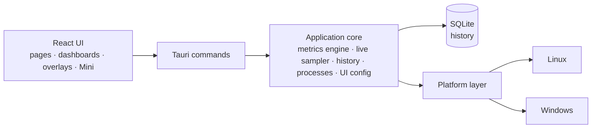

<p align="center">
  <a href="README.md">English</a> ·
  <a href="README.fr.md">Français</a> ·
  <a href="README.es.md">Español</a> ·
  <a href="README.pt-BR.md">Português (Brasil)</a> ·
  <a href="README.de.md">Deutsch</a> ·
  <b>Italiano</b> ·
  <a href="README.zh-CN.md">简体中文</a> ·
  <a href="README.ja.md">日本語</a> ·
  <a href="README.ko.md">한국어</a> ·
  <a href="README.ru.md">Русский</a>
</p>

<p align="center"><sub>Traduzione di <a href="README.md">README.md</a>, che resta il riferimento. La documentazione dettagliata è in inglese.</sub></p>

<p align="center">
  
</p>

<p align="center">
  <strong>Un monitor di sistema multipiattaforma per Windows e Fedora Linux — metriche in tempo reale,<br>
  cronologia locale, dashboard che componi tu e overlay sul desktop.</strong>
</p>

<p align="center">
  <a href="https://github.com/lolmath06/PULSE/actions/workflows/ci.yml"></a>
  
  
  
  
  <a href="LICENSE"></a>
</p>

<p align="center">
  <a href="#gallery">Galleria</a> ·
  <a href="#build-from-source">Compilare dai sorgenti</a> ·
  <a href="docs/README.md">Documentazione</a> ·
  <a href="#platforms-and-status">Stato</a> ·
  <a href="CHANGELOG.md">Registro delle modifiche</a>
</p>

<p align="center">
  
</p>

## Che cos'è PULSE

PULSE mostra cosa sta facendo il tuo computer — processore, scheda grafica, memoria,
archiviazione, rete e processi — e ti lascia decidere **come** mostrarlo: nella
panoramica, in dashboard costruite con i widget, in una piccola finestra Mini o come
overlay posati sul desktop sopra le altre finestre.

Funziona in modo nativo su **Windows 10/11** e **Fedora Linux** dietro un unico
contratto di metriche, così un widget collegato a «temperatura GPU» o a «processore
logico 3» significa la stessa cosa su entrambi. Legge tutto con i permessi
dell'utente, conserva la cronologia in un file locale e, quando un computer non può
fornire un valore, dice _perché_ invece di inventarne uno.

## In evidenza

|                                 |                                                                                                                                                                                                              |
| ------------------------------- | ------------------------------------------------------------------------------------------------------------------------------------------------------------------------------------------------------------ |
| **Monitoraggio in tempo reale** | Uso e topologia della CPU, uso e frequenze per processore logico, memoria, carico / VRAM / frequenze / temperature / ventola della GPU, I/O di archiviazione e stato NVMe, rete e Wi-Fi                      |
| **Cronologia locale**           | Registrata ogni 5 s in un file SQLite locale; intervalli da 15 minuti a 7 giorni, con min / max / media conservati quando i dati più vecchi vengono compattati                                               |
| **Dashboard**                   | Più dashboard di widget spostabili e ridimensionabili; otto modelli; rappresentazioni a linea, area, sparkline, valore, barra e indicatore; importazione ed esportazione                                     |
| **Overlay e Mini**              | Dodici pacchetti di overlay — letture, barre, binari, HUD d'angolo — trasparenti ai clic quando bloccati; un'icona nell'area di notifica, una scorciatoia globale configurabile e una finestra Mini compatta |
| **Modalità**                    | Gioco, Sviluppo, Personale e Mini: ognuna con il suo stile, la sua striscia in tempo reale, la dashboard iniziale e i pacchetti di overlay                                                                   |
| **Studio dell'aspetto**         | Otto stili integrati (Clean, Glass, Technical, Neon, Gaming, Stealth, Compact, Transparent HUD), regolazioni avanzate e stili salvati personali                                                              |
| **Processi**                    | Applicazioni e processi con CPU, memoria e I/O; un ispettore con provenienza del pacchetto o della firma, SHA-256 su richiesta e controlli espliciti                                                         |
| **Lingue**                      | Sedici lingue dell'interfaccia; segue la lingua di sistema per impostazione predefinita, oppure scegline una nel benvenuto o in Aspetto — anche numeri e date la seguono                                     |

<a id="gallery"></a>

## Galleria

<table>
  <tr>
    <td width="50%"><br><sub><b>Panoramica</b> — una striscia in tempo reale dell'essenziale, le quattro modalità e i dettagli del sistema.</sub></td>
    <td width="50%"><br><sub><b>Dashboard</b> — il modello <i>Fancy showcase</i>, con il suo stile Glass.</sub></td>
  </tr>
  <tr>
    <td><br><sub><b>Modelli</b> — otto punti di partenza già composti; tutto resta modificabile.</sub></td>
    <td><br><sub><b>Cronologia</b> — il dettaglio per processore logico sopra 24 ore di carico CPU registrato.</sub></td>
  </tr>
  <tr>
    <td><br><sub><b>Processi</b> — l'ispettore: identità, risorse, eseguibile e provenienza.</sub></td>
    <td><br><sub><b>Aspetto</b> — otto stili, regolazioni avanzate e un'anteprima in tempo reale.</sub></td>
  </tr>
  <tr>
    <td><br><sub><b>Overlay</b> — dodici pacchetti, da una lettura di tre righe a binari a tutta altezza.</sub></td>
    <td><br><sub><b>Modalità</b> — Sviluppo, nel suo stile Technical: una striscia densa, un modello, i suoi pacchetti.</sub></td>
  </tr>
</table>

<p align="center">
  <br>
  <sub><b>Mini</b> — una piccola finestra normale con i suoi layout (qui: Vitals).</sub>
</p>

<sub>Ogni immagine è una cattura della vera interfaccia di PULSE. Per renderle riproducibili e
prive di dati personali, le risposte del backend provengono da un computer fittizio
deterministico — vedi [`scripts/showcase/`](scripts/showcase/README.md). Le catture mostrano
l'interfaccia in inglese.</sub>

## Perché PULSE

La maggior parte dei monitor decide per te che cosa conta. PULSE parte dalla
premessa opposta — **lo componi tu** — ed è rigoroso su ciò che mostra:

- **Disponibilità onesta.** Ogni metrica ha uno stato: disponibile, non supportata su
  questa piattaforma, non rilevata su questo computer, bloccata dai permessi,
  temporaneamente non disponibile o errore del fornitore — ciascuno con un motivo. Un
  sensore assente è mostrato come assente, mai come `0`.
- **Distinzioni che altri strumenti confondono.** Un core fisico non è un processore
  logico; la VRAM dedicata non è memoria di sistema condivisa; un dispositivo di
  archiviazione non è un volume; un limite termico non è una temperatura; un contatore
  locale di scarti non è una perdita di pacchetti su Internet.
- **Identità stabili.** GPU, dischi e interfacce di rete sono identificati da ciò che
  sopravvive ai riavvii (un UUID NVML, il WWID di un'unità, un MAC permanente), mai da
  `nvme0n1`, un indice di scheda o un indirizzo casuale — così le dashboard salvate
  continuano a puntare all'hardware giusto e le esportazioni non contengono
  identificatori hardware grezzi.
- **Modalità e dashboard sono separate.** Una modalità descrive _come_ si comporta
  PULSE; una dashboard descrive _che cosa_ mostra. Qualsiasi dashboard, qualsiasi stile,
  qualsiasi modalità.

## Che cosa monitora

Ciò che un computer può riportare dipende da hardware, driver e piattaforma; PULSE
legge ciò che c'è davvero.

| Area              | Metriche                                                                                                                                                                                  |
| ----------------- | ----------------------------------------------------------------------------------------------------------------------------------------------------------------------------------------- |
| **CPU**           | Uso totale; uso e frequenza attuale / massima per processore logico; core fisici, processori logici e package; temperatura del package dove esiste un sensore                             |
| **Memoria**       | Totale, usata, disponibile, utilizzo                                                                                                                                                      |
| **GPU**           | Ogni scheda, con nome e identificata; uso, VRAM, frequenze di core e memoria, temperature di core / hotspot / memoria e giri della ventola quando NVML o il driver `amdgpu` le espongono  |
| **Archiviazione** | Dispositivi e volumi; capacità e utilizzo; throughput, IOPS e latenza in lettura / scrittura; stato NVMe (temperatura, usura, riserva, ore di accensione, spegnimenti non sicuri, errori) |
| **Rete**          | Interfacce e stato del collegamento; download / upload, pacchetti, errori e scarti; velocità di collegamento; segnale Wi-Fi e velocità di collegamento                                    |
| **Processi**      | Numero di processi, in esecuzione e thread; CPU, memoria, thread e I/O su disco per processo e per applicazione                                                                           |

Le librerie GPU dei produttori sono caricate in fase di esecuzione: un driver
mancante costa quelle metriche, mai la capacità di avviarsi. Dettagli:
[documentazione delle metriche](docs/metrics/README.md).

## Prima di tutto locale, sicuro per progettazione

- **La cronologia resta sul tuo computer** — un file SQLite locale, campioni grezzi
  per 24 ore e aggregati al minuto di min / max / media / conteggio per 7 giorni.
  ([conservazione](docs/history/retention.md))
- **Nessuna telemetria.** PULSE non invia nulla a nessun server. Le uniche azioni in
  uscita sono quelle su cui fai clic — _Cerca online_ il nome di un processo o un hash,
  _Controlla l'hash su VirusTotal_ — che aprono il browser su quella pagina (nessun
  file viene mai caricato).
- **Nessuna riga di comando, nessun argomento, nessuna variabile d'ambiente** viene
  raccolta per i processi.
- **I controlli sui processi sono espliciti.** Sospendi / riprendi, termina processo o
  albero, priorità e affinità vengono eseguiti solo quando li scegli; quelli
  distruttivi chiedono prima conferma. Ognuno punta a un'istanza esatta del processo —
  PID più token di avvio, riconvalidato appena prima di agire — così un PID riciclato
  non viene mai colpito per errore.
- **Nessuna elevazione.** PULSE gira con i diritti dell'utente e non li eleva mai;
  ciò che richiede di più viene segnalato come permesso negato, con il motivo.
- **Accesso all'hardware in sola lettura.** Nessuna impostazione di ventole, limiti o
  alimentazione viene mai scritta; nulla viene iniettato nei giochi — gli overlay sono
  finestre separate.

Vedi [SECURITY.md](SECURITY.md) e i [controlli sui processi](docs/processes/controls.md).

<a id="platforms-and-status"></a>

## Piattaforme e stato

|                      | Windows 10 / 11                                                     | Fedora Linux                                                   |
| -------------------- | ------------------------------------------------------------------- | -------------------------------------------------------------- |
| Livello di supporto  | Di prima classe                                                     | Di prima classe                                                |
| Fonti di dati native | Win32 / NT APIs, DXGI + D3DKMT, SetupAPI, IP Helper, NVML           | `/proc`, `/sys`, `hwmon`, DRM, `rtnetlink` + `nl80211`, NVML   |
| Overlay              | Finestre native stratificate sempre in primo piano                  | Ponte GNOME Shell su Wayland; finestre Wayland e X11 standard  |
| Convalida automatica | CI nativa: build, test, Clippy, MSRV 1.77.2, NSIS / MSI / portabile | CI: lint, typecheck, test, build dell'app, Clippy, MSRV 1.77.2 |
| Convalida fisica     | Ultimo passaggio prima del rilascio, in attesa                      | Eseguita (Fedora 39, GNOME 45 su Wayland)                      |

PULSE è alla versione **0.1.0-dev** ed è completo nelle funzionalità per il suo primo
rilascio. Le build native per Windows vengono compilate, testate e impacchettate in CI
a ogni esecuzione; l'ultimo passaggio prima di un rilascio pubblico è la
[checklist fisica per Windows](docs/release/windows-physical-validation.md).
Non c'è ancora alcun rilascio pubblicato — vedi il [processo di rilascio](docs/release/release-process.md).
macOS non è un obiettivo.

<a id="build-from-source"></a>

## Compilare dai sorgenti

**Prerequisiti:** Node.js 20.19+ con pnpm (`corepack enable pnpm`) e Rust 1.77.2+
tramite [rustup](https://rustup.rs) ([note sulla MSRV](docs/development/msrv.md)).

<details>
<summary>Pacchetti di sistema per <b>Fedora Linux</b></summary>

```bash
sudo dnf install -y \
  webkit2gtk4.1-devel \
  openssl-devel \
  curl wget file \
  libappindicator-gtk3-devel \
  librsvg2-devel \
  gcc gcc-c++ make
```

</details>

<details>
<summary>Prerequisiti per <b>Windows</b></summary>

- **Microsoft C++ Build Tools** con il carico di lavoro «Sviluppo di applicazioni desktop con C++»
- **WebView2 Runtime** (preinstallato su Windows 11 e su Windows 10 aggiornato)

</details>

```bash
git clone https://github.com/lolmath06/PULSE.git
cd PULSE
pnpm install
pnpm app:dev      # run PULSE in development
pnpm app:build    # build the desktop application and its bundles
```

Ogni esecuzione riuscita della CI produce anche una build Windows non firmata
(installer NSIS, MSI, eseguibile portabile e checksum) per i test — vedi
[CI per Windows e artefatti](docs/release/windows-ci.md).

## Architettura



L'interfaccia non legge mai `/proc`, `/sys`, DXGI o NVML — tutto ciò che riguarda il
sistema attraversa il confine dei comandi come dati tipizzati, e solo il livello di
piattaforma sa su quale sistema operativo gira. Approfondisci nella
[panoramica dell'architettura](docs/architecture/overview.md).

| Livello              | Tecnologia                                              |
| -------------------- | ------------------------------------------------------- |
| Applicazione desktop | [Tauri 2](https://tauri.app)                            |
| Backend              | Rust (edizione 2021, MSRV 1.77.2)                       |
| Archiviazione        | SQLite tramite `rusqlite` (incluso)                     |
| Interfaccia          | React 19, TypeScript, React Router, D3 shape, i18next   |
| Build e strumenti    | Vite, pnpm                                              |
| Test e qualità       | Vitest, `cargo test`, ESLint, Prettier, rustfmt, Clippy |

<details>
<summary><b>Struttura del repository</b></summary>

```text
PULSE/
├── src/                 # React frontend
│   ├── app/             # router, routes, app constants
│   ├── components/      # Dashboard, Overlay, Mini, History, ProcessInspector…
│   ├── config/          # the shared UI configuration store
│   ├── dashboard/       # widget model, grid layout, library, bindings, templates
│   ├── design/          # styles, tokens, appearance
│   ├── i18n/            # languages, locale resolution, translation catalogs
│   ├── live/            # this window's side of the live widget feed
│   ├── modes/           # Gaming, Development, Personal, Mini
│   ├── overlay/         # overlay model, desktop commands
│   ├── presets/         # dashboard templates and overlay packs
│   ├── services/        # the invoke() boundary
│   ├── types/           # shared types, mirrors of Rust payloads
│   └── visualization/   # chart engine: renderers, config, Customize
├── src-tauri/           # Rust backend
│   └── src/
│       ├── commands/    # Tauri command surface
│       ├── desktop.rs   # overlay windows, Mini, tray, global shortcut
│       ├── history/     # scheduler, SQLite store, queries, retention
│       ├── live/        # one shared 1 s sampler, in-memory rings
│       ├── metrics/     # metrics engine, model, well-known declarations
│       ├── overlay/     # capabilities, geometry, specs, settings, GNOME bridge
│       ├── platform/    # the platform seam: linux/ and windows/
│       ├── processes/   # snapshots, inspector, controls, provenance
│       └── ui_config/   # the shared UI configuration file (atomic, versioned)
├── integrations/        # the GNOME Shell overlay bridge extension
├── tools/windows-check/ # type-checks the Windows code from Linux
├── scripts/showcase/    # regenerates the README media
└── docs/
```

</details>

## Sviluppo

| Comando                             | Che cosa fa                                     |
| ----------------------------------- | ----------------------------------------------- |
| `pnpm app:dev`                      | Avviare PULSE in sviluppo                       |
| `pnpm app:build`                    | Compilare l'applicazione desktop                |
| `pnpm dev`                          | Solo il server di sviluppo Vite (senza backend) |
| `pnpm build`                        | Controllare i tipi e compilare l'interfaccia    |
| `pnpm typecheck`                    | TypeScript, senza output                        |
| `pnpm lint` / `pnpm lint:fix`       | ESLint                                          |
| `pnpm format` / `pnpm format:check` | Prettier                                        |
| `pnpm test` / `pnpm test:watch`     | Vitest                                          |
| `pnpm rust:fmt`                     | `cargo fmt --check`                             |
| `pnpm rust:lint`                    | Clippy, avvisi trattati come errori             |
| `pnpm rust:test`                    | `cargo test`                                    |
| `pnpm rust:windows`                 | Controllare i tipi del codice Windows da Linux  |
| `pnpm check:all`                    | Tutto ciò che esegue la CI                      |

`pnpm dev` avvia l'interfaccia senza il backend Rust; la barra di stato segnala allora
che il backend non è disponibile, cosa prevista fuori da Tauri. Vedi
[per iniziare](docs/development/getting-started.md) e [test](docs/development/testing.md).

Una funzionalità che riguarda il sistema non è considerata completa finché il suo
comportamento su Windows e su Fedora Linux non è stato progettato e, quando è
davvero verificabile, convalidato.

## Documentazione

Inizia da [`docs/README.md`](docs/README.md) (in inglese).

- **Usare PULSE** — [guida utente](docs/user-guide/README.md) ·
  [modalità](docs/modes/overview.md) · [overlay](docs/overlay/user-guide.md) ·
  [aspetto](docs/design-system/customization.md) ·
  [modelli di dashboard](docs/presets/dashboard-templates.md) ·
  [pacchetti di overlay](docs/presets/overlay-packs.md)
- **Metriche** — [motore](docs/metrics/README.md) · [modello](docs/metrics/model.md) ·
  [identificatori](docs/metrics/identifiers.md) · [CPU e memoria](docs/metrics/cpu-memory.md) ·
  [CPU avanzata](docs/metrics/cpu-advanced.md) · [GPU](docs/metrics/gpu.md) ·
  [temperature](docs/metrics/thermals.md) · [archiviazione](docs/metrics/storage.md) ·
  [rete](docs/metrics/network.md) · [processi](docs/metrics/processes.md)
- **Processi** — [ispettore](docs/processes/inspector.md) ·
  [provenienza](docs/processes/provenance.md) · [controlli](docs/processes/controls.md)
- **Cronologia e visualizzazione** — [cronologia](docs/history/architecture.md) ·
  [archiviazione](docs/history/storage.md) · [conservazione](docs/history/retention.md) ·
  [visualizzazione](docs/visualization/architecture.md) ·
  [rappresentazioni](docs/visualization/renderers.md)
- **Dashboard e overlay** — [dashboard](docs/dashboard/architecture.md) ·
  [widget](docs/dashboard/widgets.md) · [layout](docs/dashboard/layout.md) ·
  [architettura degli overlay](docs/overlay/architecture.md) ·
  [backend](docs/overlay/backends.md) · [ponte GNOME](docs/overlay/gnome-bridge.md)
- **Design** — [design system](docs/design-system/overview.md)
- **Piattaforme** — [Fedora Linux](docs/platforms/fedora.md) · [Windows](docs/platforms/windows.md)
- **Rilascio** — [CI](docs/release/ci.md) · [CI per Windows e artefatti](docs/release/windows-ci.md) ·
  [convalida fisica su Windows](docs/release/windows-physical-validation.md) ·
  [processo di rilascio](docs/release/release-process.md)

## Contribuire

Vedi [CONTRIBUTING.md](CONTRIBUTING.md). Esegui `pnpm check:all` prima di aprire una
pull request e tieni presente la regola multipiattaforma indicata sopra.

## Sicurezza

Segnala le vulnerabilità in privato — vedi [SECURITY.md](SECURITY.md).

## Licenza

PULSE è distribuito con [licenza proprietaria](LICENSE). I crate e i pacchetti di terze parti
mantengono le proprie licenze, come registrato in `src-tauri/Cargo.lock` e
`pnpm-lock.yaml`; SQLite, compilato tramite `rusqlite`, è di pubblico dominio.
