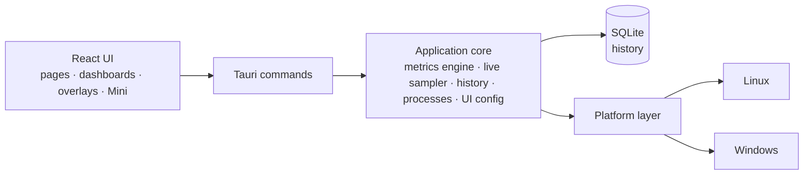

<p align="center">
  <a href="README.md">English</a> ·
  <a href="README.fr.md">Français</a> ·
  <a href="README.es.md">Español</a> ·
  <a href="README.pt-BR.md">Português (Brasil)</a> ·
  <a href="README.de.md">Deutsch</a> ·
  <a href="README.it.md">Italiano</a> ·
  <a href="README.zh-CN.md">简体中文</a> ·
  <b>日本語</b> ·
  <a href="README.ko.md">한국어</a> ·
  <a href="README.ru.md">Русский</a>
</p>

<p align="center"><sub>本書は <a href="README.md">README.md</a> の翻訳です。英語版が正となります。詳細なドキュメントは英語です。</sub></p>

<p align="center">
  
</p>

<p align="center">
  <strong>Windows と Fedora Linux のためのクロスプラットフォーム・システムモニター —— リアルタイムのメトリクス、<br>
  ローカル履歴、自分で組み立てるダッシュボード、そしてデスクトップ・オーバーレイ。</strong>
</p>

<p align="center">
  <a href="https://github.com/lolmath06/PULSE/actions/workflows/ci.yml"></a>
  
  
  
  
  <a href="LICENSE"></a>
</p>

<p align="center">
  <a href="#gallery">ギャラリー</a> ·
  <a href="#build-from-source">ソースからビルド</a> ·
  <a href="docs/README.md">ドキュメント</a> ·
  <a href="#platforms-and-status">ステータス</a> ·
  <a href="CHANGELOG.md">変更履歴</a>
</p>

<p align="center">
  
</p>

## PULSE とは

PULSE は、マシンがいま何をしているか —— プロセッサー、グラフィックス、メモリ、ストレージ、
ネットワーク、プロセス —— を表示し、それを**どう**見せるかをあなたが決められます。概要画面、
ウィジェットで組み立てるダッシュボード、小さな Mini ウィンドウ、あるいは他のウィンドウの上に
重なるデスクトップ・オーバーレイで表示できます。

**Windows 10/11** と **Fedora Linux** でネイティブに動作し、共通のメトリクス契約を備えているため、
「GPU 温度」や「論理プロセッサー 3」に紐づけたウィジェットはどちらでも同じ意味になります。
すべてをユーザー自身の権限で読み取り、履歴はローカルファイルに保存します。マシンが値を提供
できないときは、値をでっち上げずに**理由**を示します。

## 主な特長

|                         |                                                                                                                                                                               |
| ----------------------- | ----------------------------------------------------------------------------------------------------------------------------------------------------------------------------- |
| **リアルタイム監視**    | CPU 使用率とトポロジー、論理プロセッサーごとの使用率とクロック、メモリ、GPU 負荷 / VRAM / クロック / 温度 / ファン、ストレージ I/O と NVMe の健全性、ネットワークと Wi-Fi     |
| **ローカル履歴**        | 5 秒ごとにローカルの SQLite ファイルへ記録。15 分から 7 日までの範囲を表示でき、古いデータを圧縮しても最小 / 最大 / 平均は保持                                                |
| **ダッシュボード**      | 移動・サイズ変更できるウィジェットを並べた複数のダッシュボード。8 種類のテンプレート。折れ線・面・スパークライン・数値・棒・ゲージ表示。インポートとエクスポート              |
| **オーバーレイと Mini** | 12 種類のオーバーレイパック —— 読み取り表示、バー、レール、コーナー HUD —— ロック時はクリックが透過。トレイ、設定可能なグローバルショートカット、コンパクトな Mini ウィンドウ |
| **モード**              | ゲーム、開発、パーソナル、Mini。それぞれに専用のスタイル、ライブストリップ、初期ダッシュボード、オーバーレイパック                                                            |
| **外観スタジオ**        | 8 種類の組み込みスタイル（Clean、Glass、Technical、Neon、Gaming、Stealth、Compact、Transparent HUD）、詳細な調整、自分で保存したスタイル                                      |
| **プロセス**            | アプリとプロセスの CPU・メモリ・I/O。パッケージまたは署名の出所、オンデマンドの SHA-256、明示的な操作を備えたインスペクター                                                   |
| **言語**                | 16 のインターフェース言語。既定ではシステムの言語に従い、ようこそ画面または「外観」で選ぶこともできます —— 数値や日付の書式も追従します                                       |

<a id="gallery"></a>

## ギャラリー

<table>
  <tr>
    <td width="50%"><br><sub><b>概要</b> —— 要点のライブストリップ、4 つのモード、システムの詳細。</sub></td>
    <td width="50%"><br><sub><b>ダッシュボード</b> —— 専用の Glass スタイルをまとった <i>Fancy showcase</i> テンプレート。</sub></td>
  </tr>
  <tr>
    <td><br><sub><b>テンプレート</b> —— 8 つの出発点。すべて自由に編集できます。</sub></td>
    <td><br><sub><b>履歴</b> —— 論理プロセッサーごとの詳細と、その下に 24 時間分の CPU 負荷記録。</sub></td>
  </tr>
  <tr>
    <td><br><sub><b>プロセス</b> —— インスペクター: 識別情報、リソース、実行ファイル、出所。</sub></td>
    <td><br><sub><b>外観</b> —— 8 種類のスタイル、詳細な調整、ライブプレビュー。</sub></td>
  </tr>
  <tr>
    <td><br><sub><b>オーバーレイ</b> —— 3 行の読み取り表示から全高のレールまで、12 種類のパック。</sub></td>
    <td><br><sub><b>モード</b> —— Technical スタイルの開発モード: 密度の高いストリップ、テンプレート、専用パック。</sub></td>
  </tr>
</table>

<p align="center">
  <br>
  <sub><b>Mini</b> —— 独自のレイアウトを持つ小さな通常ウィンドウ（ここでは Vitals）。</sub>
</p>

<sub>すべての画像は実際の PULSE インターフェースのキャプチャです。再現可能で誰の個人データも含まない
ように、バックエンドの応答は決定論的な架空のマシンから得ています —— [`scripts/showcase/`](scripts/showcase/README.md)
を参照してください。キャプチャは英語のインターフェースです。</sub>

## PULSE を選ぶ理由

多くのモニターは、何が重要かを代わりに決めてしまいます。PULSE は逆の前提 —— **組み立てるのは
あなた** —— から出発し、表示する内容について厳密です。

- **正直な可用性。** すべてのメトリクスには状態があります: 利用可能、このプラットフォームでは
  非対応、このマシンでは未検出、権限によりブロック、一時的に利用不可、プロバイダーエラー ——
  それぞれに理由が付きます。存在しないセンサーは存在しないと表示し、決して `0` とは表示しません。
- **他のツールが曖昧にする区別。** 物理コアは論理プロセッサーではなく、専用 VRAM は共有
  システムメモリではなく、ストレージデバイスはボリュームではなく、温度上限は温度ではなく、
  ローカルのドロップカウンターはインターネットのパケットロスではありません。
- **安定した識別。** GPU、ディスク、ネットワークインターフェースは、再起動を越えて変わらない
  情報（NVML の UUID、ドライブの WWID、恒久的な MAC）で識別し、`nvme0n1` やアダプター番号、
  ランダム化されたアドレスには頼りません —— そのため保存したダッシュボードは常に正しい
  ハードウェアを指し、エクスポートには生のハードウェア識別子が含まれません。
- **モードとダッシュボードは別物。** モードは PULSE が**どう**振る舞うかを、ダッシュボードは
  **何を**表示するかを表します。どのダッシュボードも、どのスタイルも、どのモードとも組み合わせられます。

## 監視できるもの

マシンが報告できる内容はハードウェア、ドライバー、プラットフォームによって異なります。PULSE は
実際に存在するものを読み取ります。

| 分野             | メトリクス                                                                                                                                                                    |
| ---------------- | ----------------------------------------------------------------------------------------------------------------------------------------------------------------------------- |
| **CPU**          | 全体の使用率。論理プロセッサーごとの使用率と現在 / 最大クロック。物理コア、論理プロセッサー、パッケージ数。センサーがある場合はパッケージ温度                                 |
| **メモリ**       | 合計、使用中、空き、使用率                                                                                                                                                    |
| **GPU**          | 名前と識別情報付きのすべてのアダプター。使用率、VRAM、コアとメモリのクロック、NVML または `amdgpu` ドライバーが提供する場合はコア / ホットスポット / メモリ温度とファン回転数 |
| **ストレージ**   | デバイスとボリューム。容量と使用量。読み取り / 書き込みのスループット、IOPS、レイテンシ。NVMe の健全性（温度、摩耗、予備領域、通電時間、異常シャットダウン、エラー）          |
| **ネットワーク** | インターフェースとリンク状態。ダウンロード / アップロード、パケット、エラー、ドロップ。リンク速度。Wi-Fi の信号強度とリンクレート                                             |
| **プロセス**     | プロセス数、実行中の数、スレッド数。プロセスごと・アプリごとの CPU、メモリ、スレッド、ディスク I/O                                                                            |

ベンダーの GPU ライブラリは実行時に読み込まれます。ドライバーがなくても失うのはそのメトリクス
だけで、起動できなくなることはありません。詳細は[メトリクスのドキュメント](docs/metrics/README.md)を
参照してください。

## ローカルファーストで、設計から安全

- **履歴はあなたのマシンに残ります** —— ローカルの SQLite ファイルに、24 時間分の生サンプルと、
  7 日分の 1 分ごとの最小 / 最大 / 平均 / 件数の集計を保存します。（[保持期間](docs/history/retention.md)）
- **テレメトリーはありません。** PULSE はどのサーバーにも何も送信しません。外部に向かう操作は、
  あなたがクリックしたもの —— プロセス名やハッシュのオンライン検索、VirusTotal でのハッシュ確認 ——
  だけで、ブラウザーでそのページを開くのみです（ファイルがアップロードされることはありません）。
- **プロセスのコマンドライン、引数、環境変数は一切収集しません。**
- **プロセス操作は明示的です。** 一時停止 / 再開、プロセスまたはツリーの終了、優先度、アフィニティは
  あなたが選んだときだけ実行され、破壊的な操作は事前に確認します。各操作は正確なプロセス
  インスタンス —— PID と起動トークンを実行直前に再検証 —— を対象とするため、再利用された PID を
  誤って操作することはありません。
- **権限昇格はしません。** PULSE はユーザー自身の権限で動作し、決して昇格しません。それ以上の
  権限が必要なものは、理由とともに「権限が拒否されました」と報告します。
- **ハードウェアへのアクセスは読み取り専用。** ファン、上限、電源の設定を書き込むことはなく、
  ゲームに何かを注入することもありません —— オーバーレイは独立したウィンドウです。

[SECURITY.md](SECURITY.md) と[プロセス操作](docs/processes/controls.md)を参照してください。

<a id="platforms-and-status"></a>

## プラットフォームとステータス

|                      | Windows 10 / 11                                                             | Fedora Linux                                                       |
| -------------------- | --------------------------------------------------------------------------- | ------------------------------------------------------------------ |
| サポートレベル       | ファーストクラス                                                            | ファーストクラス                                                   |
| ネイティブのデータ源 | Win32 / NT APIs, DXGI + D3DKMT, SetupAPI, IP Helper, NVML                   | `/proc`, `/sys`, `hwmon`, DRM, `rtnetlink` + `nl80211`, NVML       |
| オーバーレイ         | ネイティブのレイヤード最前面ウィンドウ                                      | Wayland では GNOME Shell ブリッジ。標準の Wayland / X11 ウィンドウ |
| 自動検証             | ネイティブ CI: ビルド、テスト、Clippy、MSRV 1.77.2、NSIS / MSI / ポータブル | CI: lint、型チェック、テスト、アプリのビルド、Clippy、MSRV 1.77.2  |
| 実機検証             | リリース前の最終関門、未完了                                                | 実施済み（Fedora 39、Wayland 上の GNOME 45）                       |

PULSE のバージョンは **0.1.0-dev** で、最初のリリースに必要な機能はそろっています。ネイティブの
Windows ビルドは CI の実行ごとにコンパイル、テスト、パッケージ化されます。公開リリース前に残る
最後の関門は [Windows 実機チェックリスト](docs/release/windows-physical-validation.md)です。
公開済みのリリースはまだありません —— [リリース手順](docs/release/release-process.md)を参照してください。
macOS は対象外です。

<a id="build-from-source"></a>

## ソースからビルド

**前提条件:** pnpm 付きの Node.js 20.19+（`corepack enable pnpm`）と、[rustup](https://rustup.rs)
で導入した Rust 1.77.2+（[MSRV に関する注意](docs/development/msrv.md)）。

<details>
<summary><b>Fedora Linux</b> のシステムパッケージ</summary>

```bash
sudo dnf install -y \
  webkit2gtk4.1-devel \
  openssl-devel \
  curl wget file \
  libappindicator-gtk3-devel \
  librsvg2-devel \
  gcc gcc-c++ make
```

</details>

<details>
<summary><b>Windows</b> の前提条件</summary>

- 「C++ によるデスクトップ開発」ワークロードを含む **Microsoft C++ Build Tools**
- **WebView2 Runtime**（Windows 11 と最新の Windows 10 にはプリインストール済み）

</details>

```bash
git clone https://github.com/lolmath06/PULSE.git
cd PULSE
pnpm install
pnpm app:dev      # run PULSE in development
pnpm app:build    # build the desktop application and its bundles
```

CI が成功するたびに、テスト用の未署名 Windows ビルド（NSIS インストーラー、MSI、ポータブル実行
ファイル、チェックサム）も生成されます —— [Windows CI と成果物](docs/release/windows-ci.md)を参照してください。

## アーキテクチャ



フロントエンドが `/proc`、`/sys`、DXGI、NVML を直接読むことはありません —— システムに関わるものは
すべて型付きのデータとしてコマンド境界を越え、どの OS で動いているかを知っているのはプラットフォーム
層だけです。詳しくは[アーキテクチャの概要](docs/architecture/overview.md)をご覧ください。

| レイヤー           | 技術                                                    |
| ------------------ | ------------------------------------------------------- |
| デスクトップシェル | [Tauri 2](https://tauri.app)                            |
| バックエンド       | Rust（エディション 2021、MSRV 1.77.2）                  |
| ストレージ         | `rusqlite` 経由の SQLite（同梱）                        |
| フロントエンド     | React 19, TypeScript, React Router, D3 shape, i18next   |
| ビルドとツール     | Vite, pnpm                                              |
| テストと品質       | Vitest, `cargo test`, ESLint, Prettier, rustfmt, Clippy |

<details>
<summary><b>リポジトリ構成</b></summary>

```text
PULSE/
├── src/                 # React frontend
│   ├── app/             # router, routes, app constants
│   ├── components/      # Dashboard, Overlay, Mini, History, ProcessInspector…
│   ├── config/          # the shared UI configuration store
│   ├── dashboard/       # widget model, grid layout, library, bindings, templates
│   ├── design/          # styles, tokens, appearance
│   ├── i18n/            # languages, locale resolution, translation catalogs
│   ├── live/            # this window's side of the live widget feed
│   ├── modes/           # Gaming, Development, Personal, Mini
│   ├── overlay/         # overlay model, desktop commands
│   ├── presets/         # dashboard templates and overlay packs
│   ├── services/        # the invoke() boundary
│   ├── types/           # shared types, mirrors of Rust payloads
│   └── visualization/   # chart engine: renderers, config, Customize
├── src-tauri/           # Rust backend
│   └── src/
│       ├── commands/    # Tauri command surface
│       ├── desktop.rs   # overlay windows, Mini, tray, global shortcut
│       ├── history/     # scheduler, SQLite store, queries, retention
│       ├── live/        # one shared 1 s sampler, in-memory rings
│       ├── metrics/     # metrics engine, model, well-known declarations
│       ├── overlay/     # capabilities, geometry, specs, settings, GNOME bridge
│       ├── platform/    # the platform seam: linux/ and windows/
│       ├── processes/   # snapshots, inspector, controls, provenance
│       └── ui_config/   # the shared UI configuration file (atomic, versioned)
├── integrations/        # the GNOME Shell overlay bridge extension
├── tools/windows-check/ # type-checks the Windows code from Linux
├── scripts/showcase/    # regenerates the README media
└── docs/
```

</details>

## 開発

| コマンド                            | 内容                                        |
| ----------------------------------- | ------------------------------------------- |
| `pnpm app:dev`                      | 開発モードで PULSE を実行                   |
| `pnpm app:build`                    | デスクトップアプリをビルド                  |
| `pnpm dev`                          | Vite の開発サーバーのみ（バックエンドなし） |
| `pnpm build`                        | 型チェックしてフロントエンドをビルド        |
| `pnpm typecheck`                    | TypeScript の型チェック（出力なし）         |
| `pnpm lint` / `pnpm lint:fix`       | ESLint                                      |
| `pnpm format` / `pnpm format:check` | Prettier                                    |
| `pnpm test` / `pnpm test:watch`     | Vitest                                      |
| `pnpm rust:fmt`                     | `cargo fmt --check`                         |
| `pnpm rust:lint`                    | Clippy（警告はエラー扱い）                  |
| `pnpm rust:test`                    | `cargo test`                                |
| `pnpm rust:windows`                 | Linux から Windows コードを型チェック       |
| `pnpm check:all`                    | CI が実行するすべて                         |

`pnpm dev` は Rust バックエンドなしでインターフェースを起動します。このときステータスバーには
バックエンドが利用できないと表示されますが、Tauri の外では想定どおりの動作です。
[はじめに](docs/development/getting-started.md)と[テスト](docs/development/testing.md)を参照してください。

システムに関わる機能は、Windows と Fedora Linux の両方での動作が設計され、実際にテストできる
場合には検証されるまで、完成とは見なしません。

## ドキュメント

まずは [`docs/README.md`](docs/README.md)（英語）から。

- **PULSE の使い方** —— [ユーザーガイド](docs/user-guide/README.md) ·
  [モード](docs/modes/overview.md) · [オーバーレイ](docs/overlay/user-guide.md) ·
  [外観](docs/design-system/customization.md) ·
  [ダッシュボードテンプレート](docs/presets/dashboard-templates.md) ·
  [オーバーレイパック](docs/presets/overlay-packs.md)
- **メトリクス** —— [エンジン](docs/metrics/README.md) · [モデル](docs/metrics/model.md) ·
  [識別子](docs/metrics/identifiers.md) · [CPU とメモリ](docs/metrics/cpu-memory.md) ·
  [CPU の詳細](docs/metrics/cpu-advanced.md) · [GPU](docs/metrics/gpu.md) ·
  [温度](docs/metrics/thermals.md) · [ストレージ](docs/metrics/storage.md) ·
  [ネットワーク](docs/metrics/network.md) · [プロセス](docs/metrics/processes.md)
- **プロセス** —— [インスペクター](docs/processes/inspector.md) ·
  [出所](docs/processes/provenance.md) · [操作](docs/processes/controls.md)
- **履歴と可視化** —— [履歴](docs/history/architecture.md) ·
  [ストレージ](docs/history/storage.md) · [保持期間](docs/history/retention.md) ·
  [可視化](docs/visualization/architecture.md) ·
  [レンダラー](docs/visualization/renderers.md)
- **ダッシュボードとオーバーレイ** —— [ダッシュボード](docs/dashboard/architecture.md) ·
  [ウィジェット](docs/dashboard/widgets.md) · [レイアウト](docs/dashboard/layout.md) ·
  [オーバーレイのアーキテクチャ](docs/overlay/architecture.md) ·
  [バックエンド](docs/overlay/backends.md) · [GNOME ブリッジ](docs/overlay/gnome-bridge.md)
- **デザイン** —— [デザインシステム](docs/design-system/overview.md)
- **プラットフォーム** —— [Fedora Linux](docs/platforms/fedora.md) · [Windows](docs/platforms/windows.md)
- **リリース** —— [CI](docs/release/ci.md) · [Windows CI と成果物](docs/release/windows-ci.md) ·
  [Windows 実機検証](docs/release/windows-physical-validation.md) ·
  [リリース手順](docs/release/release-process.md)

## コントリビュート

[CONTRIBUTING.md](CONTRIBUTING.md) を参照してください。pull request を作成する前に `pnpm check:all` を
実行し、上記のクロスプラットフォームの原則を念頭に置いてください。

## セキュリティ

脆弱性は非公開で報告してください —— [SECURITY.md](SECURITY.md) を参照してください。

## ライセンス

PULSE は [プロプライエタリライセンス](LICENSE)で公開されています。サードパーティの crate とパッケージは、
`src-tauri/Cargo.lock` と `pnpm-lock.yaml` に記録されているとおり、それぞれのライセンスに従います。
`rusqlite` を通じて組み込まれる SQLite はパブリックドメインです。
