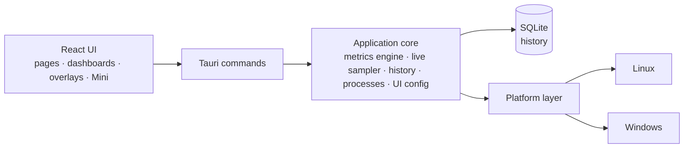

<p align="center">
  <a href="README.md">English</a> ·
  <a href="README.fr.md">Français</a> ·
  <a href="README.es.md">Español</a> ·
  <a href="README.pt-BR.md">Português (Brasil)</a> ·
  <a href="README.de.md">Deutsch</a> ·
  <a href="README.it.md">Italiano</a> ·
  <a href="README.zh-CN.md">简体中文</a> ·
  <a href="README.ja.md">日本語</a> ·
  <b>한국어</b> ·
  <a href="README.ru.md">Русский</a>
</p>

<p align="center"><sub>이 문서는 <a href="README.md">README.md</a>의 번역이며, 영어 원문이 기준입니다. 자세한 문서는 영어로 제공됩니다.</sub></p>

<p align="center">
  
</p>

<p align="center">
  <strong>Windows와 Fedora Linux를 위한 크로스 플랫폼 시스템 모니터 — 실시간 지표,<br>
  로컬 기록, 직접 구성하는 대시보드, 그리고 데스크톱 오버레이.</strong>
</p>

<p align="center">
  <a href="https://github.com/lolmath06/PULSE/actions/workflows/ci.yml"></a>
  
  
  
  
  <a href="LICENSE"></a>
</p>

<p align="center">
  <a href="#gallery">갤러리</a> ·
  <a href="#build-from-source">소스에서 빌드</a> ·
  <a href="docs/README.md">문서</a> ·
  <a href="#platforms-and-status">상태</a> ·
  <a href="CHANGELOG.md">변경 내역</a>
</p>

<p align="center">
  
</p>

## PULSE란

PULSE는 컴퓨터가 지금 무엇을 하고 있는지 — 프로세서, 그래픽, 메모리, 저장 장치, 네트워크,
프로세스 — 를 보여 주고, 그것을 **어떻게** 보여 줄지는 사용자가 정합니다. 개요 화면, 위젯으로
구성한 대시보드, 작은 Mini 창, 또는 다른 창 위에 떠 있는 데스크톱 오버레이로 볼 수 있습니다.

**Windows 10/11**과 **Fedora Linux**에서 하나의 공통 지표 규약 위에서 네이티브로 동작하므로,
“GPU 온도”나 “논리 프로세서 3”에 연결된 위젯은 두 플랫폼에서 같은 의미를 가집니다. 모든 정보를
사용자 자신의 권한으로 읽고, 기록은 로컬 파일에 보관하며, 컴퓨터가 값을 제공할 수 없을 때는 값을
지어내지 않고 **이유**를 알려 줍니다.

## 주요 기능

|                     |                                                                                                                                               |
| ------------------- | --------------------------------------------------------------------------------------------------------------------------------------------- |
| **실시간 모니터링** | CPU 사용률과 토폴로지, 논리 프로세서별 사용률과 클럭, 메모리, GPU 부하 / VRAM / 클럭 / 온도 / 팬, 저장 장치 I/O와 NVMe 상태, 네트워크와 Wi-Fi |
| **로컬 기록**       | 5초마다 로컬 SQLite 파일에 기록. 15분부터 7일까지의 범위를 볼 수 있고, 오래된 데이터를 압축해도 최소 / 최대 / 평균은 유지                     |
| **대시보드**        | 위젯을 옮기고 크기를 바꿀 수 있는 여러 대시보드, 8개의 템플릿, 선·영역·스파크라인·값·막대·게이지 렌더러, 가져오기와 내보내기                  |
| **오버레이와 Mini** | 12개의 오버레이 팩 — 판독값, 막대, 레일, 모서리 HUD — 잠그면 클릭이 통과됩니다. 트레이, 설정 가능한 전역 단축키, 작은 Mini 창                 |
| **모드**            | 게임, 개발, 개인, Mini: 각각 고유한 스타일, 실시간 스트립, 시작 대시보드, 오버레이 팩을 갖습니다                                              |
| **모양 스튜디오**   | 8가지 기본 스타일(Clean, Glass, Technical, Neon, Gaming, Stealth, Compact, Transparent HUD), 세부 조정, 직접 저장한 스타일                    |
| **프로세스**        | 애플리케이션과 프로세스의 CPU, 메모리, I/O. 패키지 또는 서명 출처, 요청 시 SHA-256, 명시적인 제어 기능을 갖춘 검사기                          |
| **언어**            | 16개의 인터페이스 언어. 기본적으로 시스템 언어를 따르며, 환영 화면이나 “모양”에서 직접 고를 수도 있습니다 — 숫자와 날짜 형식도 함께 바뀝니다  |

<a id="gallery"></a>

## 갤러리

<table>
  <tr>
    <td width="50%"><br><sub><b>개요</b> — 핵심 정보의 실시간 스트립, 네 가지 모드, 시스템 정보.</sub></td>
    <td width="50%"><br><sub><b>대시보드</b> — 전용 Glass 스타일을 입은 <i>Fancy showcase</i> 템플릿.</sub></td>
  </tr>
  <tr>
    <td><br><sub><b>템플릿</b> — 잘 구성된 8개의 출발점. 모든 것을 계속 편집할 수 있습니다.</sub></td>
    <td><br><sub><b>기록</b> — 논리 프로세서별 정보와 그 아래 24시간 동안 기록된 CPU 부하.</sub></td>
  </tr>
  <tr>
    <td><br><sub><b>프로세스</b> — 검사기: 신원, 리소스, 실행 파일, 출처.</sub></td>
    <td><br><sub><b>모양</b> — 8가지 스타일, 세부 조정, 실시간 미리 보기.</sub></td>
  </tr>
  <tr>
    <td><br><sub><b>오버레이</b> — 세 줄짜리 판독값부터 전체 높이 레일까지 12개의 팩.</sub></td>
    <td><br><sub><b>모드</b> — Technical 스타일의 개발 모드: 촘촘한 스트립, 템플릿, 전용 팩.</sub></td>
  </tr>
</table>

<p align="center">
  <br>
  <sub><b>Mini</b> — 자체 레이아웃을 갖춘 작고 평범한 창(여기서는 Vitals).</sub>
</p>

<sub>모든 이미지는 실제 PULSE 인터페이스를 캡처한 것입니다. 재현 가능하고 누구의 개인 정보도 담기지
않도록, 백엔드의 응답은 결정적인 가상의 컴퓨터에서 나옵니다 — [`scripts/showcase/`](scripts/showcase/README.md)를
참고하세요. 캡처는 영어 인터페이스입니다.</sub>

## 왜 PULSE인가

대부분의 모니터는 무엇이 중요한지 대신 결정해 버립니다. PULSE는 그 반대 — **구성하는 사람은
바로 당신** — 에서 출발하며, 보여 주는 내용에 대해 엄격합니다.

- **정직한 가용성.** 모든 지표에는 상태가 있습니다: 사용 가능, 이 플랫폼에서 지원되지 않음, 이
  컴퓨터에서 감지되지 않음, 권한으로 차단됨, 일시적으로 사용할 수 없음, 공급자 오류 — 각각 이유와
  함께 표시됩니다. 없는 센서는 없다고 표시하며, 절대 `0`으로 표시하지 않습니다.
- **다른 도구가 흐리는 구분.** 물리 코어는 논리 프로세서가 아니고, 전용 VRAM은 공유 시스템 메모리가
  아니며, 저장 장치는 볼륨이 아니고, 온도 한계는 온도가 아니며, 로컬 드롭 카운터는 인터넷 패킷
  손실이 아닙니다.
- **안정적인 식별.** GPU, 디스크, 네트워크 인터페이스는 재부팅 후에도 유지되는 정보(NVML UUID,
  드라이브 WWID, 고정 MAC)로 식별하며, `nvme0n1`, 어댑터 번호, 무작위 주소에 의존하지 않습니다 —
  그래서 저장한 대시보드는 항상 올바른 하드웨어를 가리키고, 내보낸 파일에는 원시 하드웨어 식별자가
  들어가지 않습니다.
- **모드와 대시보드는 별개입니다.** 모드는 PULSE가 **어떻게** 동작하는지, 대시보드는 **무엇을**
  보여 주는지를 정합니다. 어떤 대시보드든, 어떤 스타일이든, 어떤 모드든 조합할 수 있습니다.

## 모니터링 항목

컴퓨터가 보고할 수 있는 내용은 하드웨어, 드라이버, 플랫폼에 따라 다릅니다. PULSE는 실제로 있는 것을
읽습니다.

| 영역          | 지표                                                                                                                                                    |
| ------------- | ------------------------------------------------------------------------------------------------------------------------------------------------------- |
| **CPU**       | 전체 사용률, 논리 프로세서별 사용률과 현재 / 최대 클럭, 물리 코어·논리 프로세서·패키지 수, 센서가 있는 경우 패키지 온도                                 |
| **메모리**    | 전체, 사용 중, 사용 가능, 사용률                                                                                                                        |
| **GPU**       | 이름과 식별 정보가 있는 모든 어댑터. 사용률, VRAM, 코어와 메모리 클럭, NVML 또는 `amdgpu` 드라이버가 제공하는 경우 코어 / 핫스폿 / 메모리 온도와 팬 RPM |
| **저장 장치** | 장치와 볼륨, 용량과 사용량, 읽기 / 쓰기 처리량·IOPS·지연 시간, NVMe 상태(온도, 마모, 예비 공간, 전원 켜짐 시간, 비정상 종료, 오류)                      |
| **네트워크**  | 인터페이스와 링크 상태, 다운로드 / 업로드, 패킷, 오류와 드롭, 링크 속도, Wi-Fi 신호와 링크 속도                                                         |
| **프로세스**  | 프로세스 수, 실행 중인 수, 스레드 수, 프로세스별·애플리케이션별 CPU, 메모리, 스레드, 디스크 I/O                                                         |

제조사의 GPU 라이브러리는 실행 중에 로드됩니다. 드라이버가 없으면 해당 지표만 잃을 뿐, 시작하지
못하는 일은 없습니다. 자세한 내용은 [지표 문서](docs/metrics/README.md)를 참고하세요.

## 로컬 우선, 설계부터 안전하게

- **기록은 내 컴퓨터에만 남습니다** — 로컬 SQLite 파일에 24시간 분량의 원시 샘플과 7일 분량의
  1분 단위 최소 / 최대 / 평균 / 개수 집계를 보관합니다. ([보존 정책](docs/history/retention.md))
- **원격 측정이 없습니다.** PULSE는 어떤 서버에도 아무것도 보내지 않습니다. 외부로 나가는 동작은
  사용자가 직접 클릭한 것 — 프로세스 이름이나 해시 온라인 검색, VirusTotal에서 해시 확인 — 뿐이며,
  브라우저에서 해당 페이지를 열 뿐입니다(파일은 절대 업로드되지 않습니다).
- **프로세스의 명령줄, 인수, 환경 변수는 수집하지 않습니다.**
- **프로세스 제어는 명시적입니다.** 일시 중지 / 재개, 프로세스 또는 트리 종료, 우선순위와
  선호도는 사용자가 선택할 때만 실행되며, 파괴적인 작업은 먼저 확인합니다. 각 작업은 정확한
  프로세스 인스턴스 — PID와 시작 토큰, 실행 직전에 다시 검증 — 를 대상으로 하므로, 재사용된 PID가
  실수로 영향을 받지 않습니다.
- **권한 상승이 없습니다.** PULSE는 사용자 자신의 권한으로 실행되며 절대 권한을 올리지 않습니다.
  더 높은 권한이 필요한 것은 이유와 함께 권한 거부로 보고합니다.
- **하드웨어는 읽기 전용으로 접근합니다.** 팬, 한계, 전원 설정을 절대 쓰지 않으며, 게임에 아무것도
  주입하지 않습니다 — 오버레이는 별도의 창입니다.

[SECURITY.md](SECURITY.md)와 [프로세스 제어](docs/processes/controls.md)를 참고하세요.

<a id="platforms-and-status"></a>

## 플랫폼과 상태

|                      | Windows 10 / 11                                                     | Fedora Linux                                                 |
| -------------------- | ------------------------------------------------------------------- | ------------------------------------------------------------ |
| 지원 수준            | 최우선 지원                                                         | 최우선 지원                                                  |
| 네이티브 데이터 소스 | Win32 / NT APIs, DXGI + D3DKMT, SetupAPI, IP Helper, NVML           | `/proc`, `/sys`, `hwmon`, DRM, `rtnetlink` + `nl80211`, NVML |
| 오버레이             | 네이티브 레이어드 최상위 창                                         | Wayland에서 GNOME Shell 브리지, 표준 Wayland 및 X11 창       |
| 자동 검증            | 네이티브 CI: 빌드, 테스트, Clippy, MSRV 1.77.2, NSIS / MSI / 포터블 | CI: lint, 타입 검사, 테스트, 앱 빌드, Clippy, MSRV 1.77.2    |
| 실기기 검증          | 출시 전 마지막 관문, 대기 중                                        | 완료(Fedora 39, Wayland의 GNOME 45)                          |

PULSE는 **0.1.0-dev** 버전이며 첫 출시를 위한 기능을 모두 갖추었습니다. 네이티브 Windows 빌드는
CI가 실행될 때마다 컴파일, 테스트, 패키징됩니다. 공개 출시 전 남은 마지막 관문은
[Windows 실기기 체크리스트](docs/release/windows-physical-validation.md)입니다.
아직 공개된 릴리스는 없습니다 — [릴리스 절차](docs/release/release-process.md)를 참고하세요.
macOS는 대상이 아닙니다.

<a id="build-from-source"></a>

## 소스에서 빌드

**사전 요구 사항:** pnpm이 포함된 Node.js 20.19+(`corepack enable pnpm`), 그리고
[rustup](https://rustup.rs)으로 설치한 Rust 1.77.2+([MSRV 참고 사항](docs/development/msrv.md)).

<details>
<summary><b>Fedora Linux</b> 시스템 패키지</summary>

```bash
sudo dnf install -y \
  webkit2gtk4.1-devel \
  openssl-devel \
  curl wget file \
  libappindicator-gtk3-devel \
  librsvg2-devel \
  gcc gcc-c++ make
```

</details>

<details>
<summary><b>Windows</b> 사전 요구 사항</summary>

- “C++를 사용한 데스크톱 개발” 워크로드가 포함된 **Microsoft C++ Build Tools**
- **WebView2 Runtime**(Windows 11과 최신 Windows 10에는 미리 설치되어 있음)

</details>

```bash
git clone https://github.com/lolmath06/PULSE.git
cd PULSE
pnpm install
pnpm app:dev      # run PULSE in development
pnpm app:build    # build the desktop application and its bundles
```

CI가 성공할 때마다 테스트용 서명되지 않은 Windows 빌드(NSIS 설치 프로그램, MSI, 포터블 실행 파일,
체크섬)도 만들어집니다 — [Windows CI와 아티팩트](docs/release/windows-ci.md)를 참고하세요.

## 아키텍처



프런트엔드는 `/proc`, `/sys`, DXGI, NVML을 직접 읽지 않습니다 — 시스템과 관련된 모든 것은 타입이
지정된 데이터로 명령 경계를 넘으며, 어떤 OS에서 실행 중인지는 플랫폼 계층만 압니다. 자세한 내용은
[아키텍처 개요](docs/architecture/overview.md)를 참고하세요.

| 계층          | 기술                                                    |
| ------------- | ------------------------------------------------------- |
| 데스크톱 셸   | [Tauri 2](https://tauri.app)                            |
| 백엔드        | Rust(에디션 2021, MSRV 1.77.2)                          |
| 저장소        | `rusqlite`를 통한 SQLite(내장)                          |
| 프런트엔드    | React 19, TypeScript, React Router, D3 shape, i18next   |
| 빌드와 도구   | Vite, pnpm                                              |
| 테스트와 품질 | Vitest, `cargo test`, ESLint, Prettier, rustfmt, Clippy |

<details>
<summary><b>저장소 구조</b></summary>

```text
PULSE/
├── src/                 # React frontend
│   ├── app/             # router, routes, app constants
│   ├── components/      # Dashboard, Overlay, Mini, History, ProcessInspector…
│   ├── config/          # the shared UI configuration store
│   ├── dashboard/       # widget model, grid layout, library, bindings, templates
│   ├── design/          # styles, tokens, appearance
│   ├── i18n/            # languages, locale resolution, translation catalogs
│   ├── live/            # this window's side of the live widget feed
│   ├── modes/           # Gaming, Development, Personal, Mini
│   ├── overlay/         # overlay model, desktop commands
│   ├── presets/         # dashboard templates and overlay packs
│   ├── services/        # the invoke() boundary
│   ├── types/           # shared types, mirrors of Rust payloads
│   └── visualization/   # chart engine: renderers, config, Customize
├── src-tauri/           # Rust backend
│   └── src/
│       ├── commands/    # Tauri command surface
│       ├── desktop.rs   # overlay windows, Mini, tray, global shortcut
│       ├── history/     # scheduler, SQLite store, queries, retention
│       ├── live/        # one shared 1 s sampler, in-memory rings
│       ├── metrics/     # metrics engine, model, well-known declarations
│       ├── overlay/     # capabilities, geometry, specs, settings, GNOME bridge
│       ├── platform/    # the platform seam: linux/ and windows/
│       ├── processes/   # snapshots, inspector, controls, provenance
│       └── ui_config/   # the shared UI configuration file (atomic, versioned)
├── integrations/        # the GNOME Shell overlay bridge extension
├── tools/windows-check/ # type-checks the Windows code from Linux
├── scripts/showcase/    # regenerates the README media
└── docs/
```

</details>

## 개발

| 명령                                | 하는 일                            |
| ----------------------------------- | ---------------------------------- |
| `pnpm app:dev`                      | 개발 모드로 PULSE 실행             |
| `pnpm app:build`                    | 데스크톱 애플리케이션 빌드         |
| `pnpm dev`                          | Vite 개발 서버만 실행(백엔드 없음) |
| `pnpm build`                        | 타입 검사 후 프런트엔드 빌드       |
| `pnpm typecheck`                    | TypeScript 타입 검사(출력 없음)    |
| `pnpm lint` / `pnpm lint:fix`       | ESLint                             |
| `pnpm format` / `pnpm format:check` | Prettier                           |
| `pnpm test` / `pnpm test:watch`     | Vitest                             |
| `pnpm rust:fmt`                     | `cargo fmt --check`                |
| `pnpm rust:lint`                    | Clippy(경고를 오류로 처리)         |
| `pnpm rust:test`                    | `cargo test`                       |
| `pnpm rust:windows`                 | Linux에서 Windows 코드 타입 검사   |
| `pnpm check:all`                    | CI가 실행하는 모든 검사            |

`pnpm dev`는 Rust 백엔드 없이 인터페이스를 실행합니다. 이때 상태 표시줄에 백엔드를 사용할 수 없다고
표시되는데, Tauri 밖에서는 정상입니다. [시작하기](docs/development/getting-started.md)와
[테스트](docs/development/testing.md)를 참고하세요.

시스템과 관련된 기능은 Windows와 Fedora Linux 양쪽에서의 동작이 설계되고, 실제로 테스트할 수 있는
경우 검증되기 전까지는 완료된 것으로 보지 않습니다.

## 문서

[`docs/README.md`](docs/README.md)(영어)에서 시작하세요.

- **PULSE 사용하기** — [사용자 가이드](docs/user-guide/README.md) ·
  [모드](docs/modes/overview.md) · [오버레이](docs/overlay/user-guide.md) ·
  [모양](docs/design-system/customization.md) ·
  [대시보드 템플릿](docs/presets/dashboard-templates.md) ·
  [오버레이 팩](docs/presets/overlay-packs.md)
- **지표** — [엔진](docs/metrics/README.md) · [모델](docs/metrics/model.md) ·
  [식별자](docs/metrics/identifiers.md) · [CPU와 메모리](docs/metrics/cpu-memory.md) ·
  [CPU 심화](docs/metrics/cpu-advanced.md) · [GPU](docs/metrics/gpu.md) ·
  [온도](docs/metrics/thermals.md) · [저장 장치](docs/metrics/storage.md) ·
  [네트워크](docs/metrics/network.md) · [프로세스](docs/metrics/processes.md)
- **프로세스** — [검사기](docs/processes/inspector.md) ·
  [출처](docs/processes/provenance.md) · [제어](docs/processes/controls.md)
- **기록과 시각화** — [기록](docs/history/architecture.md) ·
  [저장소](docs/history/storage.md) · [보존 정책](docs/history/retention.md) ·
  [시각화](docs/visualization/architecture.md) ·
  [렌더러](docs/visualization/renderers.md)
- **대시보드와 오버레이** — [대시보드](docs/dashboard/architecture.md) ·
  [위젯](docs/dashboard/widgets.md) · [레이아웃](docs/dashboard/layout.md) ·
  [오버레이 아키텍처](docs/overlay/architecture.md) ·
  [백엔드](docs/overlay/backends.md) · [GNOME 브리지](docs/overlay/gnome-bridge.md)
- **디자인** — [디자인 시스템](docs/design-system/overview.md)
- **플랫폼** — [Fedora Linux](docs/platforms/fedora.md) · [Windows](docs/platforms/windows.md)
- **릴리스** — [CI](docs/release/ci.md) · [Windows CI와 아티팩트](docs/release/windows-ci.md) ·
  [Windows 실기기 검증](docs/release/windows-physical-validation.md) ·
  [릴리스 절차](docs/release/release-process.md)

## 기여하기

[CONTRIBUTING.md](CONTRIBUTING.md)를 참고하세요. pull request를 열기 전에 `pnpm check:all`을 실행하고,
위의 크로스 플랫폼 원칙을 염두에 두세요.

## 보안

취약점은 비공개로 신고해 주세요 — [SECURITY.md](SECURITY.md)를 참고하세요.

## 라이선스

**PULSE는 독점 소프트웨어입니다.**
Copyright © 2026 Matheo Dolmen. All rights reserved.

GitHub에 공개된 소스 코드는 읽기, 감사 및 토론을 위해 제공됩니다. 공개되었다는 사실만으로
재사용 또는 재배포 권한이 부여되지는 않습니다. 상당 부분의 복사, 재배포, 수정 버전 공개
또는 상업적 이용에는 사전 서면 허가가 필요합니다.

자세한 내용은 **[LICENSE](LICENSE)** 를 참조하십시오. 타사 구성 요소에는 각각의
라이선스가 계속 적용됩니다.
