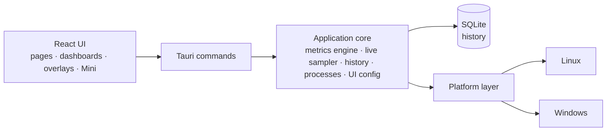

<p align="center">
  <b>English</b> ·
  <a href="README.fr.md">Français</a> ·
  <a href="README.es.md">Español</a> ·
  <a href="README.pt-BR.md">Português (Brasil)</a> ·
  <a href="README.de.md">Deutsch</a> ·
  <a href="README.it.md">Italiano</a> ·
  <a href="README.zh-CN.md">简体中文</a> ·
  <a href="README.ja.md">日本語</a> ·
  <a href="README.ko.md">한국어</a> ·
  <a href="README.ru.md">Русский</a>
</p>

<p align="center">
  
</p>

<p align="center">
  <strong>A cross-platform system monitor for Windows and Fedora Linux — live metrics,<br>
  local history, dashboards you compose, and desktop overlays.</strong>
</p>

<p align="center">
  <a href="https://github.com/lolmath06/PULSE/actions/workflows/ci.yml"></a>
  
  
  
  
  <a href="LICENSE"></a>
</p>

<p align="center">
  <a href="#gallery">Gallery</a> ·
  <a href="#build-from-source">Build from source</a> ·
  <a href="docs/README.md">Documentation</a> ·
  <a href="#platforms-and-status">Status</a> ·
  <a href="CHANGELOG.md">Changelog</a>
</p>

<p align="center">
  
</p>

## What PULSE is

PULSE shows what your machine is doing — processor, graphics, memory, storage,
network and processes — and lets you decide **how** it is shown: on the
Overview, on dashboards you build from widgets, in a small Mini window, or as
overlays that sit on the desktop above other windows.

It runs natively on **Windows 10/11** and **Fedora Linux** behind one shared
metric contract, so a widget bound to "GPU temperature" or "logical processor 3"
means the same thing on both. It reads everything with the user's own
permissions, keeps its history in a local file, and when a machine cannot
provide a value it says _why_ instead of inventing one.

## Highlights

|                       |                                                                                                                                                                       |
| --------------------- | --------------------------------------------------------------------------------------------------------------------------------------------------------------------- |
| **Live monitoring**   | CPU usage and topology, per-logical-processor usage and clocks, memory, GPU load / VRAM / clocks / temperatures / fan, storage I/O and NVMe health, network and Wi-Fi |
| **Local history**     | Recorded every 5 s into a local SQLite file; ranges from 15 minutes to 7 days, with min / max / average kept when older data is compacted                             |
| **Dashboards**        | Several dashboards of movable, resizable widgets; eight templates; line, area, sparkline, value, bar and gauge renderers; import and export                           |
| **Overlays & Mini**   | Twelve overlay packs — readouts, bars, rails, corner HUDs — click-through when locked; a tray, a configurable global shortcut and a compact Mini window               |
| **Modes**             | Gaming, Development, Personal and Mini: each with its own style, live strip, starter dashboard and overlay packs                                                      |
| **Appearance studio** | Eight built-in styles (Clean, Glass, Technical, Neon, Gaming, Stealth, Compact, Transparent HUD), deep tuning, and saved styles of your own                           |
| **Processes**         | Applications and processes with CPU, memory and I/O; an inspector with package or signature provenance, SHA-256 on demand, and explicit controls                      |
| **Languages**         | Sixteen interface languages; follows the system language by default, or pick one in the Welcome sheet or Appearance — numbers and dates follow it too                 |

## Gallery

<table>
  <tr>
    <td width="50%"><br><sub><b>Overview</b> — a live strip of the essentials, the four modes, and system details.</sub></td>
    <td width="50%"><br><sub><b>Dashboards</b> — the <i>Fancy showcase</i> template, wearing its own Glass style.</sub></td>
  </tr>
  <tr>
    <td><br><sub><b>Templates</b> — eight composed starting points; everything stays editable.</sub></td>
    <td><br><sub><b>History</b> — per-logical-processor detail above 24 hours of recorded CPU load.</sub></td>
  </tr>
  <tr>
    <td><br><sub><b>Processes</b> — the inspector: identity, resources, executable and provenance.</sub></td>
    <td><br><sub><b>Appearance</b> — eight styles, deep tuning and a live preview.</sub></td>
  </tr>
  <tr>
    <td><br><sub><b>Overlays</b> — twelve packs, from a three-line readout to full-height rails.</sub></td>
    <td><br><sub><b>Modes</b> — Development, in its Technical style: a dense strip, a template, its packs.</sub></td>
  </tr>
</table>

<p align="center">
  <br>
  <sub><b>Mini</b> — a small, ordinary window with its own layouts (here: Vitals).</sub>
</p>

<sub>Every image is a capture of the real PULSE interface. To keep them reproducible and free of
anyone's personal data, the backend's answers come from a deterministic fictional machine —
see [`scripts/showcase/`](scripts/showcase/README.md).</sub>

## Why PULSE

Most monitors decide for you what matters. PULSE starts from the opposite
premise — **you compose it** — and is strict about what it shows:

- **Honest availability.** Every metric carries a status: available,
  unsupported on this platform, not detected on this machine, blocked by
  permissions, temporarily unavailable, or a provider error — each with a
  reason. A missing sensor is shown as missing, never as `0`.
- **Distinctions other tools blur.** A physical core is not a logical
  processor; dedicated VRAM is not shared system memory; a storage device is
  not a volume; a thermal limit is not a temperature; a local drop counter is
  not Internet packet loss.
- **Stable identities.** GPUs, disks and network interfaces are identified by
  what survives reboots (an NVML UUID, a drive's WWID, a permanent MAC), never
  by `nvme0n1`, an adapter index or a randomised address — so saved dashboards
  keep pointing at the right hardware, and exports contain no raw hardware
  identifiers.
- **Modes and dashboards are separate.** A mode describes _how_ PULSE behaves;
  a dashboard describes _what_ it shows. Any dashboard, any style, any mode.

## What it monitors

What a given machine can report depends on its hardware, drivers and
platform; PULSE reads what is genuinely there.

| Area          | Metrics                                                                                                                                                                   |
| ------------- | ------------------------------------------------------------------------------------------------------------------------------------------------------------------------- |
| **CPU**       | Total usage; usage and current / maximum frequency per logical processor; physical cores, logical processors and packages; package temperature where a sensor exists      |
| **Memory**    | Total, used, available, usage                                                                                                                                             |
| **GPU**       | Every adapter, named and identified; usage, VRAM, core and memory clocks, core / hotspot / memory temperatures and fan RPM where NVML or the `amdgpu` driver exposes them |
| **Storage**   | Devices and volumes; capacity and usage; read / write throughput, IOPS and latency; NVMe health (temperature, wear, spare, power-on hours, unsafe shutdowns, errors)      |
| **Network**   | Interfaces and link state; download / upload, packets, errors and drops; link speeds; Wi-Fi signal and link rates                                                         |
| **Processes** | Process, running and thread counts; per-process and per-application CPU, memory, threads and disk I/O                                                                     |

Vendor GPU libraries are loaded at runtime: a missing driver costs those
metrics, never the ability to start. Details: [metrics documentation](docs/metrics/README.md).

## Local-first and safe by design

- **History stays on your machine** — a local SQLite file, raw samples for 24
  hours and one-minute min / max / average / count aggregates for 7 days.
  ([retention](docs/history/retention.md))
- **No telemetry.** PULSE sends nothing to any server. The only outbound
  actions are ones you click — _Search online_ for a process name or a hash,
  _Check hash on VirusTotal_ — which open your browser on that page (a file is never uploaded).
- **No command lines, no arguments, no environment variables** are collected
  for processes.
- **Process controls are explicit.** Suspend / resume, end process or tree,
  priority and affinity run only when you choose them; destructive ones ask
  first. Each targets one exact process instance — PID plus start token,
  re-validated just before acting — so a recycled PID is never hit by mistake.
- **No elevation.** PULSE runs with the user's own rights and never escalates;
  what needs more is reported as permission-denied, with the reason.
- **Read-only hardware access.** No fan, limit or power setting is ever
  written; no game is injected into — overlays are separate windows.

See [SECURITY.md](SECURITY.md) and [process controls](docs/processes/controls.md).

## Platforms and status

|                      | Windows 10 / 11                                                     | Fedora Linux                                                    |
| -------------------- | ------------------------------------------------------------------- | --------------------------------------------------------------- |
| Support level        | First-class                                                         | First-class                                                     |
| Native data sources  | Win32 / NT APIs, DXGI + D3DKMT, SetupAPI, IP Helper, NVML           | `/proc`, `/sys`, `hwmon`, DRM, `rtnetlink` + `nl80211`, NVML    |
| Overlays             | Native layered topmost windows                                      | GNOME Shell bridge on Wayland; standard Wayland and X11 windows |
| Automated validation | Native CI: build, tests, Clippy, MSRV 1.77.2, NSIS / MSI / portable | CI: lint, typecheck, tests, app build, Clippy, MSRV 1.77.2      |
| Physical validation  | Final pre-release gate, pending                                     | Performed (Fedora 39, GNOME 45 on Wayland)                      |

PULSE is at version **0.1.0-dev** and feature-complete for its first release.
Native Windows builds are compiled, tested and packaged in CI on every run;
the remaining gate before a public release is the
[physical Windows checklist](docs/release/windows-physical-validation.md).
There is no published release yet — see the [release process](docs/release/release-process.md).
macOS is not a target.

## Build from source

**Prerequisites:** Node.js 20.19+ with pnpm (`corepack enable pnpm`), and Rust
1.77.2+ via [rustup](https://rustup.rs) ([MSRV notes](docs/development/msrv.md)).

<details>
<summary><b>Fedora Linux</b> system packages</summary>

```bash
sudo dnf install -y \
  webkit2gtk4.1-devel \
  openssl-devel \
  curl wget file \
  libappindicator-gtk3-devel \
  librsvg2-devel \
  gcc gcc-c++ make
```

</details>

<details>
<summary><b>Windows</b> prerequisites</summary>

- **Microsoft C++ Build Tools** with the "Desktop development with C++" workload
- **WebView2 Runtime** (preinstalled on Windows 11 and current Windows 10)

</details>

```bash
git clone https://github.com/lolmath06/PULSE.git
cd PULSE
pnpm install
pnpm app:dev      # run PULSE in development
pnpm app:build    # build the desktop application and its bundles
```

Each green CI run also produces an unsigned Windows build (NSIS installer, MSI,
portable executable and checksums) for testing — see
[Windows CI & artifacts](docs/release/windows-ci.md).

## Architecture



The frontend never reads `/proc`, `/sys`, DXGI or NVML — everything
system-facing crosses the command boundary as a typed payload, and only the
platform layer knows which OS it runs on. Read more in the
[architecture overview](docs/architecture/overview.md).

| Layer           | Technology                                              |
| --------------- | ------------------------------------------------------- |
| Desktop shell   | [Tauri 2](https://tauri.app)                            |
| Backend         | Rust (edition 2021, MSRV 1.77.2)                        |
| Storage         | SQLite via `rusqlite` (bundled)                         |
| Frontend        | React 19, TypeScript, React Router, D3 shape, i18next   |
| Build & tooling | Vite, pnpm                                              |
| Tests & quality | Vitest, `cargo test`, ESLint, Prettier, rustfmt, Clippy |

<details>
<summary><b>Repository layout</b></summary>

```text
PULSE/
├── src/                 # React frontend
│   ├── app/             # router, routes, app constants
│   ├── components/      # Dashboard, Overlay, Mini, History, ProcessInspector…
│   ├── config/          # the shared UI configuration store
│   ├── dashboard/       # widget model, grid layout, library, bindings, templates
│   ├── design/          # styles, tokens, appearance
│   ├── i18n/            # languages, locale resolution, translation catalogs
│   ├── live/            # this window's side of the live widget feed
│   ├── modes/           # Gaming, Development, Personal, Mini
│   ├── overlay/         # overlay model, desktop commands
│   ├── presets/         # dashboard templates and overlay packs
│   ├── services/        # the invoke() boundary
│   ├── types/           # shared types, mirrors of Rust payloads
│   └── visualization/   # chart engine: renderers, config, Customize
├── src-tauri/           # Rust backend
│   └── src/
│       ├── commands/    # Tauri command surface
│       ├── desktop.rs   # overlay windows, Mini, tray, global shortcut
│       ├── history/     # scheduler, SQLite store, queries, retention
│       ├── live/        # one shared 1 s sampler, in-memory rings
│       ├── metrics/     # metrics engine, model, well-known declarations
│       ├── overlay/     # capabilities, geometry, specs, settings, GNOME bridge
│       ├── platform/    # the platform seam: linux/ and windows/
│       ├── processes/   # snapshots, inspector, controls, provenance
│       └── ui_config/   # the shared UI configuration file (atomic, versioned)
├── integrations/        # the GNOME Shell overlay bridge extension
├── tools/windows-check/ # type-checks the Windows code from Linux
├── scripts/showcase/    # regenerates the README media
└── docs/
```

</details>

## Development

| Command                             | What it does                            |
| ----------------------------------- | --------------------------------------- |
| `pnpm app:dev`                      | Run PULSE in development                |
| `pnpm app:build`                    | Build the desktop application           |
| `pnpm dev`                          | Vite dev server only (no backend)       |
| `pnpm build`                        | Typecheck and build the frontend bundle |
| `pnpm typecheck`                    | TypeScript, no emit                     |
| `pnpm lint` / `pnpm lint:fix`       | ESLint                                  |
| `pnpm format` / `pnpm format:check` | Prettier                                |
| `pnpm test` / `pnpm test:watch`     | Vitest                                  |
| `pnpm rust:fmt`                     | `cargo fmt --check`                     |
| `pnpm rust:lint`                    | Clippy, warnings denied                 |
| `pnpm rust:test`                    | `cargo test`                            |
| `pnpm rust:windows`                 | Type-check the Windows code from Linux  |
| `pnpm check:all`                    | Everything CI runs                      |

`pnpm dev` runs the interface without the Rust backend; the status bar then
reports that the backend is unavailable, which is expected outside Tauri.
See [getting started](docs/development/getting-started.md) and
[testing](docs/development/testing.md).

A system-facing feature is not considered complete until its behaviour on both
Windows and Fedora Linux has been designed and, whenever materially testable,
validated.

## Documentation

Start at [`docs/README.md`](docs/README.md).

- **Using PULSE** — [user guide](docs/user-guide/README.md) ·
  [modes](docs/modes/overview.md) · [overlays](docs/overlay/user-guide.md) ·
  [appearance](docs/design-system/customization.md) ·
  [dashboard templates](docs/presets/dashboard-templates.md) ·
  [overlay packs](docs/presets/overlay-packs.md)
- **Metrics** — [engine](docs/metrics/README.md) · [model](docs/metrics/model.md) ·
  [identifiers](docs/metrics/identifiers.md) · [CPU & memory](docs/metrics/cpu-memory.md) ·
  [advanced CPU](docs/metrics/cpu-advanced.md) · [GPU](docs/metrics/gpu.md) ·
  [thermals](docs/metrics/thermals.md) · [storage](docs/metrics/storage.md) ·
  [network](docs/metrics/network.md) · [processes](docs/metrics/processes.md)
- **Processes** — [inspector](docs/processes/inspector.md) ·
  [provenance](docs/processes/provenance.md) · [controls](docs/processes/controls.md)
- **History & visualization** — [history](docs/history/architecture.md) ·
  [storage](docs/history/storage.md) · [retention](docs/history/retention.md) ·
  [visualization](docs/visualization/architecture.md) ·
  [renderers](docs/visualization/renderers.md)
- **Dashboards & overlays** — [dashboard](docs/dashboard/architecture.md) ·
  [widgets](docs/dashboard/widgets.md) · [layout](docs/dashboard/layout.md) ·
  [overlay architecture](docs/overlay/architecture.md) ·
  [backends](docs/overlay/backends.md) · [GNOME bridge](docs/overlay/gnome-bridge.md)
- **Design** — [design system](docs/design-system/overview.md)
- **Platforms** — [Fedora Linux](docs/platforms/fedora.md) · [Windows](docs/platforms/windows.md)
- **Release** — [CI](docs/release/ci.md) · [Windows CI & artifacts](docs/release/windows-ci.md) ·
  [physical Windows validation](docs/release/windows-physical-validation.md) ·
  [release process](docs/release/release-process.md)

## Contributing

See [CONTRIBUTING.md](CONTRIBUTING.md). Run `pnpm check:all` before opening a
pull request, and keep the cross-platform rule above in mind.

## Security

Please report vulnerabilities privately — see [SECURITY.md](SECURITY.md).

## License

**PULSE is proprietary software.**
Copyright © 2026 Matheo Dolmen. All rights reserved.

The source code published on GitHub is available to be read, audited and
discussed; publication does not grant a license to reuse or redistribute it.
Substantial copying, redistribution, publication of modified versions or
commercial exploitation requires prior written permission.

See **[LICENSE](LICENSE)**. Third-party components remain under their own
licenses.
