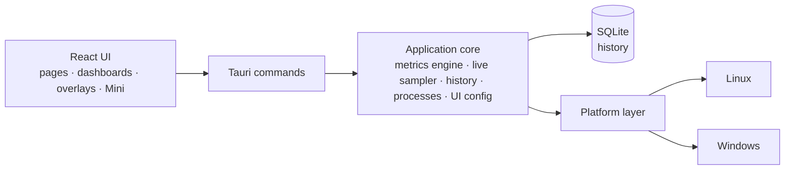

<p align="center">
  <a href="README.md">English</a> ·
  <a href="README.fr.md">Français</a> ·
  <a href="README.es.md">Español</a> ·
  <b>Português (Brasil)</b> ·
  <a href="README.de.md">Deutsch</a> ·
  <a href="README.it.md">Italiano</a> ·
  <a href="README.zh-CN.md">简体中文</a> ·
  <a href="README.ja.md">日本語</a> ·
  <a href="README.ko.md">한국어</a> ·
  <a href="README.ru.md">Русский</a>
</p>

<p align="center"><sub>Tradução de <a href="README.md">README.md</a>, que continua sendo a referência. A documentação detalhada está em inglês.</sub></p>

<p align="center">
  
</p>

<p align="center">
  <strong>Um monitor de sistema multiplataforma para Windows e Fedora Linux — métricas ao vivo,<br>
  histórico local, painéis que você monta e overlays na área de trabalho.</strong>
</p>

<p align="center">
  <a href="https://github.com/lolmath06/PULSE/actions/workflows/ci.yml"></a>
  
  
  
  
  <a href="LICENSE"></a>
</p>

<p align="center">
  <a href="#gallery">Galeria</a> ·
  <a href="#build-from-source">Compilar a partir do código-fonte</a> ·
  <a href="docs/README.md">Documentação</a> ·
  <a href="#platforms-and-status">Status</a> ·
  <a href="CHANGELOG.md">Registro de alterações</a>
</p>

<p align="center">
  
</p>

## O que é o PULSE

O PULSE mostra o que a sua máquina está fazendo — processador, placa de vídeo,
memória, armazenamento, rede e processos — e deixa você decidir **como** isso é
exibido: na visão geral, em painéis montados com widgets, numa pequena janela Mini
ou em overlays posicionados na área de trabalho, acima das outras janelas.

Ele roda de forma nativa no **Windows 10/11** e no **Fedora Linux** sobre um mesmo
contrato de métricas, então um widget ligado a "temperatura da GPU" ou a
"processador lógico 3" significa a mesma coisa nos dois. Ele lê tudo com as
permissões do próprio usuário, guarda o histórico num arquivo local e, quando uma
máquina não consegue fornecer um valor, diz _por quê_ em vez de inventar um.

## Destaques

|                           |                                                                                                                                                                                           |
| ------------------------- | ----------------------------------------------------------------------------------------------------------------------------------------------------------------------------------------- |
| **Monitoramento ao vivo** | Uso e topologia da CPU, uso e frequências por processador lógico, memória, carga / VRAM / frequências / temperaturas / ventoinha da GPU, E/S de armazenamento e saúde NVMe, rede e Wi-Fi  |
| **Histórico local**       | Gravado a cada 5 s num arquivo SQLite local; intervalos de 15 minutos a 7 dias, com mín. / máx. / média preservados quando os dados antigos são compactados                               |
| **Painéis**               | Vários painéis de widgets móveis e redimensionáveis; oito modelos; renderizações em linha, área, sparkline, valor, barra e medidor; importação e exportação                               |
| **Overlays e Mini**       | Doze pacotes de overlays — leituras, barras, trilhos, HUDs de canto — que deixam o clique passar quando travados; ícone na bandeja, atalho global configurável e uma janela Mini compacta |
| **Modos**                 | Jogos, Desenvolvimento, Pessoal e Mini: cada um com seu estilo, sua faixa ao vivo, seu painel inicial e seus pacotes de overlays                                                          |
| **Estúdio de aparência**  | Oito estilos integrados (Clean, Glass, Technical, Neon, Gaming, Stealth, Compact, Transparent HUD), ajuste detalhado e estilos salvos por você                                            |
| **Processos**             | Aplicativos e processos com CPU, memória e E/S; um inspetor com a procedência do pacote ou da assinatura, SHA-256 sob demanda e controles explícitos                                      |
| **Idiomas**               | Dezesseis idiomas de interface; segue o idioma do sistema por padrão, ou escolha um nas boas-vindas ou em Aparência — números e datas também acompanham                                   |

<a id="gallery"></a>

## Galeria

<table>
  <tr>
    <td width="50%"><br><sub><b>Visão geral</b> — uma faixa ao vivo com o essencial, os quatro modos e os detalhes do sistema.</sub></td>
    <td width="50%"><br><sub><b>Painéis</b> — o modelo <i>Fancy showcase</i>, com seu próprio estilo Glass.</sub></td>
  </tr>
  <tr>
    <td><br><sub><b>Modelos</b> — oito pontos de partida prontos; tudo continua editável.</sub></td>
    <td><br><sub><b>Histórico</b> — o detalhe por processador lógico acima de 24 horas de carga de CPU gravada.</sub></td>
  </tr>
  <tr>
    <td><br><sub><b>Processos</b> — o inspetor: identidade, recursos, executável e procedência.</sub></td>
    <td><br><sub><b>Aparência</b> — oito estilos, ajuste detalhado e prévia ao vivo.</sub></td>
  </tr>
  <tr>
    <td><br><sub><b>Overlays</b> — doze pacotes, de uma leitura de três linhas a trilhos de altura total.</sub></td>
    <td><br><sub><b>Modos</b> — Desenvolvimento, no estilo Technical: uma faixa densa, um modelo, seus pacotes.</sub></td>
  </tr>
</table>

<p align="center">
  <br>
  <sub><b>Mini</b> — uma janela pequena e comum, com seus próprios layouts (aqui: Vitals).</sub>
</p>

<sub>Cada imagem é uma captura da interface real do PULSE. Para que sejam reproduzíveis e livres
de dados pessoais de qualquer pessoa, as respostas do backend vêm de uma máquina fictícia
determinística — veja [`scripts/showcase/`](scripts/showcase/README.md). As capturas mostram a
interface em inglês.</sub>

## Por que o PULSE

A maioria dos monitores decide por você o que importa. O PULSE parte da premissa
oposta — **quem monta é você** — e é rigoroso com o que mostra:

- **Disponibilidade honesta.** Cada métrica tem um status: disponível, sem suporte
  nesta plataforma, não detectada nesta máquina, bloqueada por permissões,
  temporariamente indisponível ou erro do provedor — cada um com um motivo. Um
  sensor ausente aparece como ausente, nunca como `0`.
- **Distinções que outras ferramentas confundem.** Um núcleo físico não é um
  processador lógico; VRAM dedicada não é memória do sistema compartilhada; um
  dispositivo de armazenamento não é um volume; um limite térmico não é uma
  temperatura; um contador local de descartes não é perda de pacotes na Internet.
- **Identidades estáveis.** GPUs, discos e interfaces de rede são identificados pelo
  que sobrevive a reinicializações (um UUID da NVML, o WWID de um disco, um MAC
  permanente), nunca por `nvme0n1`, um índice de adaptador ou um endereço aleatório —
  assim os painéis salvos continuam apontando para o hardware certo, e as
  exportações não contêm identificadores de hardware brutos.
- **Modos e painéis são separados.** Um modo descreve _como_ o PULSE se comporta;
  um painel descreve _o que_ ele mostra. Qualquer painel, qualquer estilo, qualquer
  modo.

## O que ele monitora

O que cada máquina consegue informar depende do hardware, dos drivers e da
plataforma; o PULSE lê o que realmente existe.

| Área              | Métricas                                                                                                                                                                                          |
| ----------------- | ------------------------------------------------------------------------------------------------------------------------------------------------------------------------------------------------- |
| **CPU**           | Uso total; uso e frequência atual / máxima por processador lógico; núcleos físicos, processadores lógicos e pacotes; temperatura do pacote quando há sensor                                       |
| **Memória**       | Total, usada, disponível, uso                                                                                                                                                                     |
| **GPU**           | Cada adaptador, nomeado e identificado; uso, VRAM, frequências do núcleo e da memória, temperaturas do núcleo / hotspot / memória e RPM da ventoinha quando a NVML ou o driver `amdgpu` as expõem |
| **Armazenamento** | Dispositivos e volumes; capacidade e uso; vazão, IOPS e latência de leitura / gravação; saúde NVMe (temperatura, desgaste, reserva, horas ligado, desligamentos inseguros, erros)                 |
| **Rede**          | Interfaces e estado do link; download / upload, pacotes, erros e descartes; velocidades do link; sinal Wi-Fi e taxas do link                                                                      |
| **Processos**     | Contagem de processos, em execução e threads; CPU, memória, threads e E/S de disco por processo e por aplicativo                                                                                  |

As bibliotecas de GPU dos fabricantes são carregadas em tempo de execução: um driver
ausente custa essas métricas, nunca a capacidade de iniciar. Detalhes:
[documentação das métricas](docs/metrics/README.md).

## Local em primeiro lugar e seguro por design

- **O histórico fica na sua máquina** — um arquivo SQLite local, amostras brutas por
  24 horas e agregados por minuto de mín. / máx. / média / contagem por 7 dias.
  ([retenção](docs/history/retention.md))
- **Sem telemetria.** O PULSE não envia nada a nenhum servidor. As únicas ações de
  saída são as que você clica — _Pesquisar on-line_ um nome de processo ou um hash,
  _Verificar o hash no VirusTotal_ — que abrem o navegador nessa página (nenhum
  arquivo é enviado).
- **Nenhuma linha de comando, argumento ou variável de ambiente** é coletada dos
  processos.
- **Os controles de processos são explícitos.** Suspender / retomar, encerrar um
  processo ou uma árvore, prioridade e afinidade só rodam quando você escolhe; os
  destrutivos pedem confirmação antes. Cada um mira uma instância exata de processo —
  PID mais token de início, revalidado logo antes de agir — então um PID reciclado
  nunca é atingido por engano.
- **Sem elevação.** O PULSE roda com os direitos do próprio usuário e nunca os
  eleva; o que exige mais é informado como permissão negada, com o motivo.
- **Acesso ao hardware somente leitura.** Nenhuma configuração de ventoinha, limite
  ou energia é gravada; nada é injetado em jogos — os overlays são janelas separadas.

Veja [SECURITY.md](SECURITY.md) e os [controles de processos](docs/processes/controls.md).

<a id="platforms-and-status"></a>

## Plataformas e status

|                         | Windows 10 / 11                                                      | Fedora Linux                                                   |
| ----------------------- | -------------------------------------------------------------------- | -------------------------------------------------------------- |
| Nível de suporte        | De primeira classe                                                   | De primeira classe                                             |
| Fontes de dados nativas | Win32 / NT APIs, DXGI + D3DKMT, SetupAPI, IP Helper, NVML            | `/proc`, `/sys`, `hwmon`, DRM, `rtnetlink` + `nl80211`, NVML   |
| Overlays                | Janelas nativas em camadas, sempre no topo                           | Ponte do GNOME Shell no Wayland; janelas Wayland e X11 padrão  |
| Validação automatizada  | CI nativa: build, testes, Clippy, MSRV 1.77.2, NSIS / MSI / portátil | CI: lint, typecheck, testes, build do app, Clippy, MSRV 1.77.2 |
| Validação física        | Etapa final antes da publicação, pendente                            | Realizada (Fedora 39, GNOME 45 no Wayland)                     |

O PULSE está na versão **0.1.0-dev** e tem todos os recursos da primeira versão.
Builds nativos para Windows são compilados, testados e empacotados na CI a cada
execução; a última etapa antes de uma publicação é o
[checklist físico do Windows](docs/release/windows-physical-validation.md).
Ainda não há nenhuma versão publicada — veja o [processo de publicação](docs/release/release-process.md).
O macOS não é um alvo.

<a id="build-from-source"></a>

## Compilar a partir do código-fonte

**Pré-requisitos:** Node.js 20.19+ com pnpm (`corepack enable pnpm`), e Rust
1.77.2+ via [rustup](https://rustup.rs) ([notas sobre a MSRV](docs/development/msrv.md)).

<details>
<summary>Pacotes de sistema do <b>Fedora Linux</b></summary>

```bash
sudo dnf install -y \
  webkit2gtk4.1-devel \
  openssl-devel \
  curl wget file \
  libappindicator-gtk3-devel \
  librsvg2-devel \
  gcc gcc-c++ make
```

</details>

<details>
<summary>Pré-requisitos do <b>Windows</b></summary>

- **Microsoft C++ Build Tools** com a carga de trabalho "Desenvolvimento para desktop com C++"
- **WebView2 Runtime** (pré-instalado no Windows 11 e no Windows 10 atualizado)

</details>

```bash
git clone https://github.com/lolmath06/PULSE.git
cd PULSE
pnpm install
pnpm app:dev      # run PULSE in development
pnpm app:build    # build the desktop application and its bundles
```

Cada execução bem-sucedida da CI também gera um build não assinado para Windows
(instalador NSIS, MSI, executável portátil e somas de verificação) para testes —
veja [CI do Windows e artefatos](docs/release/windows-ci.md).

## Arquitetura



A interface nunca lê `/proc`, `/sys`, DXGI ou NVML — tudo o que toca o sistema
atravessa a fronteira de comandos como dados tipados, e só a camada de plataforma
sabe em qual sistema operacional está rodando. Saiba mais na
[visão geral da arquitetura](docs/architecture/overview.md).

| Camada              | Tecnologia                                              |
| ------------------- | ------------------------------------------------------- |
| Aplicativo desktop  | [Tauri 2](https://tauri.app)                            |
| Backend             | Rust (edição 2021, MSRV 1.77.2)                         |
| Armazenamento       | SQLite via `rusqlite` (embutido)                        |
| Interface           | React 19, TypeScript, React Router, D3 shape, i18next   |
| Build e ferramentas | Vite, pnpm                                              |
| Testes e qualidade  | Vitest, `cargo test`, ESLint, Prettier, rustfmt, Clippy |

<details>
<summary><b>Estrutura do repositório</b></summary>

```text
PULSE/
├── src/                 # React frontend
│   ├── app/             # router, routes, app constants
│   ├── components/      # Dashboard, Overlay, Mini, History, ProcessInspector…
│   ├── config/          # the shared UI configuration store
│   ├── dashboard/       # widget model, grid layout, library, bindings, templates
│   ├── design/          # styles, tokens, appearance
│   ├── i18n/            # languages, locale resolution, translation catalogs
│   ├── live/            # this window's side of the live widget feed
│   ├── modes/           # Gaming, Development, Personal, Mini
│   ├── overlay/         # overlay model, desktop commands
│   ├── presets/         # dashboard templates and overlay packs
│   ├── services/        # the invoke() boundary
│   ├── types/           # shared types, mirrors of Rust payloads
│   └── visualization/   # chart engine: renderers, config, Customize
├── src-tauri/           # Rust backend
│   └── src/
│       ├── commands/    # Tauri command surface
│       ├── desktop.rs   # overlay windows, Mini, tray, global shortcut
│       ├── history/     # scheduler, SQLite store, queries, retention
│       ├── live/        # one shared 1 s sampler, in-memory rings
│       ├── metrics/     # metrics engine, model, well-known declarations
│       ├── overlay/     # capabilities, geometry, specs, settings, GNOME bridge
│       ├── platform/    # the platform seam: linux/ and windows/
│       ├── processes/   # snapshots, inspector, controls, provenance
│       └── ui_config/   # the shared UI configuration file (atomic, versioned)
├── integrations/        # the GNOME Shell overlay bridge extension
├── tools/windows-check/ # type-checks the Windows code from Linux
├── scripts/showcase/    # regenerates the README media
└── docs/
```

</details>

## Desenvolvimento

| Comando                             | O que faz                                                  |
| ----------------------------------- | ---------------------------------------------------------- |
| `pnpm app:dev`                      | Rodar o PULSE em desenvolvimento                           |
| `pnpm app:build`                    | Compilar o aplicativo desktop                              |
| `pnpm dev`                          | Apenas o servidor de desenvolvimento do Vite (sem backend) |
| `pnpm build`                        | Verificar tipos e compilar a interface                     |
| `pnpm typecheck`                    | TypeScript, sem gerar arquivos                             |
| `pnpm lint` / `pnpm lint:fix`       | ESLint                                                     |
| `pnpm format` / `pnpm format:check` | Prettier                                                   |
| `pnpm test` / `pnpm test:watch`     | Vitest                                                     |
| `pnpm rust:fmt`                     | `cargo fmt --check`                                        |
| `pnpm rust:lint`                    | Clippy, com avisos tratados como erros                     |
| `pnpm rust:test`                    | `cargo test`                                               |
| `pnpm rust:windows`                 | Verificar os tipos do código Windows a partir do Linux     |
| `pnpm check:all`                    | Tudo o que a CI executa                                    |

`pnpm dev` roda a interface sem o backend em Rust; a barra de status então informa
que o backend está indisponível, o que é esperado fora do Tauri. Veja
[primeiros passos](docs/development/getting-started.md) e [testes](docs/development/testing.md).

Um recurso que toca o sistema não é considerado concluído até que seu comportamento
no Windows e no Fedora Linux tenha sido projetado e, sempre que for realmente
testável, validado.

## Documentação

Comece por [`docs/README.md`](docs/README.md) (em inglês).

- **Usando o PULSE** — [guia do usuário](docs/user-guide/README.md) ·
  [modos](docs/modes/overview.md) · [overlays](docs/overlay/user-guide.md) ·
  [aparência](docs/design-system/customization.md) ·
  [modelos de painel](docs/presets/dashboard-templates.md) ·
  [pacotes de overlays](docs/presets/overlay-packs.md)
- **Métricas** — [motor](docs/metrics/README.md) · [modelo](docs/metrics/model.md) ·
  [identificadores](docs/metrics/identifiers.md) · [CPU e memória](docs/metrics/cpu-memory.md) ·
  [CPU avançada](docs/metrics/cpu-advanced.md) · [GPU](docs/metrics/gpu.md) ·
  [temperaturas](docs/metrics/thermals.md) · [armazenamento](docs/metrics/storage.md) ·
  [rede](docs/metrics/network.md) · [processos](docs/metrics/processes.md)
- **Processos** — [inspetor](docs/processes/inspector.md) ·
  [procedência](docs/processes/provenance.md) · [controles](docs/processes/controls.md)
- **Histórico e visualização** — [histórico](docs/history/architecture.md) ·
  [armazenamento](docs/history/storage.md) · [retenção](docs/history/retention.md) ·
  [visualização](docs/visualization/architecture.md) ·
  [renderizações](docs/visualization/renderers.md)
- **Painéis e overlays** — [painel](docs/dashboard/architecture.md) ·
  [widgets](docs/dashboard/widgets.md) · [layout](docs/dashboard/layout.md) ·
  [arquitetura de overlays](docs/overlay/architecture.md) ·
  [backends](docs/overlay/backends.md) · [ponte do GNOME](docs/overlay/gnome-bridge.md)
- **Design** — [design system](docs/design-system/overview.md)
- **Plataformas** — [Fedora Linux](docs/platforms/fedora.md) · [Windows](docs/platforms/windows.md)
- **Publicação** — [CI](docs/release/ci.md) · [CI do Windows e artefatos](docs/release/windows-ci.md) ·
  [validação física no Windows](docs/release/windows-physical-validation.md) ·
  [processo de publicação](docs/release/release-process.md)

## Como contribuir

Veja [CONTRIBUTING.md](CONTRIBUTING.md). Rode `pnpm check:all` antes de abrir um
pull request e tenha em mente a regra multiplataforma acima.

## Segurança

Relate vulnerabilidades de forma privada — veja [SECURITY.md](SECURITY.md).

## Licença

**O PULSE é um software proprietário.**
Copyright © 2026 Matheo Dolmen. Todos os direitos reservados.

O código-fonte publicado no GitHub pode ser lido, auditado e discutido; sua
publicação não concede licença para reutilização ou redistribuição. Cópia
substancial, redistribuição, publicação de versões modificadas ou exploração
comercial exigem autorização prévia por escrito.

Consulte **[LICENSE](LICENSE)**. Componentes de terceiros permanecem sob suas
próprias licenças.
