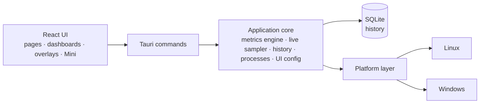

<p align="center">
  <a href="README.md">English</a> ·
  <a href="README.fr.md">Français</a> ·
  <a href="README.es.md">Español</a> ·
  <a href="README.pt-BR.md">Português (Brasil)</a> ·
  <a href="README.de.md">Deutsch</a> ·
  <a href="README.it.md">Italiano</a> ·
  <a href="README.zh-CN.md">简体中文</a> ·
  <a href="README.ja.md">日本語</a> ·
  <a href="README.ko.md">한국어</a> ·
  <b>Русский</b>
</p>

<p align="center"><sub>Перевод <a href="README.md">README.md</a>; основным остаётся английский оригинал. Подробная документация — на английском.</sub></p>

<p align="center">
  
</p>

<p align="center">
  <strong>Кроссплатформенный системный монитор для Windows и Fedora Linux — метрики в реальном времени,<br>
  локальная история, панели, которые вы собираете сами, и оверлеи на рабочем столе.</strong>
</p>

<p align="center">
  <a href="https://github.com/lolmath06/PULSE/actions/workflows/ci.yml"></a>
  
  
  
  
  <a href="LICENSE"></a>
</p>

<p align="center">
  <a href="#gallery">Галерея</a> ·
  <a href="#build-from-source">Сборка из исходников</a> ·
  <a href="docs/README.md">Документация</a> ·
  <a href="#platforms-and-status">Статус</a> ·
  <a href="CHANGELOG.md">Журнал изменений</a>
</p>

<p align="center">
  
</p>

## Что такое PULSE

PULSE показывает, чем занят ваш компьютер, — процессор, графика, память, накопители,
сеть и процессы — и позволяет решать, **как** это отображать: на странице обзора, на
панелях из виджетов, в маленьком окне Mini или в виде оверлеев поверх других окон на
рабочем столе.

Он работает нативно в **Windows 10/11** и **Fedora Linux** на основе единого контракта
метрик, поэтому виджет, привязанный к «температуре GPU» или к «логическому процессору 3»,
означает одно и то же на обеих системах. Всё читается с правами самого пользователя,
история хранится в локальном файле, а если компьютер не может предоставить значение,
PULSE объясняет _почему_, а не выдумывает его.

## Основное

|                                   |                                                                                                                                                                                                 |
| --------------------------------- | ----------------------------------------------------------------------------------------------------------------------------------------------------------------------------------------------- |
| **Мониторинг в реальном времени** | Загрузка и топология CPU, загрузка и частоты по логическим процессорам, память, нагрузка / VRAM / частоты / температуры / вентилятор GPU, ввод-вывод накопителей и состояние NVMe, сеть и Wi-Fi |
| **Локальная история**             | Запись каждые 5 с в локальный файл SQLite; диапазоны от 15 минут до 7 дней, при сжатии старых данных сохраняются мин. / макс. / среднее                                                         |
| **Панели**                        | Несколько панелей с перемещаемыми и масштабируемыми виджетами; восемь шаблонов; линии, области, спарклайны, значения, столбцы и шкалы; импорт и экспорт                                         |
| **Оверлеи и Mini**                | Двенадцать наборов оверлеев — показания, полосы, рейки, угловые HUD — в заблокированном виде пропускают клики; значок в трее, настраиваемое глобальное сочетание клавиш и компактное окно Mini  |
| **Режимы**                        | Игры, Разработка, Личный и Mini: у каждого свой стиль, своя живая полоса, стартовая панель и наборы оверлеев                                                                                    |
| **Студия оформления**             | Восемь встроенных стилей (Clean, Glass, Technical, Neon, Gaming, Stealth, Compact, Transparent HUD), тонкая настройка и собственные сохранённые стили                                           |
| **Процессы**                      | Приложения и процессы с CPU, памятью и вводом-выводом; инспектор с происхождением пакета или подписи, SHA-256 по запросу и явными действиями                                                    |
| **Языки**                         | Шестнадцать языков интерфейса; по умолчанию следует языку системы, или выберите язык в приветствии или в разделе «Оформление» — числа и даты тоже следуют ему                                   |

<a id="gallery"></a>

## Галерея

<table>
  <tr>
    <td width="50%"><br><sub><b>Обзор</b> — живая полоса с главным, четыре режима и сведения о системе.</sub></td>
    <td width="50%"><br><sub><b>Панели</b> — шаблон <i>Fancy showcase</i> в собственном стиле Glass.</sub></td>
  </tr>
  <tr>
    <td><br><sub><b>Шаблоны</b> — восемь готовых отправных точек; всё остаётся редактируемым.</sub></td>
    <td><br><sub><b>История</b> — данные по логическим процессорам над 24 часами записанной загрузки CPU.</sub></td>
  </tr>
  <tr>
    <td><br><sub><b>Процессы</b> — инспектор: идентичность, ресурсы, исполняемый файл и происхождение.</sub></td>
    <td><br><sub><b>Оформление</b> — восемь стилей, тонкая настройка и живой предпросмотр.</sub></td>
  </tr>
  <tr>
    <td><br><sub><b>Оверлеи</b> — двенадцать наборов, от трёхстрочного показания до реек во всю высоту.</sub></td>
    <td><br><sub><b>Режимы</b> — «Разработка» в стиле Technical: плотная полоса, шаблон, свои наборы.</sub></td>
  </tr>
</table>

<p align="center">
  <br>
  <sub><b>Mini</b> — небольшое обычное окно со своими раскладками (здесь: Vitals).</sub>
</p>

<sub>Каждое изображение — снимок настоящего интерфейса PULSE. Чтобы снимки были воспроизводимыми и не
содержали ничьих личных данных, ответы бэкенда берутся с детерминированной вымышленной машины — см.
[`scripts/showcase/`](scripts/showcase/README.md). На снимках интерфейс на английском.</sub>

## Почему PULSE

Большинство мониторов решают за вас, что важно. PULSE исходит из обратного — **собираете
его вы** — и строго относится к тому, что показывает:

- **Честная доступность.** У каждой метрики есть состояние: доступна, не поддерживается на
  этой платформе, не обнаружена на этом компьютере, заблокирована правами доступа, временно
  недоступна или ошибка поставщика — и у каждого есть причина. Отсутствующий датчик
  показывается как отсутствующий, а не как `0`.
- **Различия, которые другие инструменты размывают.** Физическое ядро — не логический
  процессор; выделенная VRAM — не общая системная память; накопитель — не том; тепловой
  предел — не температура; локальный счётчик отброшенных пакетов — не потеря пакетов в
  интернете.
- **Стабильные идентификаторы.** GPU, диски и сетевые интерфейсы определяются по тому, что
  переживает перезагрузку (UUID NVML, WWID накопителя, постоянный MAC), а не по `nvme0n1`,
  номеру адаптера или случайному адресу, — поэтому сохранённые панели продолжают указывать на
  нужное оборудование, а экспорт не содержит сырых аппаратных идентификаторов.
- **Режимы и панели независимы.** Режим описывает, _как_ ведёт себя PULSE; панель — _что_ он
  показывает. Любая панель, любой стиль, любой режим.

## Что он отслеживает

Что может сообщить конкретный компьютер, зависит от оборудования, драйверов и платформы;
PULSE читает то, что действительно есть.

| Область        | Метрики                                                                                                                                                                                        |
| -------------- | ---------------------------------------------------------------------------------------------------------------------------------------------------------------------------------------------- |
| **CPU**        | Общая загрузка; загрузка и текущая / максимальная частота по логическим процессорам; физические ядра, логические процессоры и корпуса; температура корпуса при наличии датчика                 |
| **Память**     | Всего, занято, доступно, загрузка                                                                                                                                                              |
| **GPU**        | Каждый адаптер, с именем и идентификатором; загрузка, VRAM, частоты ядра и памяти, температуры ядра / хотспота / памяти и обороты вентилятора, если их предоставляет NVML или драйвер `amdgpu` |
| **Накопители** | Устройства и тома; ёмкость и заполненность; пропускная способность, IOPS и задержка чтения / записи; состояние NVMe (температура, износ, резерв, часы работы, небезопасные отключения, ошибки) |
| **Сеть**       | Интерфейсы и состояние соединения; приём / передача, пакеты, ошибки и отбрасывания; скорости соединения; сигнал Wi-Fi и скорости канала                                                        |
| **Процессы**   | Число процессов, выполняющихся процессов и потоков; CPU, память, потоки и дисковый ввод-вывод по процессам и по приложениям                                                                    |

Библиотеки GPU от производителей загружаются во время работы: отсутствие драйвера стоит
только этих метрик, но никогда не мешает запуску. Подробнее:
[документация по метрикам](docs/metrics/README.md).

## Прежде всего локально и безопасно по замыслу

- **История остаётся на вашем компьютере** — локальный файл SQLite, сырые замеры за 24 часа
  и поминутные агрегаты мин. / макс. / среднее / количество за 7 дней.
  ([хранение](docs/history/retention.md))
- **Никакой телеметрии.** PULSE ничего не отправляет ни на какие серверы. Единственные
  исходящие действия — те, по которым вы щёлкаете сами: _Искать в интернете_ имя процесса или
  хеш, _Проверить хеш на VirusTotal_ — они открывают эту страницу в браузере (файлы никогда не
  загружаются).
- **Командные строки, аргументы и переменные окружения** процессов не собираются.
- **Управление процессами — только явное.** Приостановка / возобновление, завершение процесса
  или дерева, приоритет и привязка к процессорам выполняются, только когда вы их выбираете;
  разрушительные действия сначала спрашивают подтверждение. Каждое действие нацелено на
  конкретный экземпляр процесса — PID плюс маркер запуска, перепроверяемые непосредственно
  перед действием, — поэтому повторно использованный PID никогда не будет задет по ошибке.
- **Никакого повышения прав.** PULSE работает с правами самого пользователя и никогда их не
  повышает; то, что требует большего, отображается как отказ в доступе с указанием причины.
- **Доступ к оборудованию только на чтение.** Никакие настройки вентиляторов, ограничений или
  питания не записываются; ничего не внедряется в игры — оверлеи являются отдельными окнами.

См. [SECURITY.md](SECURITY.md) и [управление процессами](docs/processes/controls.md).

<a id="platforms-and-status"></a>

## Платформы и статус

|                           | Windows 10 / 11                                                           | Fedora Linux                                                            |
| ------------------------- | ------------------------------------------------------------------------- | ----------------------------------------------------------------------- |
| Уровень поддержки         | Полноценная                                                               | Полноценная                                                             |
| Нативные источники данных | Win32 / NT APIs, DXGI + D3DKMT, SetupAPI, IP Helper, NVML                 | `/proc`, `/sys`, `hwmon`, DRM, `rtnetlink` + `nl80211`, NVML            |
| Оверлеи                   | Нативные многослойные окна поверх остальных                               | Мост GNOME Shell в Wayland; обычные окна Wayland и X11                  |
| Автоматическая проверка   | Нативный CI: сборка, тесты, Clippy, MSRV 1.77.2, NSIS / MSI / портативная | CI: lint, проверка типов, тесты, сборка приложения, Clippy, MSRV 1.77.2 |
| Проверка на железе        | Последний этап перед выпуском, ожидается                                  | Выполнена (Fedora 39, GNOME 45 в Wayland)                               |

PULSE находится в версии **0.1.0-dev**, и все функции первого выпуска готовы. Нативные
сборки для Windows компилируются, тестируются и упаковываются в CI при каждом запуске;
последний этап перед публичным выпуском —
[чек-лист проверки на реальном Windows](docs/release/windows-physical-validation.md).
Опубликованных выпусков пока нет — см. [процесс выпуска](docs/release/release-process.md).
macOS не поддерживается.

<a id="build-from-source"></a>

## Сборка из исходников

**Требования:** Node.js 20.19+ с pnpm (`corepack enable pnpm`) и Rust 1.77.2+ через
[rustup](https://rustup.rs) ([заметки о MSRV](docs/development/msrv.md)).

<details>
<summary>Системные пакеты <b>Fedora Linux</b></summary>

```bash
sudo dnf install -y \
  webkit2gtk4.1-devel \
  openssl-devel \
  curl wget file \
  libappindicator-gtk3-devel \
  librsvg2-devel \
  gcc gcc-c++ make
```

</details>

<details>
<summary>Требования для <b>Windows</b></summary>

- **Microsoft C++ Build Tools** с рабочей нагрузкой «Разработка классических приложений на C++»
- **WebView2 Runtime** (предустановлен в Windows 11 и в актуальной Windows 10)

</details>

```bash
git clone https://github.com/lolmath06/PULSE.git
cd PULSE
pnpm install
pnpm app:dev      # run PULSE in development
pnpm app:build    # build the desktop application and its bundles
```

Каждый успешный запуск CI также создаёт неподписанную сборку для Windows (установщик NSIS,
MSI, портативный исполняемый файл и контрольные суммы) для тестирования — см.
[CI для Windows и артефакты](docs/release/windows-ci.md).

## Архитектура



Интерфейс никогда не читает `/proc`, `/sys`, DXGI или NVML — всё, что касается системы,
пересекает границу команд в виде типизированных данных, и только слой платформы знает, на
какой ОС он работает. Подробнее — в [обзоре архитектуры](docs/architecture/overview.md).

| Слой                 | Технологии                                              |
| -------------------- | ------------------------------------------------------- |
| Оболочка приложения  | [Tauri 2](https://tauri.app)                            |
| Бэкенд               | Rust (редакция 2021, MSRV 1.77.2)                       |
| Хранение             | SQLite через `rusqlite` (встроенный)                    |
| Интерфейс            | React 19, TypeScript, React Router, D3 shape, i18next   |
| Сборка и инструменты | Vite, pnpm                                              |
| Тесты и качество     | Vitest, `cargo test`, ESLint, Prettier, rustfmt, Clippy |

<details>
<summary><b>Структура репозитория</b></summary>

```text
PULSE/
├── src/                 # React frontend
│   ├── app/             # router, routes, app constants
│   ├── components/      # Dashboard, Overlay, Mini, History, ProcessInspector…
│   ├── config/          # the shared UI configuration store
│   ├── dashboard/       # widget model, grid layout, library, bindings, templates
│   ├── design/          # styles, tokens, appearance
│   ├── i18n/            # languages, locale resolution, translation catalogs
│   ├── live/            # this window's side of the live widget feed
│   ├── modes/           # Gaming, Development, Personal, Mini
│   ├── overlay/         # overlay model, desktop commands
│   ├── presets/         # dashboard templates and overlay packs
│   ├── services/        # the invoke() boundary
│   ├── types/           # shared types, mirrors of Rust payloads
│   └── visualization/   # chart engine: renderers, config, Customize
├── src-tauri/           # Rust backend
│   └── src/
│       ├── commands/    # Tauri command surface
│       ├── desktop.rs   # overlay windows, Mini, tray, global shortcut
│       ├── history/     # scheduler, SQLite store, queries, retention
│       ├── live/        # one shared 1 s sampler, in-memory rings
│       ├── metrics/     # metrics engine, model, well-known declarations
│       ├── overlay/     # capabilities, geometry, specs, settings, GNOME bridge
│       ├── platform/    # the platform seam: linux/ and windows/
│       ├── processes/   # snapshots, inspector, controls, provenance
│       └── ui_config/   # the shared UI configuration file (atomic, versioned)
├── integrations/        # the GNOME Shell overlay bridge extension
├── tools/windows-check/ # type-checks the Windows code from Linux
├── scripts/showcase/    # regenerates the README media
└── docs/
```

</details>

## Разработка

| Команда                             | Что делает                                  |
| ----------------------------------- | ------------------------------------------- |
| `pnpm app:dev`                      | Запустить PULSE в режиме разработки         |
| `pnpm app:build`                    | Собрать настольное приложение               |
| `pnpm dev`                          | Только dev-сервер Vite (без бэкенда)        |
| `pnpm build`                        | Проверить типы и собрать интерфейс          |
| `pnpm typecheck`                    | Проверка типов TypeScript без вывода файлов |
| `pnpm lint` / `pnpm lint:fix`       | ESLint                                      |
| `pnpm format` / `pnpm format:check` | Prettier                                    |
| `pnpm test` / `pnpm test:watch`     | Vitest                                      |
| `pnpm rust:fmt`                     | `cargo fmt --check`                         |
| `pnpm rust:lint`                    | Clippy, предупреждения считаются ошибками   |
| `pnpm rust:test`                    | `cargo test`                                |
| `pnpm rust:windows`                 | Проверить типы кода для Windows из Linux    |
| `pnpm check:all`                    | Всё, что запускает CI                       |

`pnpm dev` запускает интерфейс без бэкенда на Rust; строка состояния тогда сообщает, что бэкенд
недоступен, — вне Tauri это ожидаемо. См. [начало работы](docs/development/getting-started.md) и
[тестирование](docs/development/testing.md).

Функция, затрагивающая систему, не считается готовой, пока её поведение в Windows и в Fedora
Linux не продумано и — везде, где это реально можно проверить, — не проверено.

## Документация

Начните с [`docs/README.md`](docs/README.md) (на английском).

- **Работа с PULSE** — [руководство пользователя](docs/user-guide/README.md) ·
  [режимы](docs/modes/overview.md) · [оверлеи](docs/overlay/user-guide.md) ·
  [оформление](docs/design-system/customization.md) ·
  [шаблоны панелей](docs/presets/dashboard-templates.md) ·
  [наборы оверлеев](docs/presets/overlay-packs.md)
- **Метрики** — [движок](docs/metrics/README.md) · [модель](docs/metrics/model.md) ·
  [идентификаторы](docs/metrics/identifiers.md) · [CPU и память](docs/metrics/cpu-memory.md) ·
  [CPU подробно](docs/metrics/cpu-advanced.md) · [GPU](docs/metrics/gpu.md) ·
  [температуры](docs/metrics/thermals.md) · [накопители](docs/metrics/storage.md) ·
  [сеть](docs/metrics/network.md) · [процессы](docs/metrics/processes.md)
- **Процессы** — [инспектор](docs/processes/inspector.md) ·
  [происхождение](docs/processes/provenance.md) · [управление](docs/processes/controls.md)
- **История и визуализация** — [история](docs/history/architecture.md) ·
  [хранение](docs/history/storage.md) · [сроки хранения](docs/history/retention.md) ·
  [визуализация](docs/visualization/architecture.md) ·
  [отрисовщики](docs/visualization/renderers.md)
- **Панели и оверлеи** — [панель](docs/dashboard/architecture.md) ·
  [виджеты](docs/dashboard/widgets.md) · [раскладка](docs/dashboard/layout.md) ·
  [архитектура оверлеев](docs/overlay/architecture.md) ·
  [бэкенды](docs/overlay/backends.md) · [мост GNOME](docs/overlay/gnome-bridge.md)
- **Дизайн** — [дизайн-система](docs/design-system/overview.md)
- **Платформы** — [Fedora Linux](docs/platforms/fedora.md) · [Windows](docs/platforms/windows.md)
- **Выпуск** — [CI](docs/release/ci.md) · [CI для Windows и артефакты](docs/release/windows-ci.md) ·
  [проверка на реальном Windows](docs/release/windows-physical-validation.md) ·
  [процесс выпуска](docs/release/release-process.md)

## Участие в разработке

См. [CONTRIBUTING.md](CONTRIBUTING.md). Запустите `pnpm check:all` перед открытием pull request
и помните о кроссплатформенном правиле выше.

## Безопасность

Пожалуйста, сообщайте об уязвимостях конфиденциально — см. [SECURITY.md](SECURITY.md).

## Лицензия

**PULSE является проприетарным программным обеспечением.**
Copyright © 2026 Matheo Dolmen. Все права защищены.

Исходный код опубликован на GitHub для чтения, аудита и обсуждения; публикация
не предоставляет лицензию на повторное использование или распространение.
Существенное копирование, распространение, публикация изменённых версий или
коммерческое использование требуют предварительного письменного разрешения.

См. **[LICENSE](LICENSE)**. Сторонние компоненты сохраняют собственные лицензии.
