<p align="center">
  <a href="README.md">English</a> ·
  <a href="README.fr.md">Français</a> ·
  <a href="README.es.md">Español</a> ·
  <a href="README.pt-BR.md">Português (Brasil)</a> ·
  <a href="README.de.md">Deutsch</a> ·
  <a href="README.it.md">Italiano</a> ·
  <b>简体中文</b> ·
  <a href="README.ja.md">日本語</a> ·
  <a href="README.ko.md">한국어</a> ·
  <a href="README.ru.md">Русский</a>
</p>

<p align="center"><sub>本文译自 <a href="README.md">README.md</a>，以英文原文为准。详细文档为英文。</sub></p>

<p align="center">
  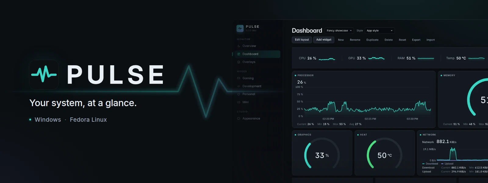
</p>

<p align="center">
  <strong>适用于 Windows 和 Fedora Linux 的跨平台系统监视器 —— 实时指标、<br>
  本地历史记录、自由组合的仪表板，以及桌面叠加层。</strong>
</p>

<p align="center">
  <a href="https://github.com/lolmath06/PULSE/actions/workflows/ci.yml"></a>
  
  
  
  
  <a href="LICENSE"></a>
</p>

<p align="center">
  <a href="#gallery">截图</a> ·
  <a href="#build-from-source">从源码构建</a> ·
  <a href="docs/README.md">文档</a> ·
  <a href="#platforms-and-status">状态</a> ·
  <a href="CHANGELOG.md">更新日志</a>
</p>

<p align="center">
  
</p>

## PULSE 是什么

PULSE 展示你的电脑正在做什么 —— 处理器、显卡、内存、存储、网络和进程 —— 并由你决定
**如何**展示：在概览页、在用小组件搭建的仪表板上、在小巧的 Mini 窗口中，或者以叠加层的
形式浮在桌面其他窗口之上。

它在 **Windows 10/11** 和 **Fedora Linux** 上原生运行，背后是同一套指标约定，因此绑定到
“GPU 温度”或“逻辑处理器 3”的小组件在两个平台上含义完全相同。它以当前用户自身的权限读取
一切，把历史记录保存在本地文件中；当某台机器无法提供某个值时，它会说明**原因**，而不是编造
一个数值。

## 亮点

|                   |                                                                                                                                     |
| ----------------- | ----------------------------------------------------------------------------------------------------------------------------------- |
| **实时监控**      | CPU 使用率与拓扑、每个逻辑处理器的使用率与频率、内存、GPU 负载 / 显存 / 频率 / 温度 / 风扇、存储 I/O 与 NVMe 健康状况、网络与 Wi-Fi |
| **本地历史**      | 每 5 秒写入本地 SQLite 文件；时间范围从 15 分钟到 7 天，压缩旧数据时保留最小值 / 最大值 / 平均值                                    |
| **仪表板**        | 多个仪表板，小组件可移动、可缩放；八个模板；折线、面积、迷你折线、数值、条形和仪表盘渲染；支持导入与导出                            |
| **叠加层与 Mini** | 十二个叠加层包 —— 读数、条形、侧栏、角落 HUD —— 锁定后可点击穿透；托盘图标、可配置的全局快捷键和紧凑的 Mini 窗口                    |
| **模式**          | 游戏、开发、个人和 Mini：每种模式都有自己的样式、实时状态条、初始仪表板和叠加层包                                                   |
| **外观工作室**    | 八种内置样式（Clean、Glass、Technical、Neon、Gaming、Stealth、Compact、Transparent HUD）、深度调节，以及你自己保存的样式            |
| **进程**          | 应用和进程的 CPU、内存与 I/O；检查器提供软件包或签名来源、按需计算 SHA-256，以及明确的控制操作                                      |
| **语言**          | 十六种界面语言；默认跟随系统语言，也可在欢迎界面或“外观”中选择 —— 数字和日期格式也随之改变                                          |

<a id="gallery"></a>

## 截图

<table>
  <tr>
    <td width="50%">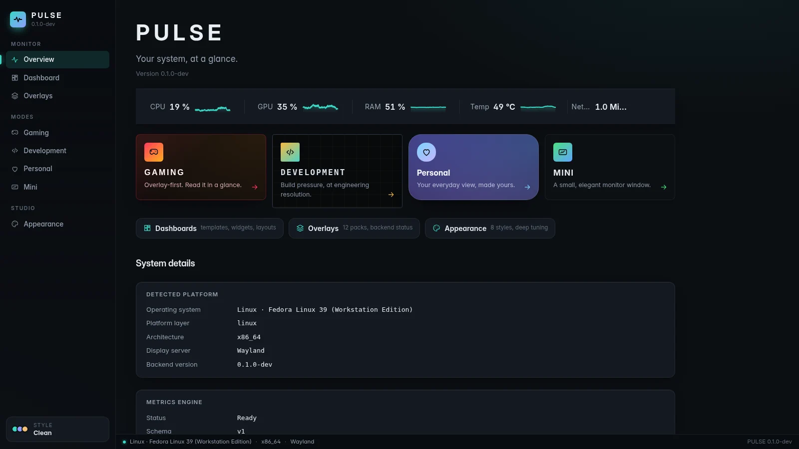<br><sub><b>概览</b> —— 关键数据的实时状态条、四种模式和系统详情。</sub></td>
    <td width="50%">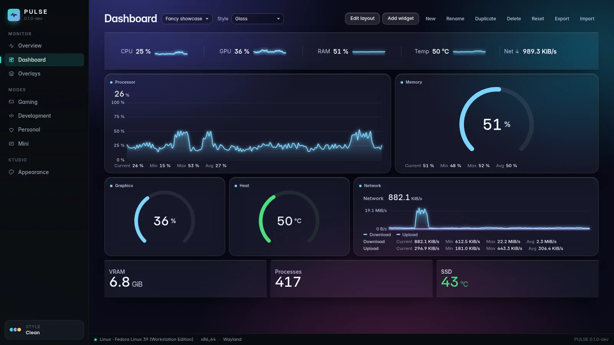<br><sub><b>仪表板</b> —— <i>Fancy showcase</i> 模板，使用其自带的 Glass 样式。</sub></td>
  </tr>
  <tr>
    <td>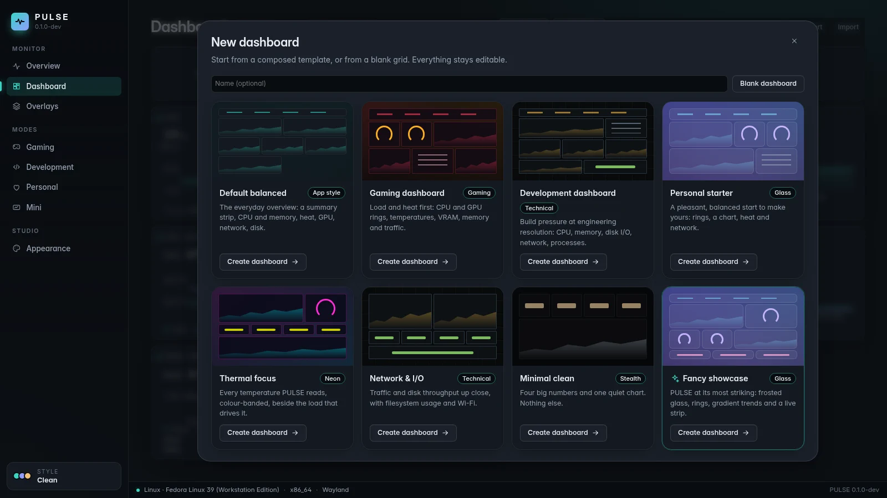<br><sub><b>模板</b> —— 八个精心搭配的起点；一切都可以继续编辑。</sub></td>
    <td>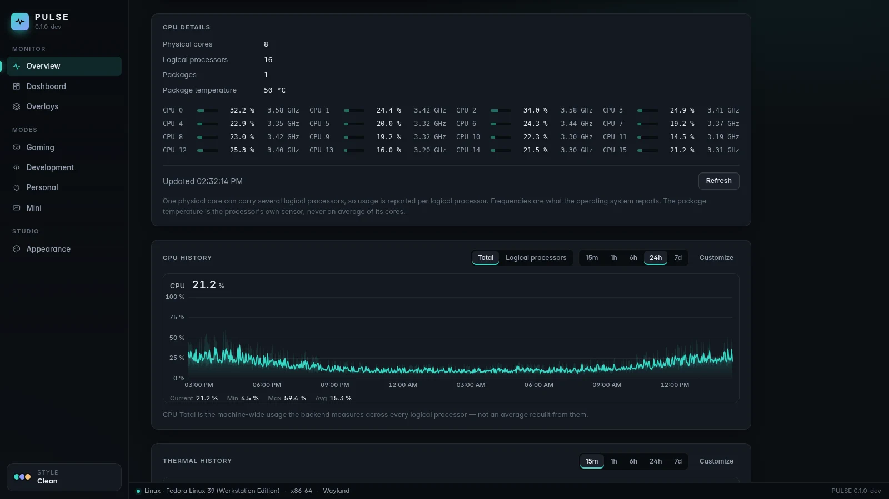<br><sub><b>历史</b> —— 逻辑处理器详情，下方是 24 小时的 CPU 负载记录。</sub></td>
  </tr>
  <tr>
    <td>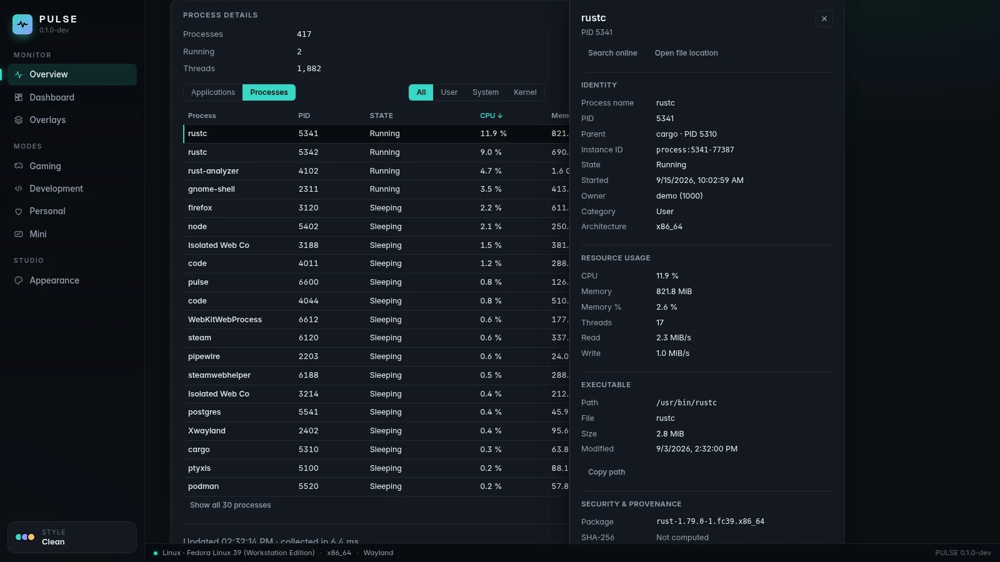<br><sub><b>进程</b> —— 检查器：身份、资源、可执行文件和来源。</sub></td>
    <td>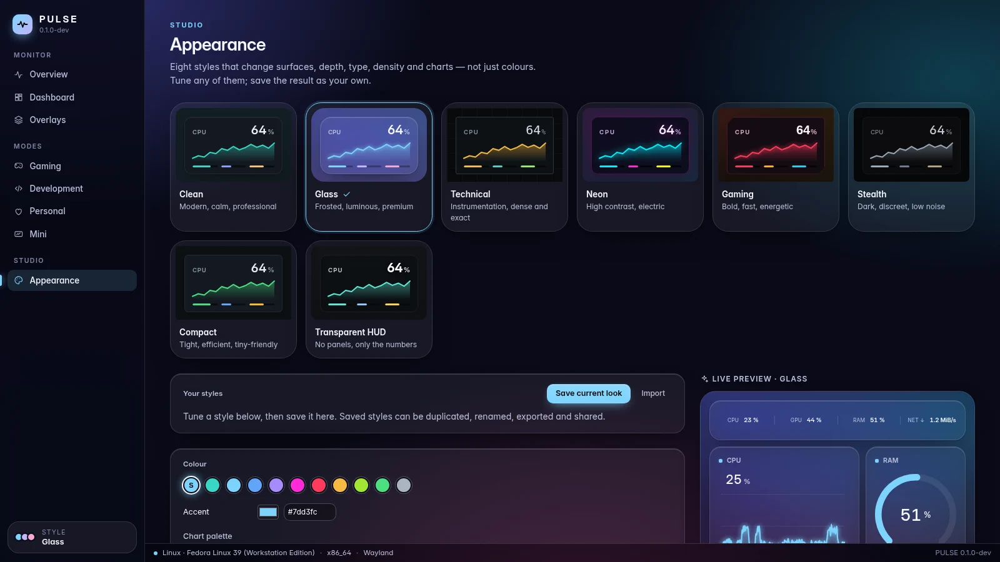<br><sub><b>外观</b> —— 八种样式、深度调节和实时预览。</sub></td>
  </tr>
  <tr>
    <td>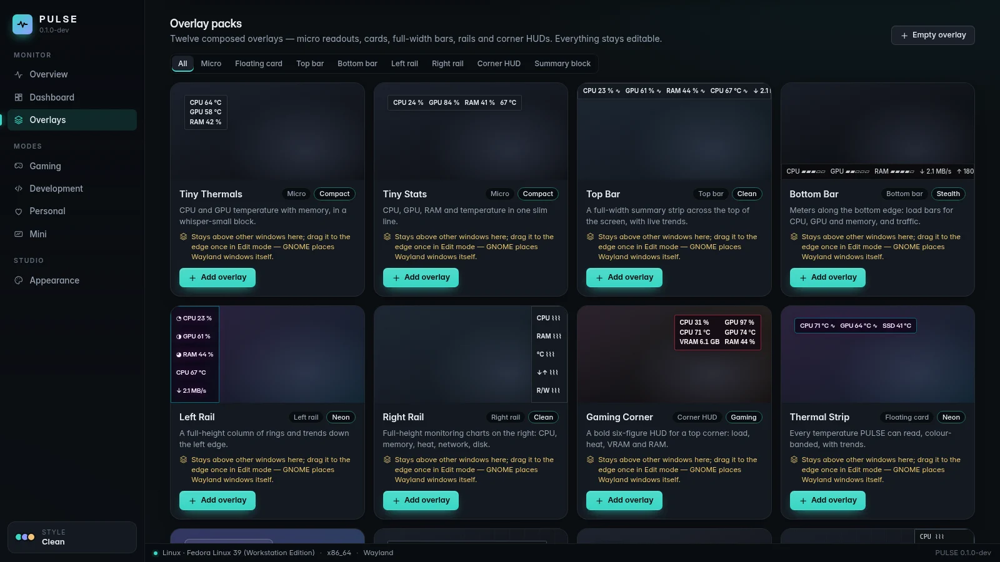<br><sub><b>叠加层</b> —— 十二个包，从三行读数到全高侧栏。</sub></td>
    <td>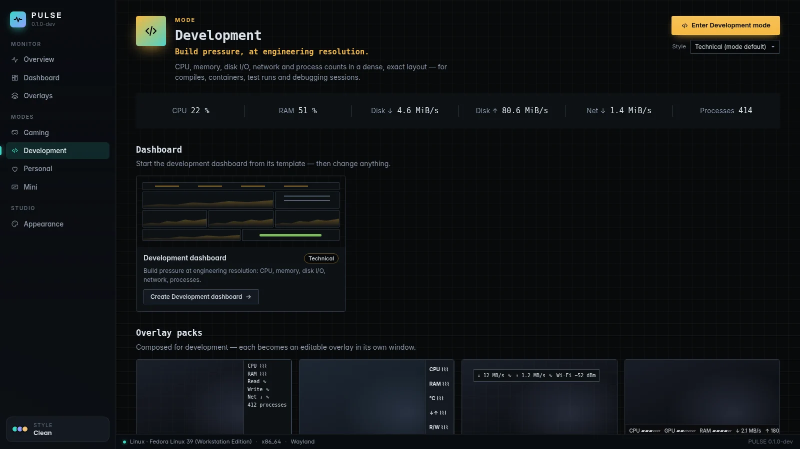<br><sub><b>模式</b> —— 开发模式，使用 Technical 样式：紧凑的状态条、一个模板和配套的包。</sub></td>
  </tr>
</table>

<p align="center">
  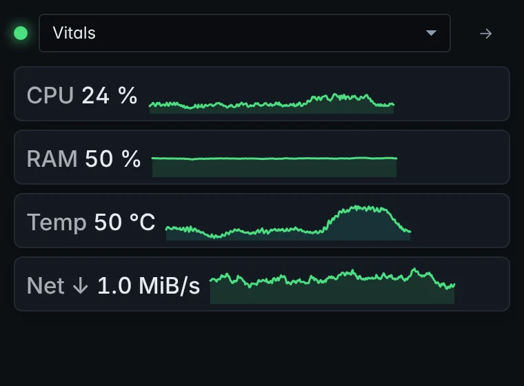<br>
  <sub><b>Mini</b> —— 一个小巧的普通窗口，拥有自己的布局（此处为 Vitals）。</sub>
</p>

<sub>每张图片都是 PULSE 真实界面的截图。为了可复现且不含任何人的个人数据，后端的响应来自一台
确定性的虚构机器 —— 参见 [`scripts/showcase/`](scripts/showcase/README.md)。截图中的界面为英文。</sub>

## 为什么选择 PULSE

大多数监视器替你决定什么重要。PULSE 的出发点正好相反 —— **由你来组合** —— 并且对它展示的
内容一丝不苟：

- **如实反映可用性。** 每个指标都带有状态：可用、此平台不支持、此机器未检测到、被权限阻止、
  暂时不可用，或提供程序错误 —— 每种状态都附有原因。缺失的传感器就显示为缺失，绝不显示为 `0`。
- **区分其他工具混为一谈的概念。** 物理核心不是逻辑处理器；专用显存不是共享的系统内存；存储
  设备不是卷；温度上限不是温度；本地丢包计数器不是互联网丢包。
- **稳定的标识。** GPU、磁盘和网络接口通过能在重启后保持不变的信息来识别（NVML UUID、
  硬盘 WWID、永久 MAC 地址），绝不依赖 `nvme0n1`、适配器序号或随机地址 —— 因此已保存的仪表板
  始终指向正确的硬件，导出内容也不包含原始硬件标识符。
- **模式与仪表板相互独立。** 模式描述 PULSE **如何**运行；仪表板描述它显示**什么**。任意仪表板、
  任意样式、任意模式自由搭配。

## 监控内容

一台机器能报告什么，取决于它的硬件、驱动和平台；PULSE 只读取真实存在的数据。

| 领域     | 指标                                                                                                                       |
| -------- | -------------------------------------------------------------------------------------------------------------------------- |
| **CPU**  | 总使用率；每个逻辑处理器的使用率与当前 / 最高频率；物理核心、逻辑处理器和封装数量；有传感器时的封装温度                    |
| **内存** | 总量、已用、可用、使用率                                                                                                   |
| **GPU**  | 每块显卡，带名称与标识；使用率、显存、核心与显存频率，以及在 NVML 或 `amdgpu` 驱动提供时的核心 / 热点 / 显存温度和风扇转速 |
| **存储** | 设备与卷；容量与使用率；读 / 写吞吐量、IOPS 与延迟；NVMe 健康状况（温度、磨损、备用空间、通电时间、异常关机、错误）        |
| **网络** | 接口与链路状态；下载 / 上传、数据包、错误与丢包；链路速率；Wi-Fi 信号与连接速率                                            |
| **进程** | 进程数、运行中进程数与线程数；按进程和按应用统计的 CPU、内存、线程与磁盘 I/O                                               |

厂商的 GPU 库在运行时加载：缺少驱动只会失去这些指标，绝不会影响启动。详情见
[指标文档](docs/metrics/README.md)。

## 本地优先，安全为本

- **历史记录留在你的电脑上** —— 一个本地 SQLite 文件，保留 24 小时原始样本，以及 7 天的每分钟
  最小值 / 最大值 / 平均值 / 计数聚合。（[保留策略](docs/history/retention.md)）
- **没有遥测。** PULSE 不向任何服务器发送任何内容。唯一的对外操作都由你点击触发 —— 在线搜索
  进程名或哈希、在 VirusTotal 上检查哈希 —— 它们只会在浏览器中打开对应页面（绝不会上传文件）。
- **不收集进程的命令行、参数或环境变量。**
- **进程控制需明确操作。** 挂起 / 恢复、结束进程或进程树、优先级和亲和性只在你选择时执行；破坏性
  操作会先确认。每个操作都针对一个确切的进程实例 —— PID 加启动令牌，并在执行前再次校验 —— 因此
  被复用的 PID 绝不会被误伤。
- **不提权。** PULSE 以用户自身权限运行，从不提升权限；需要更高权限的内容会报告为权限被拒，并附上原因。
- **只读访问硬件。** 绝不写入任何风扇、限制或电源设置；不向游戏注入任何内容 —— 叠加层是独立的窗口。

参见 [SECURITY.md](SECURITY.md) 和[进程控制](docs/processes/controls.md)。

<a id="platforms-and-status"></a>

## 平台与状态

|            | Windows 10 / 11                                               | Fedora Linux                                                 |
| ---------- | ------------------------------------------------------------- | ------------------------------------------------------------ |
| 支持级别   | 一等支持                                                      | 一等支持                                                     |
| 原生数据源 | Win32 / NT APIs, DXGI + D3DKMT, SetupAPI, IP Helper, NVML     | `/proc`, `/sys`, `hwmon`, DRM, `rtnetlink` + `nl80211`, NVML |
| 叠加层     | 原生分层置顶窗口                                              | Wayland 下的 GNOME Shell 桥接；标准 Wayland 和 X11 窗口      |
| 自动化验证 | 原生 CI：构建、测试、Clippy、MSRV 1.77.2、NSIS / MSI / 便携版 | CI：lint、类型检查、测试、应用构建、Clippy、MSRV 1.77.2      |
| 实机验证   | 发布前的最后一道关口，尚未完成                                | 已完成（Fedora 39，Wayland 下的 GNOME 45）                   |

PULSE 当前版本为 **0.1.0-dev**，首个版本的功能已经完整。原生 Windows 构建在每次 CI 运行中都会
编译、测试和打包；公开发布前剩下的最后一道关口是
[Windows 实机验证清单](docs/release/windows-physical-validation.md)。
目前尚无已发布的版本 —— 参见[发布流程](docs/release/release-process.md)。macOS 不在支持范围内。

<a id="build-from-source"></a>

## 从源码构建

**前提条件：** Node.js 20.19+ 与 pnpm（`corepack enable pnpm`），以及通过
[rustup](https://rustup.rs) 安装的 Rust 1.77.2+（[MSRV 说明](docs/development/msrv.md)）。

<details>
<summary><b>Fedora Linux</b> 系统软件包</summary>

```bash
sudo dnf install -y \
  webkit2gtk4.1-devel \
  openssl-devel \
  curl wget file \
  libappindicator-gtk3-devel \
  librsvg2-devel \
  gcc gcc-c++ make
```

</details>

<details>
<summary><b>Windows</b> 前提条件</summary>

- 安装 **Microsoft C++ Build Tools**，并选择“使用 C++ 的桌面开发”工作负载
- **WebView2 Runtime**（Windows 11 和最新的 Windows 10 已预装）

</details>

```bash
git clone https://github.com/lolmath06/PULSE.git
cd PULSE
pnpm install
pnpm app:dev      # run PULSE in development
pnpm app:build    # build the desktop application and its bundles
```

每次 CI 成功运行还会生成一个未签名的 Windows 构建（NSIS 安装程序、MSI、便携可执行文件和校验和）
用于测试 —— 参见 [Windows CI 与构建产物](docs/release/windows-ci.md)。

## 架构

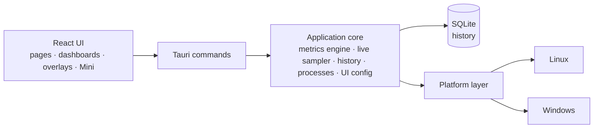

前端从不读取 `/proc`、`/sys`、DXGI 或 NVML —— 所有与系统相关的数据都以带类型的载荷跨越命令
边界，只有平台层知道自己运行在哪个操作系统上。详见[架构概览](docs/architecture/overview.md)。

| 层级       | 技术                                                    |
| ---------- | ------------------------------------------------------- |
| 桌面外壳   | [Tauri 2](https://tauri.app)                            |
| 后端       | Rust（2021 版，MSRV 1.77.2）                            |
| 存储       | 通过 `rusqlite` 使用 SQLite（内置）                     |
| 前端       | React 19, TypeScript, React Router, D3 shape, i18next   |
| 构建与工具 | Vite, pnpm                                              |
| 测试与质量 | Vitest, `cargo test`, ESLint, Prettier, rustfmt, Clippy |

<details>
<summary><b>仓库结构</b></summary>

```text
PULSE/
├── src/                 # React frontend
│   ├── app/             # router, routes, app constants
│   ├── components/      # Dashboard, Overlay, Mini, History, ProcessInspector…
│   ├── config/          # the shared UI configuration store
│   ├── dashboard/       # widget model, grid layout, library, bindings, templates
│   ├── design/          # styles, tokens, appearance
│   ├── i18n/            # languages, locale resolution, translation catalogs
│   ├── live/            # this window's side of the live widget feed
│   ├── modes/           # Gaming, Development, Personal, Mini
│   ├── overlay/         # overlay model, desktop commands
│   ├── presets/         # dashboard templates and overlay packs
│   ├── services/        # the invoke() boundary
│   ├── types/           # shared types, mirrors of Rust payloads
│   └── visualization/   # chart engine: renderers, config, Customize
├── src-tauri/           # Rust backend
│   └── src/
│       ├── commands/    # Tauri command surface
│       ├── desktop.rs   # overlay windows, Mini, tray, global shortcut
│       ├── history/     # scheduler, SQLite store, queries, retention
│       ├── live/        # one shared 1 s sampler, in-memory rings
│       ├── metrics/     # metrics engine, model, well-known declarations
│       ├── overlay/     # capabilities, geometry, specs, settings, GNOME bridge
│       ├── platform/    # the platform seam: linux/ and windows/
│       ├── processes/   # snapshots, inspector, controls, provenance
│       └── ui_config/   # the shared UI configuration file (atomic, versioned)
├── integrations/        # the GNOME Shell overlay bridge extension
├── tools/windows-check/ # type-checks the Windows code from Linux
├── scripts/showcase/    # regenerates the README media
└── docs/
```

</details>

## 开发

| 命令                                | 作用                                 |
| ----------------------------------- | ------------------------------------ |
| `pnpm app:dev`                      | 以开发模式运行 PULSE                 |
| `pnpm app:build`                    | 构建桌面应用                         |
| `pnpm dev`                          | 仅启动 Vite 开发服务器（无后端）     |
| `pnpm build`                        | 类型检查并构建前端                   |
| `pnpm typecheck`                    | TypeScript 类型检查，不输出文件      |
| `pnpm lint` / `pnpm lint:fix`       | ESLint                               |
| `pnpm format` / `pnpm format:check` | Prettier                             |
| `pnpm test` / `pnpm test:watch`     | Vitest                               |
| `pnpm rust:fmt`                     | `cargo fmt --check`                  |
| `pnpm rust:lint`                    | Clippy，警告视为错误                 |
| `pnpm rust:test`                    | `cargo test`                         |
| `pnpm rust:windows`                 | 在 Linux 上对 Windows 代码做类型检查 |
| `pnpm check:all`                    | 运行 CI 执行的全部检查               |

`pnpm dev` 在没有 Rust 后端的情况下运行界面；此时状态栏会提示后端不可用，这在 Tauri 之外是正常的。
参见[入门指南](docs/development/getting-started.md)和[测试](docs/development/testing.md)。

一项与系统相关的功能，只有在其 Windows 和 Fedora Linux 上的行为都经过设计、并在可实际测试时
完成验证后，才算完成。

## 文档

从 [`docs/README.md`](docs/README.md)（英文）开始。

- **使用 PULSE** —— [用户指南](docs/user-guide/README.md) ·
  [模式](docs/modes/overview.md) · [叠加层](docs/overlay/user-guide.md) ·
  [外观](docs/design-system/customization.md) ·
  [仪表板模板](docs/presets/dashboard-templates.md) ·
  [叠加层包](docs/presets/overlay-packs.md)
- **指标** —— [引擎](docs/metrics/README.md) · [模型](docs/metrics/model.md) ·
  [标识符](docs/metrics/identifiers.md) · [CPU 与内存](docs/metrics/cpu-memory.md) ·
  [CPU 进阶](docs/metrics/cpu-advanced.md) · [GPU](docs/metrics/gpu.md) ·
  [温度](docs/metrics/thermals.md) · [存储](docs/metrics/storage.md) ·
  [网络](docs/metrics/network.md) · [进程](docs/metrics/processes.md)
- **进程** —— [检查器](docs/processes/inspector.md) ·
  [来源](docs/processes/provenance.md) · [控制](docs/processes/controls.md)
- **历史与可视化** —— [历史](docs/history/architecture.md) ·
  [存储](docs/history/storage.md) · [保留策略](docs/history/retention.md) ·
  [可视化](docs/visualization/architecture.md) ·
  [渲染器](docs/visualization/renderers.md)
- **仪表板与叠加层** —— [仪表板](docs/dashboard/architecture.md) ·
  [小组件](docs/dashboard/widgets.md) · [布局](docs/dashboard/layout.md) ·
  [叠加层架构](docs/overlay/architecture.md) ·
  [后端](docs/overlay/backends.md) · [GNOME 桥接](docs/overlay/gnome-bridge.md)
- **设计** —— [设计系统](docs/design-system/overview.md)
- **平台** —— [Fedora Linux](docs/platforms/fedora.md) · [Windows](docs/platforms/windows.md)
- **发布** —— [CI](docs/release/ci.md) · [Windows CI 与构建产物](docs/release/windows-ci.md) ·
  [Windows 实机验证](docs/release/windows-physical-validation.md) ·
  [发布流程](docs/release/release-process.md)

## 参与贡献

参见 [CONTRIBUTING.md](CONTRIBUTING.md)。在提交 pull request 之前运行 `pnpm check:all`，并牢记上面的
跨平台原则。

## 安全

请以私密方式报告漏洞 —— 参见 [SECURITY.md](SECURITY.md)。

## 许可证

**PULSE 是专有软件。**
Copyright © 2026 Matheo Dolmen. 保留所有权利。

GitHub 上公开的源代码可供阅读、审计和讨论；公开代码并不授予重复使用或再分发的许可。
大量复制、再分发、发布修改版本或商业利用均需事先获得书面授权。

请参阅 **[LICENSE](LICENSE)**。第三方组件仍受其各自许可证的约束。
